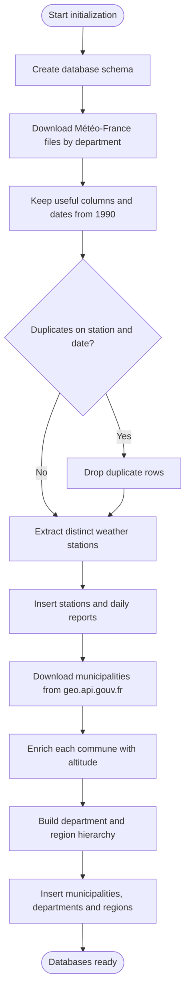
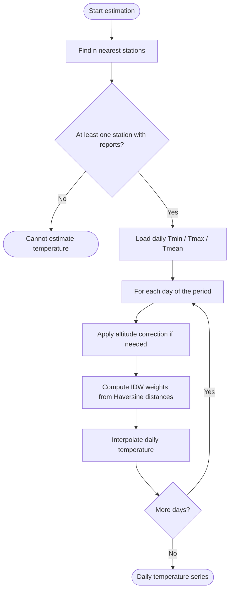
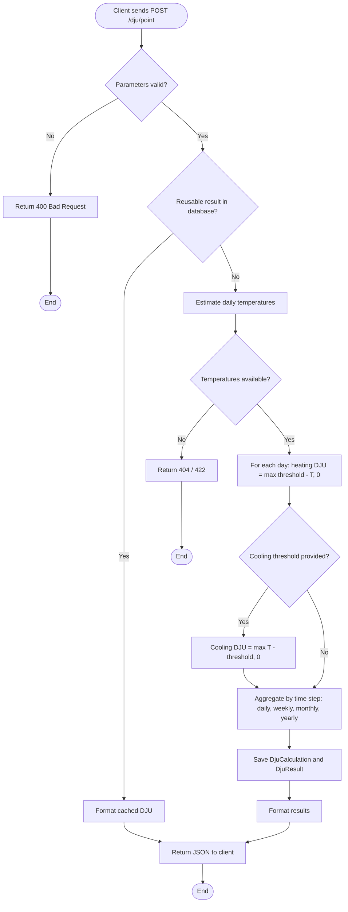
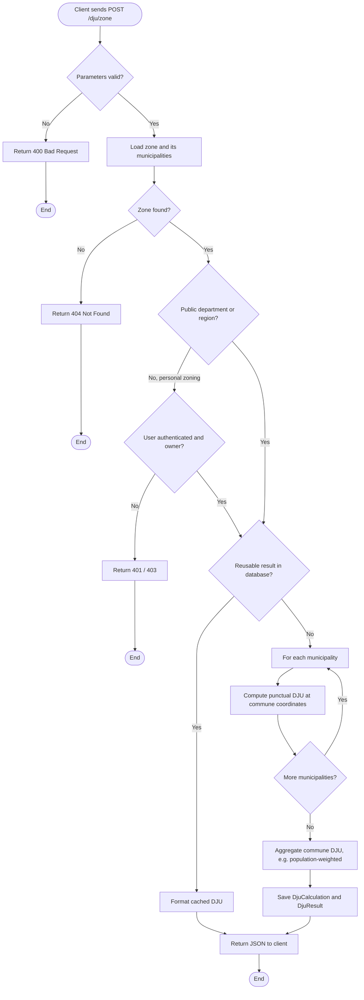
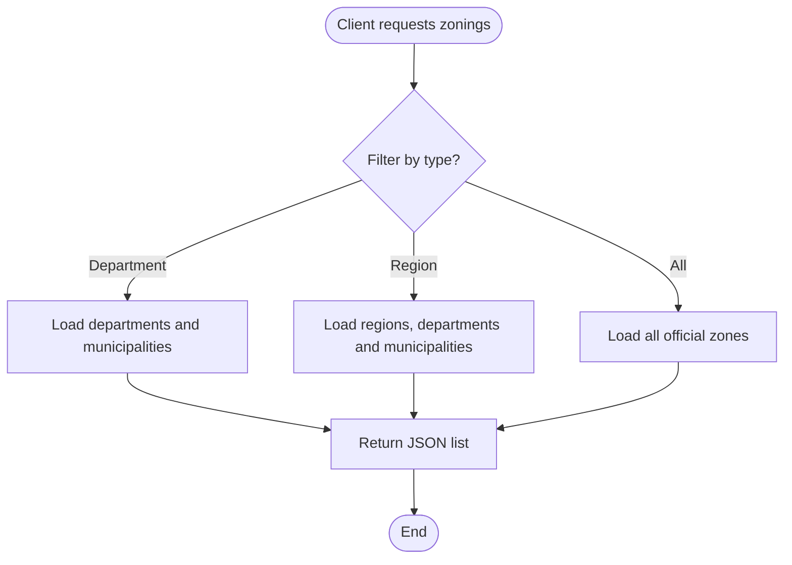
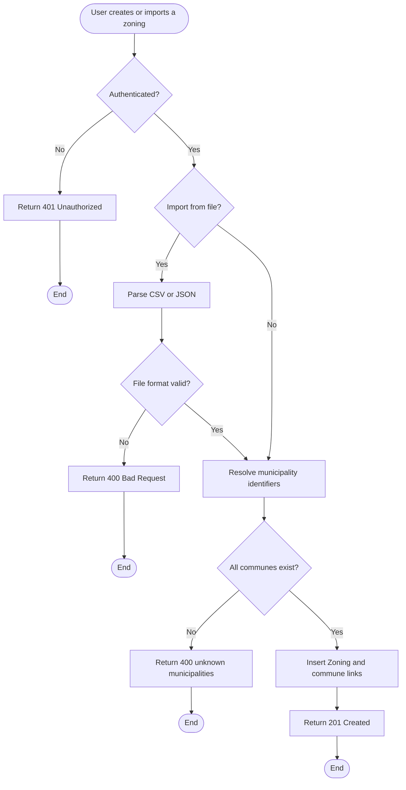
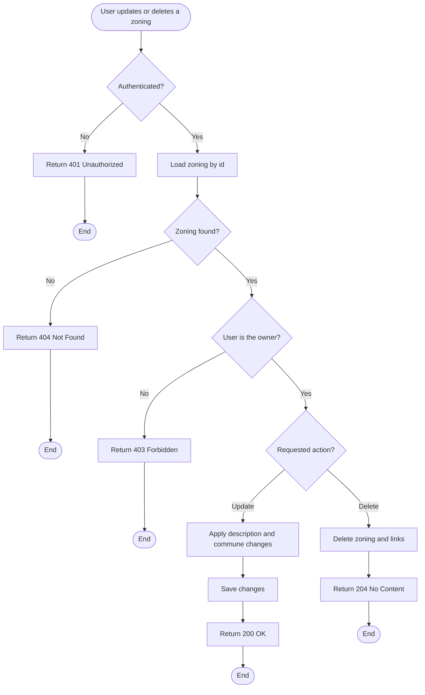

# Activity diagrams

## 1. Initialize the databases

## 2. Estimate local temperatures

## 3. Compute a punctual DJU

## 4. Compute a zone DJU

## 5. Consult zonings

## 6. Create or import a personalized zoning

An authenticated user defines a custom set of municipalities, either by sending
a list in the request body or by importing a CSV / JSON file.

## 7. Manage a personalized zoning

