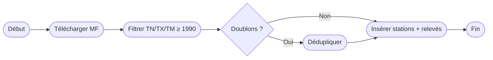
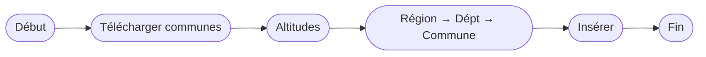
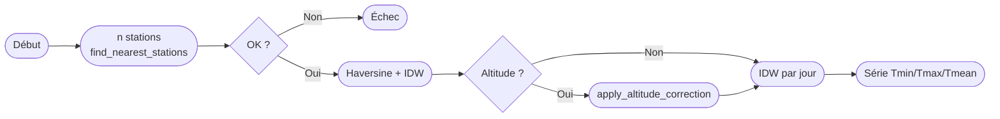
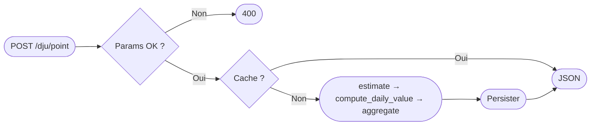
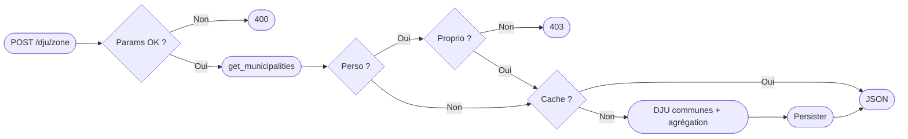
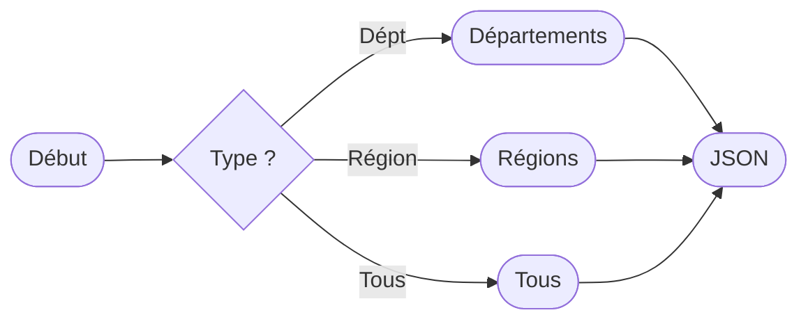
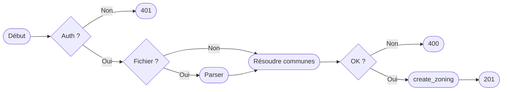
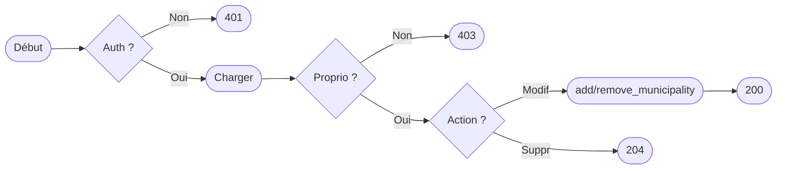

# Diagrammes d'activité

Versions compactes (flux horizontal, libellés courts).
Méthodes du modèle entre crochets.

## 1. Initialisation des stations et observations météo (F0)

```mermaid
flowchart LR
    start([Début]) --> dl([Télécharger MF])
    dl --> filter([Filtrer TN/TX/TM ≥ 1990])
    filter --> dedup{Doublons ?}
    dedup -->|Oui| drop([Dédupliquer])
    dedup -->|Non| save
    drop --> save([Insérer stations + relevés])
    save --> ready([Fin])
```

## 2. Initialisation des zonages officiels (F0)

```mermaid
flowchart LR
    start([Début]) --> geo([Télécharger communes])
    geo --> alti([Altitudes])
    alti --> hier([Région → Dépt → Commune])
    hier --> save([Insérer])
    save --> ready([Fin])
```

## 3. Estimation des températures locales

```mermaid
flowchart LR
    start([Début]) --> n(["n stations\nfind_nearest_stations"])
    n --> ok{OK ?}
    ok -->|Non| fail([Échec])
    ok -->|Oui| w([Haversine + IDW])
    w --> alt{Altitude ?}
    alt -->|Oui| c(["apply_altitude_correction"])
    alt -->|Non| idw
    c --> idw([IDW par jour])
    idw --> done([Série Tmin/Tmax/Tmean])
```

## 4. Calcul d'un DJU ponctuel (F1)

```mermaid
flowchart LR
    start([POST /dju/point]) --> val{Params OK ?}
    val -->|Non| bad([400])
    val -->|Oui| cache{Cache ?}
    cache -->|Oui| out([JSON])
    cache -->|Non| calc(["estimate → compute_daily_value → aggregate"])
    calc --> save([Persister])
    save --> out
```

## 5. Calcul d'un DJU zonal (F3)

```mermaid
flowchart LR
    start([POST /dju/zone]) --> val{Params OK ?}
    val -->|Non| bad([400])
    val -->|Oui| load(["get_municipalities"])
    load --> auth{Perso ?}
    auth -->|Oui| own{Proprio ?}
    own -->|Non| forbid([403])
    own -->|Oui| work
    auth -->|Non| work{Cache ?}
    work -->|Oui| out([JSON])
    work -->|Non| run([DJU communes + agrégation])
    run --> save([Persister])
    save --> out
```

## 6. Consultation des zonages officiels (F2)

```mermaid
flowchart LR
    start([Début]) --> type{Type ?}
    type -->|Dépt| d([Départements])
    type -->|Région| r([Régions])
    type -->|Tous| a([Tous])
    d --> out([JSON])
    r --> out
    a --> out
```

## 7. Création ou import d'un zonage personnalisé (F4 / FO3)

```mermaid
flowchart LR
    start([Début]) --> auth{Auth ?}
    auth -->|Non| u([401])
    auth -->|Oui| src{Fichier ?}
    src -->|Oui| p([Parser])
    src -->|Non| res
    p --> res([Résoudre communes])
    res --> ok{OK ?}
    ok -->|Non| bad([400])
    ok -->|Oui| save(["create_zoning"])
    save --> out([201])
```

## 8. Gestion d'un zonage personnalisé (F4)

```mermaid
flowchart LR
    start([Début]) --> auth{Auth ?}
    auth -->|Non| u([401])
    auth -->|Oui| load([Charger])
    load --> own{Proprio ?}
    own -->|Non| f([403])
    own -->|Oui| act{Action ?}
    act -->|Modif| upd(["add/remove_municipality"])
    upd --> ok([200])
    act -->|Suppr| del([204])
```
