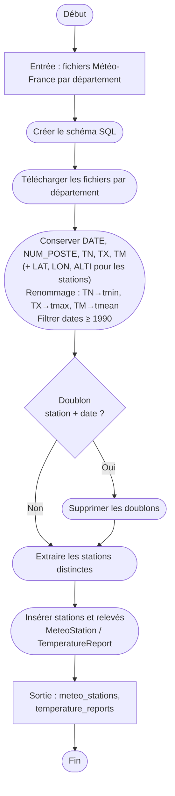
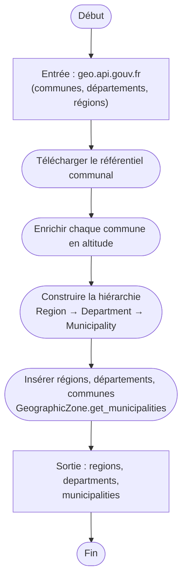
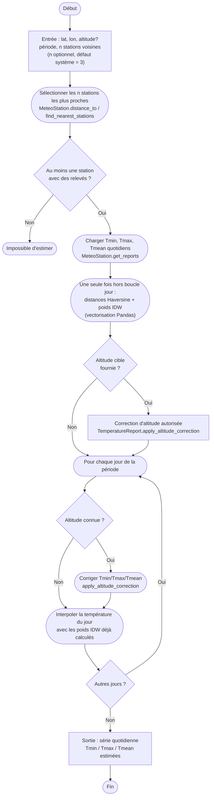
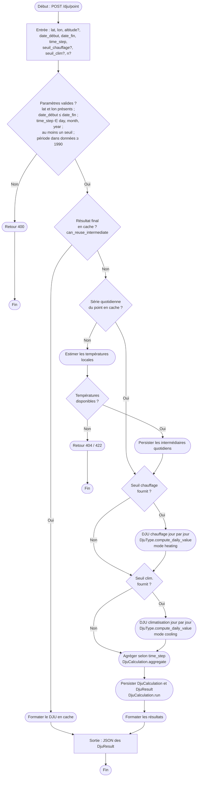
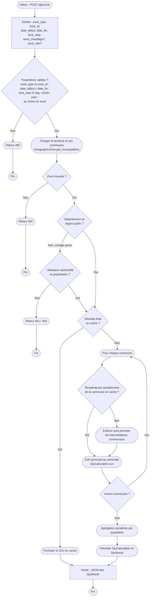
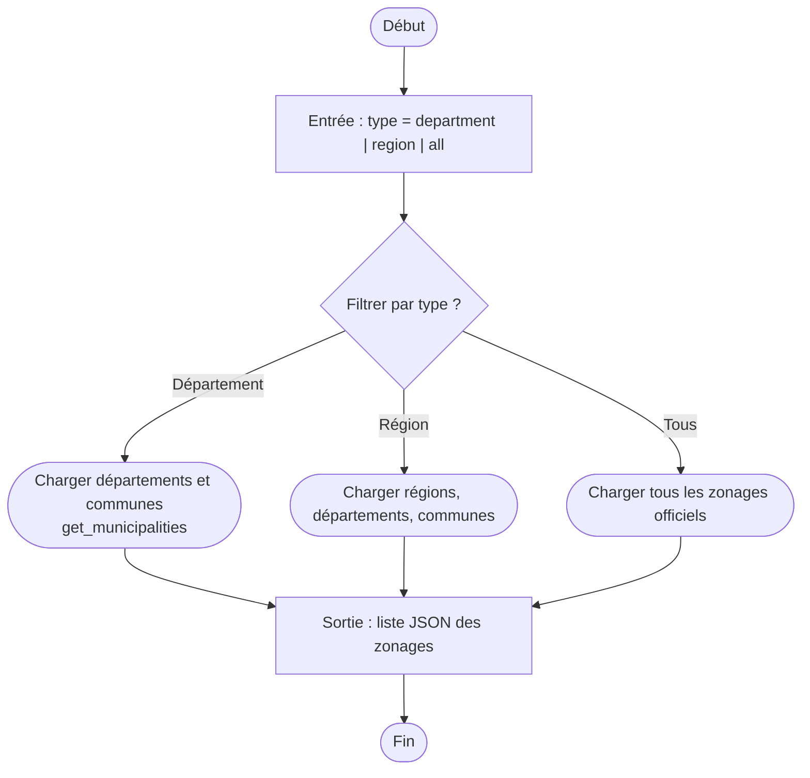
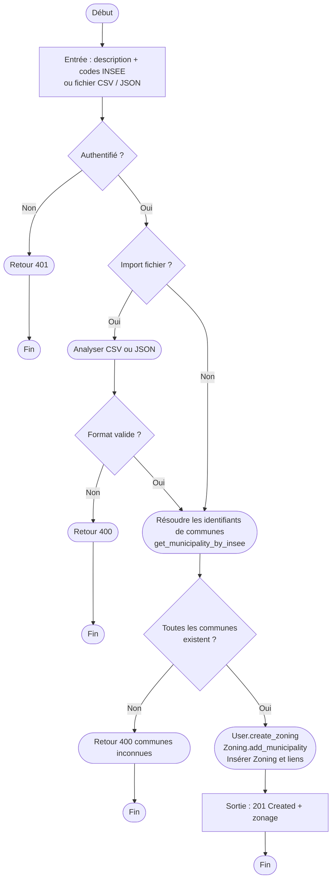
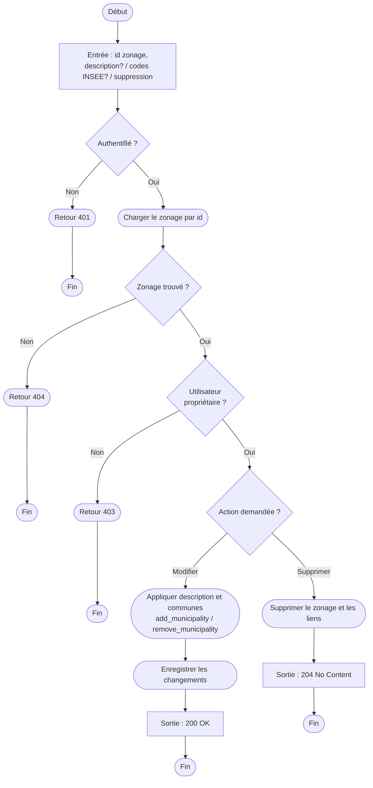

# Diagrammes d'activité

Libellés en français. Les méthodes du modèle de domaine (identifiants
code) sont indiquées entre crochets sur les actions concernées.

## 1. Initialisation des stations et observations météo (F0)

```mermaid
flowchart TD
    start([Début]) --> entree["Entrée : fichiers Météo-France par département"]
    entree --> createDb([Créer le schéma SQL])
    createDb --> weather([Télécharger les fichiers par département])
    weather --> filterMeteo(["Conserver DATE, NUM_POSTE, TN, TX, TM\n(+ LAT, LON, ALTI pour les stations)\nRenommage : TN→tmin, TX→tmax, TM→tmean\nFiltrer dates ≥ 1990"])
    filterMeteo --> dedup{Doublon\nstation + date ?}
    dedup -->|Oui| dropDup([Supprimer les doublons])
    dedup -->|Non| stations
    dropDup --> stations([Extraire les stations distinctes])
    stations --> saveMeteo(["Insérer stations et relevés\nMeteoStation / TemperatureReport"])
    saveMeteo --> sortie["Sortie : meteo_stations,\ntemperature_reports"]
    sortie --> ready([Fin])
```

## 2. Initialisation des zonages officiels (F0)

```mermaid
flowchart TD
    start([Début]) --> entree["Entrée : geo.api.gouv.fr\n(communes, départements, régions)"]
    entree --> geo([Télécharger le référentiel communal])
    geo --> alti([Enrichir chaque commune en altitude])
    alti --> hierarchy(["Construire la hiérarchie\nRegion → Department → Municipality"])
    hierarchy --> saveGeo(["Insérer régions, départements, communes\nGeographicZone.get_municipalities"])
    saveGeo --> sortie["Sortie : regions, departments,\nmunicipalities"]
    sortie --> ready([Fin])
```

## 3. Estimation des températures locales

```mermaid
flowchart TD
    start([Début]) --> entree["Entrée : lat, lon, altitude?\npériode, n stations voisines\n(n optionnel, défaut système = 3)"]
    entree --> nearest(["Sélectionner les n stations les plus proches\nMeteoStation.distance_to / find_nearest_stations"])
    nearest --> found{Au moins une station\navec des relevés ?}
    found -->|Non| fail([Impossible d'estimer])
    found -->|Oui| reports(["Charger Tmin, Tmax, Tmean quotidiens\nMeteoStation.get_reports"])
    reports --> weights(["Une seule fois hors boucle jour :\ndistances Haversine + poids IDW\n(vectorisation Pandas)"])
    weights --> hasAlt{Altitude cible\nfournie ?}
    hasAlt -->|Non| loopDay
    hasAlt -->|Oui| noteAlt["Correction d'altitude autorisée\nTemperatureReport.apply_altitude_correction"]
    noteAlt --> loopDay
    loopDay([Pour chaque jour de la période]) --> correct{Altitude connue ?}
    correct -->|Oui| applyCorr(["Corriger Tmin/Tmax/Tmean\napply_altitude_correction"])
    correct -->|Non| interp
    applyCorr --> interp(["Interpoler la température du jour\navec les poids IDW déjà calculés"])
    interp --> moreDays{Autres jours ?}
    moreDays -->|Oui| loopDay
    moreDays -->|Non| sortie["Sortie : série quotidienne\nTmin / Tmax / Tmean estimées"]
    sortie --> done([Fin])
```

## 4. Calcul d'un DJU ponctuel (F1)

```mermaid
flowchart TD
    start([Début : POST /dju/point]) --> entree["Entrée : lat, lon, altitude?,\ndate_début, date_fin, time_step,\nseuil_chauffage?, seuil_clim?, n?"]
    entree --> validate{Paramètres valides ?\nlat et lon présents ;\ndate_début ≤ date_fin ;\ntime_step ∈ day, month, year ;\nau moins un seuil ;\npériode dans données ≥ 1990}
    validate -->|Non| badReq([Retour 400])
    badReq --> endBad([Fin])
    validate -->|Oui| cacheFinal{Résultat final\nen cache ?\ncan_reuse_intermediate}
    cacheFinal -->|Oui| formatCached([Formater le DJU en cache])
    formatCached --> respondOk
    cacheFinal -->|Non| cacheInter{Série quotidienne\ndu point en cache ?}
    cacheInter -->|Oui| daily
    cacheInter -->|Non| estimate([Estimer les températures locales])
    estimate --> tempsOk{Températures\ndisponibles ?}
    tempsOk -->|Non| noData([Retour 404 / 422])
    noData --> endNoData([Fin])
    tempsOk -->|Oui| persistInter([Persister les intermédiaires quotidiens])
    persistInter --> daily
    daily{Seuil chauffage\nfournit ?} -->|Oui| heat(["DJU chauffage jour par jour\nDjuType.compute_daily_value\nmode heating"])
    daily -->|Non| coolOnly
    heat --> coolOnly{Seuil clim.\nfournit ?}
    coolOnly -->|Oui| cool(["DJU climatisation jour par jour\nDjuType.compute_daily_value\nmode cooling"])
    coolOnly -->|Non| aggregate
    cool --> aggregate
    aggregate(["Agréger selon time_step\nDjuCalculation.aggregate"]) --> save(["Persister DjuCalculation et DjuResult\nDjuCalculation.run"])
    save --> formatCached2([Formater les résultats])
    formatCached2 --> respondOk["Sortie : JSON des DjuResult"]
    respondOk --> endOk([Fin])
```

## 5. Calcul d'un DJU zonal (F3)

```mermaid
flowchart TD
    start([Début : POST /dju/zone]) --> entree["Entrée : zone_type, zone_id,\ndate_début, date_fin, time_step,\nseuil_chauffage?, seuil_clim?"]
    entree --> validate{Paramètres valides ?\nzone_type et zone_id ;\ndate_début ≤ date_fin ;\ntime_step ∈ day, month, year ;\nau moins un seuil}
    validate -->|Non| badReq([Retour 400])
    badReq --> endBad([Fin])
    validate -->|Oui| loadZone(["Charger le territoire et ses communes\nGeographicZone.get_municipalities"])
    loadZone --> exists{Zone trouvée ?}
    exists -->|Non| notFound([Retour 404])
    notFound --> end404([Fin])
    exists -->|Oui| kind{Département ou\nrégion public ?}
    kind -->|Non, zonage perso| auth{Utilisateur authentifié\net propriétaire ?}
    auth -->|Non| forbidden([Retour 401 / 403])
    forbidden --> endAuth([Fin])
    auth -->|Oui| cache
    kind -->|Oui| cache{Résultat final\nen cache ?}
    cache -->|Oui| formatCached([Formater le DJU en cache])
    formatCached --> respondOk
    cache -->|Non| loopMuni([Pour chaque commune])
    loopMuni --> cacheCommune{Températures quotidiennes\nde la commune en cache ?}
    cacheCommune -->|Oui| pointDju
    cacheCommune -->|Non| pointEst([Estimer puis persister\nles intermédiaires communaux])
    pointEst --> pointDju(["DJU ponctuel au centroïde\nDjuCalculation.run"])
    pointDju --> moreMuni{Autres communes ?}
    moreMuni -->|Oui| loopMuni
    moreMuni -->|Non| agg([Agrégation pondérée par population])
    agg --> save(["Persister DjuCalculation et DjuResult"])
    save --> respondOk["Sortie : JSON des DjuResult"]
    respondOk --> endOk([Fin])
```

## 6. Consultation des zonages officiels (F2)

```mermaid
flowchart TD
    start([Début]) --> entree["Entrée : type = department | region | all"]
    entree --> type{Filtrer par type ?}
    type -->|Département| depts(["Charger départements et communes\nget_municipalities"])
    type -->|Région| regions(["Charger régions, départements, communes"])
    type -->|Tous| all([Charger tous les zonages officiels])
    depts --> respond
    regions --> respond
    all --> respond["Sortie : liste JSON des zonages"]
    respond --> endOk([Fin])
```

## 7. Création ou import d'un zonage personnalisé (F4 / FO3)

```mermaid
flowchart TD
    start([Début]) --> entree["Entrée : description + codes INSEE\nou fichier CSV / JSON"]
    entree --> auth{Authentifié ?}
    auth -->|Non| unauth([Retour 401])
    unauth --> endUnauth([Fin])
    auth -->|Oui| source{Import fichier ?}
    source -->|Oui| parse([Analyser CSV ou JSON])
    parse --> formatOk{Format valide ?}
    formatOk -->|Non| badFile([Retour 400])
    badFile --> endFile([Fin])
    formatOk -->|Oui| resolve
    source -->|Non| resolve(["Résoudre les identifiants de communes\nget_municipality_by_insee"])
    resolve --> known{Toutes les communes\nexistent ?}
    known -->|Non| unknown([Retour 400 communes inconnues])
    unknown --> endUnknown([Fin])
    known -->|Oui| save(["User.create_zoning\nZoning.add_municipality\nInsérer Zoning et liens"])
    save --> created["Sortie : 201 Created + zonage"]
    created --> endOk([Fin])
```

## 8. Gestion d'un zonage personnalisé (F4)

```mermaid
flowchart TD
    start([Début]) --> entree["Entrée : id zonage,\ndescription? / codes INSEE? / suppression"]
    entree --> auth{Authentifié ?}
    auth -->|Non| unauth([Retour 401])
    unauth --> endUnauth([Fin])
    auth -->|Oui| load([Charger le zonage par id])
    load --> found{Zonage trouvé ?}
    found -->|Non| notFound([Retour 404])
    notFound --> end404([Fin])
    found -->|Oui| owner{Utilisateur\npropriétaire ?}
    owner -->|Non| forbidden([Retour 403])
    forbidden --> end403([Fin])
    owner -->|Oui| action{Action demandée ?}
    action -->|Modifier| update(["Appliquer description et communes\nadd_municipality / remove_municipality"])
    update --> persist([Enregistrer les changements])
    persist --> ok["Sortie : 200 OK"]
    ok --> endOk([Fin])
    action -->|Supprimer| deleteZ([Supprimer le zonage et les liens])
    deleteZ --> gone["Sortie : 204 No Content"]
    gone --> endDel([Fin])
```
