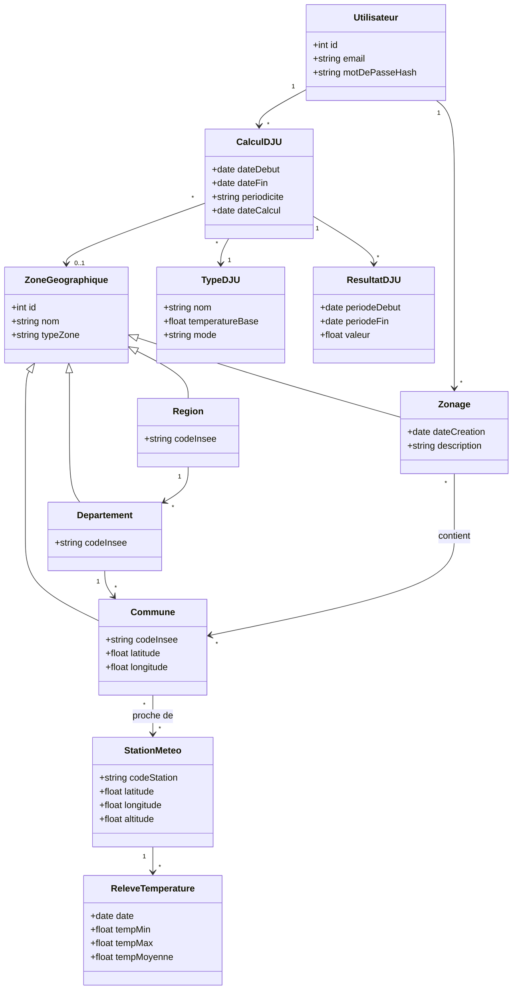

 Diagramme de classes : API DJU 

```mermaid
classDiagram
    class ZoneGeographique {
      +int id
      +string nom
      +string typeZone
    }
    class Region {
      +string codeInsee
    }
    class Departement {
      +string codeInsee
    }
    class Commune {
      +string codeInsee
      +float latitude
      +float longitude
    }
    class Zonage {
      +date dateCreation
      +string description
    }
    class Utilisateur {
      +int id
      +string email
      +string motDePasseHash
    }
    class StationMeteo {
      +string codeStation
      +float latitude
      +float longitude
      +float altitude
    }
    class ReleveTemperature {
      +date date
      +float tempMin
      +float tempMax
      +float tempMoyenne
    }
    class TypeDJU {
      +string nom
      +float temperatureBase
      +string mode
    }
    class CalculDJU {
      +date dateDebut
      +date dateFin
      +string periodicite
      +date dateCalcul
    }
    class ResultatDJU {
      +date periodeDebut
      +date periodeFin
      +float valeur
    }
    ZoneGeographique <|-- Region
    ZoneGeographique <|-- Departement
    ZoneGeographique <|-- Commune
    ZoneGeographique <|-- Zonage
    Region "1" --> "*" Departement
    Departement "1" --> "*" Commune
    Utilisateur "1" --> "*" Zonage
    Zonage "*" --> "*" Commune : contient
    Commune "*" --> "*" StationMeteo : proche de
    StationMeteo "1" --> "*" ReleveTemperature
    CalculDJU "*" --> "1" TypeDJU
    CalculDJU "*" --> "0..1" ZoneGeographique
    CalculDJU "1" --> "*" ResultatDJU
    Utilisateur "1" --> "*" CalculDJU
```
