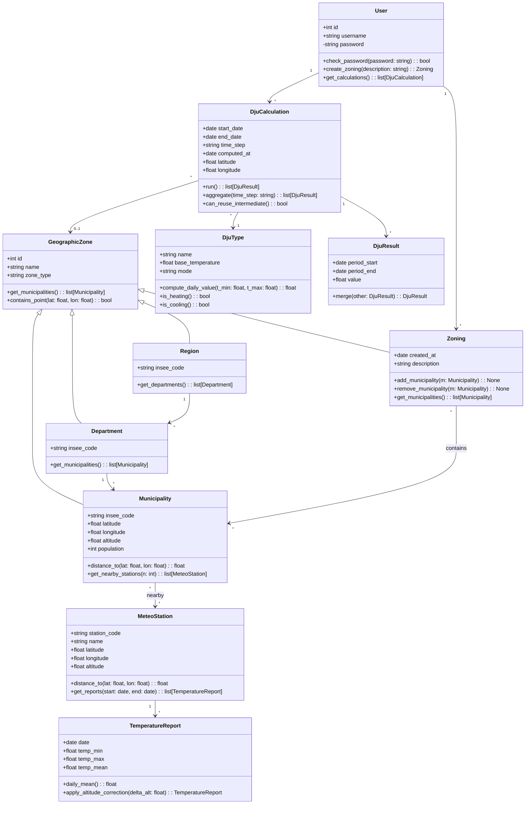

# Class diagram: DJU API

```mermaid
classDiagram
    class GeographicZone {
      +int id
      +string name
      +string zone_type
      +get_municipalities(): list[Municipality]
      +contains_point(lat: float, lon: float): bool
    }
    class Region {
      +string insee_code
      +get_departments(): list[Department]
    }
    class Department {
      +string insee_code
      +get_municipalities(): list[Municipality]
    }
    class Municipality {
      +string insee_code
      +float latitude
      +float longitude
      +float altitude
      +int population
      +distance_to(lat: float, lon: float): float
      +get_nearby_stations(n: int): list[MeteoStation]
    }
    class Zoning {
      +date created_at
      +string description
      +add_municipality(m: Municipality): None
      +remove_municipality(m: Municipality): None
      +get_municipalities(): list[Municipality]
    }
    class User {
      +int id
      +string username
      -string password
      +check_password(password: string): bool
      +create_zoning(description: string): Zoning
      +get_calculations(): list[DjuCalculation]
    }
    class MeteoStation {
      +string station_code
      +string name
      +float latitude
      +float longitude
      +float altitude
      +distance_to(lat: float, lon: float): float
      +get_reports(start: date, end: date): list[TemperatureReport]
    }
    class TemperatureReport {
      +date date
      +float temp_min
      +float temp_max
      +float temp_mean
      +daily_mean(): float
      +apply_altitude_correction(delta_alt: float): TemperatureReport
    }
    class DjuType {
      +string name
      +float base_temperature
      +string mode
      +compute_daily_value(t_min: float, t_max: float): float
      +is_heating(): bool
      +is_cooling(): bool
    }
    class DjuCalculation {
      +date start_date
      +date end_date
      +string time_step
      +date computed_at
      +float latitude
      +float longitude
      +run(): list[DjuResult]
      +aggregate(time_step: string): list[DjuResult]
      +can_reuse_intermediate(): bool
    }
    class DjuResult {
      +date period_start
      +date period_end
      +float value
      +merge(other: DjuResult): DjuResult
    }
    GeographicZone <|-- Region
    GeographicZone <|-- Department
    GeographicZone <|-- Municipality
    GeographicZone <|-- Zoning
    Region "1" --> "*" Department
    Department "1" --> "*" Municipality
    User "1" --> "*" Zoning
    Zoning "*" --> "*" Municipality : contains
    Municipality "*" --> "*" MeteoStation : nearby
    MeteoStation "1" --> "*" TemperatureReport
    DjuCalculation "*" --> "1" DjuType
    DjuCalculation "*" --> "0..1" GeographicZone
    DjuCalculation "1" --> "*" DjuResult
    User "1" --> "*" DjuCalculation
```
