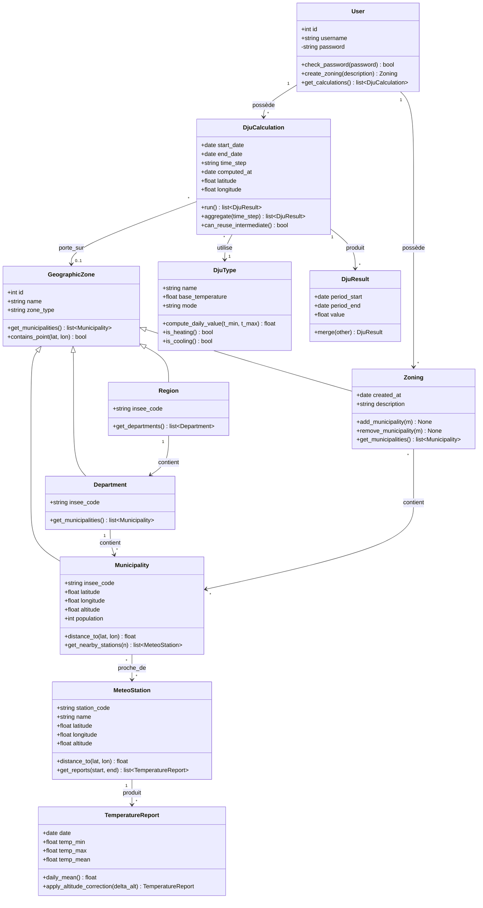

# Diagramme de classes : API DJU

Les identifiants de classes et de méthodes restent ceux du code.
Les libellés d'association sont en français.

```mermaid
classDiagram
    class GeographicZone {
      +int id
      +string name
      +string zone_type
      +get_municipalities() list~Municipality~
      +contains_point(lat, lon) bool
    }
    class Region {
      +string insee_code
      +get_departments() list~Department~
    }
    class Department {
      +string insee_code
      +get_municipalities() list~Municipality~
    }
    class Municipality {
      +string insee_code
      +float latitude
      +float longitude
      +float altitude
      +int population
      +distance_to(lat, lon) float
      +get_nearby_stations(n) list~MeteoStation~
    }
    class Zoning {
      +date created_at
      +string description
      +add_municipality(m) None
      +remove_municipality(m) None
      +get_municipalities() list~Municipality~
    }
    class User {
      +int id
      +string username
      -string password
      +check_password(password) bool
      +create_zoning(description) Zoning
      +get_calculations() list~DjuCalculation~
    }
    class MeteoStation {
      +string station_code
      +string name
      +float latitude
      +float longitude
      +float altitude
      +distance_to(lat, lon) float
      +get_reports(start, end) list~TemperatureReport~
    }
    class TemperatureReport {
      +date date
      +float temp_min
      +float temp_max
      +float temp_mean
      +daily_mean() float
      +apply_altitude_correction(delta_alt) TemperatureReport
    }
    class DjuType {
      +string name
      +float base_temperature
      +string mode
      +compute_daily_value(t_min, t_max) float
      +is_heating() bool
      +is_cooling() bool
    }
    class DjuCalculation {
      +date start_date
      +date end_date
      +string time_step
      +date computed_at
      +float latitude
      +float longitude
      +run() list~DjuResult~
      +aggregate(time_step) list~DjuResult~
      +can_reuse_intermediate() bool
    }
    class DjuResult {
      +date period_start
      +date period_end
      +float value
      +merge(other) DjuResult
    }

    GeographicZone <|-- Region
    GeographicZone <|-- Department
    GeographicZone <|-- Municipality
    GeographicZone <|-- Zoning

    Region "1" --> "*" Department : contient
    Department "1" --> "*" Municipality : contient
    User "1" --> "*" Zoning : possède
    Zoning "*" --> "*" Municipality : contient
    Municipality "*" --> "*" MeteoStation : proche_de
    MeteoStation "1" --> "*" TemperatureReport : produit

    User "1" --> "*" DjuCalculation : possède
    DjuCalculation "*" --> "1" DjuType : utilise
    DjuCalculation "1" --> "*" DjuResult : produit
    DjuCalculation "*" --> "0..1" GeographicZone : porte_sur
```
