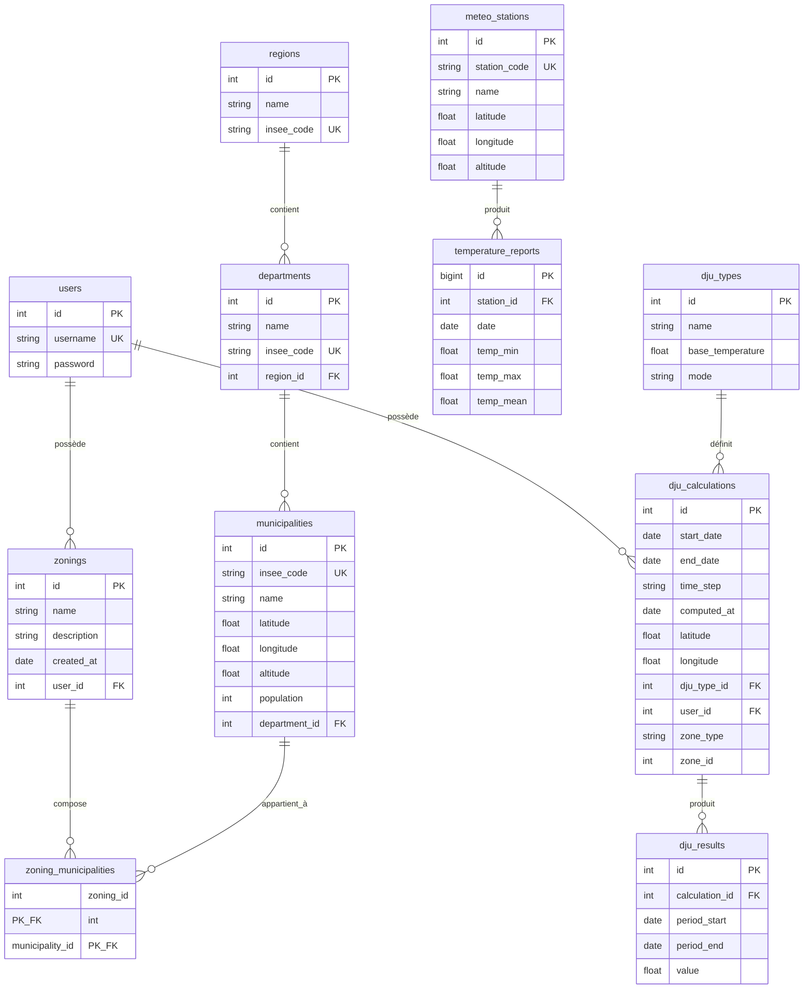

# Modèle de données (entité-relation)

Schéma relationnel aligné sur `data/init_db.sql`. Les noms de tables
suivent le schéma SQL ; les libellés de relations sont en français.

```mermaid
erDiagram
    users ||--o{ zonings : "possède"
    users ||--o{ dju_calculations : "possède"
    regions ||--o{ departments : "contient"
    departments ||--o{ municipalities : "contient"
    zonings ||--o{ zoning_municipalities : "compose"
    municipalities ||--o{ zoning_municipalities : "appartient_à"
    meteo_stations ||--o{ temperature_reports : "produit"
    dju_types ||--o{ dju_calculations : "définit"
    dju_calculations ||--o{ dju_results : "produit"

    users {
        int id PK
        string username UK
        string password
    }

    regions {
        int id PK
        string name
        string insee_code UK
    }

    departments {
        int id PK
        string name
        string insee_code UK
        int region_id FK
    }

    municipalities {
        int id PK
        string insee_code UK
        string name
        float latitude
        float longitude
        float altitude
        int population
        int department_id FK
    }

    zonings {
        int id PK
        string name
        string description
        date created_at
        int user_id FK
    }

    zoning_municipalities {
        int zoning_id PK_FK
        int municipality_id PK_FK
    }

    meteo_stations {
        int id PK
        string station_code UK
        string name
        float latitude
        float longitude
        float altitude
    }

    temperature_reports {
        bigint id PK
        int station_id FK
        date date
        float temp_min
        float temp_max
        float temp_mean
    }

    dju_types {
        int id PK
        string name
        float base_temperature
        string mode
    }

    dju_calculations {
        int id PK
        date start_date
        date end_date
        string time_step
        date computed_at
        float latitude
        float longitude
        int dju_type_id FK
        int user_id FK
        string zone_type
        int zone_id
    }

    dju_results {
        int id PK
        int calculation_id FK
        date period_start
        date period_end
        float value
    }
```
