# Diagramme de classes : API DJU

Le diagramme présente les objets métier et les services de l'API. Les noms de classes, d'attributs et de méthodes sont ceux du code ; les libellés d'association sont en français.

| Couleur | Groupe | Classes |
|---|---|---|
| 🟩 Vert foncé | Services | `DjuService`, `TemperatureService`, `ZoneService`, `AuthService` |
| 🟦 Bleu foncé | Territoire | `GeographicZone`, `Region`, `Department`, `Municipality`, `Zoning` |
| 🟧 Orange foncé | Données météo | `MeteoStation`, `TemperatureReport` |
| 🟪 Violet foncé | Calcul des DJU | `DjuCalculation`, `DjuType`, `DjuResult` |
| ⬛ Gris foncé | Utilisateur | `User` |

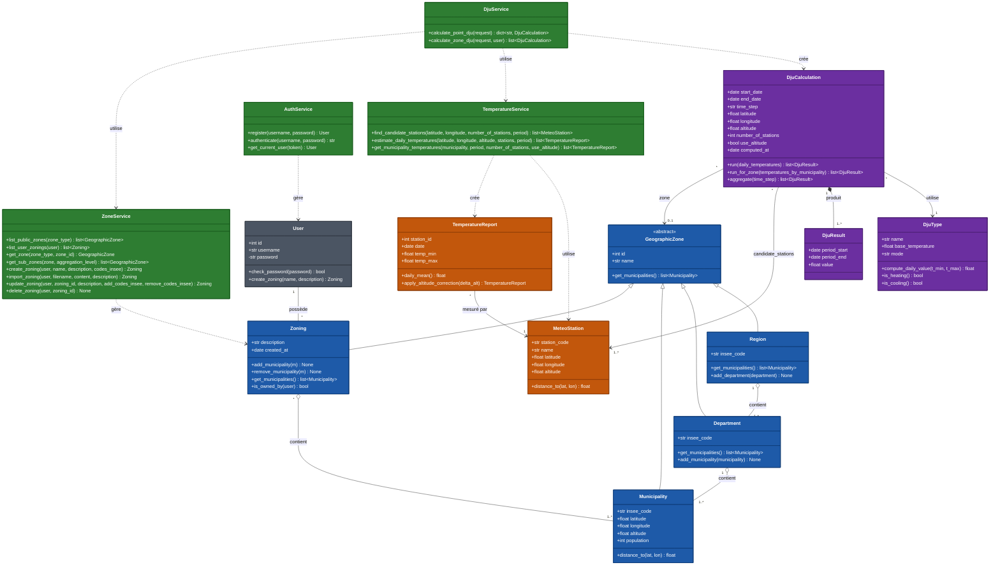

## Explication du diagramme

Les objets métier se répartissent en trois groupes. Le premier décrit le territoire : `GeographicZone` est une classe abstraite dont héritent `Region`, `Department`, `Municipality` et `Zoning`. Toutes exposent `get_municipalities()`, ce qui permet de traiter de la même façon une région, un département ou un zonage personnalisé lors d'un calcul sur un territoire (F3). Une région regroupe des départements, un département regroupe des communes, et un zonage personnalisé regroupe un ensemble libre de communes appartenant à un `User`. Le deuxième groupe décrit les données météorologiques : une `MeteoStation` (position et altitude) et des `TemperatureReport`, qui contiennent les températures minimale et maximale d'un jour. Chaque relevé est rattaché à sa station par `station_id`. Les stations ne conservent pas leurs relevés en mémoire : ceux-ci sont lus en base, uniquement sur la période demandée, par la couche DAO. Le troisième groupe décrit le calcul : un `DjuCalculation` représente une demande (période, pas de temps, lieu, nombre de stations, prise en compte de l'altitude), applique un `DjuType` (chauffage ou climatisation, avec le seuil choisi par l'utilisateur) et produit une liste de `DjuResult`.

Le calcul se fait en trois étapes, réparties entre les classes. `DjuType.compute_daily_value(t_min, t_max)` calcule le DJU d'un jour à partir de la température moyenne (Tmin + Tmax) / 2, comme le prévoit la méthode de référence. `DjuCalculation.run()` applique ce calcul à chaque jour de la période, puis `aggregate(time_step)` additionne les valeurs par jour, semaine, mois ou année. Chaque cumul donne un `DjuResult`, qui associe une valeur à ses bornes de période (`period_start`, `period_end`). Cette classe est indispensable, car la longueur des périodes varie selon le pas de temps et la période demandée. Elle sert aussi à stocker les résultats (FO1) et à construire la réponse de l'API. Un `DjuCalculation` ne porte qu'un seul `DjuType` : lorsque l'utilisateur fournit un seuil de chauffage et un seuil de climatisation, deux calculs sont créés.

Les services organisent ces objets. `DjuService` reçoit la demande transmise par le contrôleur, crée les `DjuType` et les `DjuCalculation`, puis renvoie les résultats : `calculate_point_dju()` traite un point GPS (F1) et renvoie un calcul par type de DJU, indexé par son mode ; `calculate_zone_dju()` traite un territoire (F3) et renvoie un calcul par sous-zone et par type de DJU. `TemperatureService` estime la température du lieu demandé. Il sélectionne d'abord les `number_of_stations` stations les plus proches qui disposent de relevés sur la période (lien `candidate_stations`). Il corrige ensuite les relevés de l'écart d'altitude avec `TemperatureReport.apply_altitude_correction()`, de -0,65 °C par 100 m, uniquement si l'altitude du lieu est connue. Pour un territoire, l'attribut `use_altitude` de `DjuCalculation` indique si cette correction est appliquée aux communes ; il fait partie des paramètres qui distinguent deux calculs stockés. Le service combine enfin les stations par pondération inverse à la distance, avec des distances calculées par la formule de Haversine (`distance_to`). Utiliser plusieurs stations, comme le recommande le sujet, évite de dépendre d'une seule station parfois éloignée, rend la température continue d'un lieu à l'autre et permet de compléter les jours où une station n'a pas de mesure. Le résultat est une suite de `TemperatureReport` estimés, un par jour, que `DjuCalculation` utilise comme des relevés ordinaires. Pour un territoire, `DjuCalculation.run_for_zone()` calcule les DJU de chaque commune, puis les agrège par une moyenne pondérée par la population, comme le fait le service statistique du ministère (Sdes). Les DJU servant à analyser des consommations d'énergie, une commune très peuplée doit peser davantage qu'un village.

`ZoneService` donne accès aux territoires. `list_public_zones()` liste les régions et les départements, accessibles à tous, `list_user_zonings()` les zonages de l'utilisateur connecté, et `get_zone()` retrouve la zone visée par un calcul. `get_sub_zones()` découpe cette zone selon le niveau d'agrégation demandé : une région peut ainsi être calculée d'un seul bloc, département par département ou commune par commune. Les zonages personnalisés (F4) sont créés à partir d'une liste de codes INSEE (`create_zoning()`) ou d'un fichier (`import_zoning()`, FO3), modifiés par ajout et retrait de communes (`update_zoning()`) et supprimés (`delete_zoning()`). Avant toute modification ou suppression, le service vérifie avec `Zoning.is_owned_by()` que le zonage appartient bien à l'utilisateur. `AuthService` gère les comptes : inscription (`register()`), connexion avec délivrance d'un jeton (`authenticate()`) et identification de l'utilisateur à partir de ce jeton (`get_current_user()`).

Les objets métier n'accèdent jamais à la base de données ni aux contrôleurs : ils ne font que des calculs sur leurs propres données, ce qui permet de les tester sans base. Seuls les services font appel à la couche DAO.

## Éléments faux ou à changer dans le code

- **`TemperatureReport`** : `daily_mean()` renvoie `temp_mean` (la valeur TM mesurée par Météo-France) au lieu de (`temp_min` + `temp_max`) / 2, qui est la méthode de référence. Il faut corriger le calcul et retirer l'attribut `temp_mean`. La classe n'a pas non plus d'attribut `station_id`, alors que `TemperatureReportDao` le passe au constructeur : la lecture des relevés échoue.
- **`GeographicZone`** déclare deux fois `id` et `name`, dont une ligne `id; Optional[str]` sans effet. **`Region`** définit deux fois `add_department()`.
- **`DjuCalculation`** :
  - le calcul ponctuel n'utilise que la station la plus proche ;
  - le calcul sur un territoire fait une moyenne simple des communes, sans interpolation entre stations ni pondération par la population.
  
  Il faut `run(daily_temperatures)`, qui reçoit les températures estimées par `TemperatureService`, et `run_for_zone(temperatures_by_municipality)`. Il manque aussi les attributs `altitude`, `number_of_stations` et `use_altitude`. `can_reuse_intermediate()` et `DjuResult.merge()` ne servent plus et peuvent être retirés.
- **Pas de temps** : `_VALID_TIME_STEPS` (dans `dju.py`) et `TimeStep` (dans `dju_schema.py`) n'acceptent pas `week`, alors que le sujet demande des cumuls hebdomadaires.
- **Relevés gardés dans les objets métier** : `MeteoStation.reports` et `get_reports()`, ainsi que `Municipality.stations` et `get_nearby_stations()`, gardent dans les objets des listes que les services doivent lire par la DAO. Ils sont à retirer.
- **`Zoning.is_owned_by()`** n'existe pas.
- **`User`** :
  - `create_zoning(description)` utilise la description comme nom : il faut ajouter le paramètre `name` ;
  - `get_calculations()`, `add_calculation()` et l'attribut `DjuCalculation.owner` sont à retirer si l'équipe ne garde pas d'historique des calculs.
- **Services** : `temperature_service.py`, `zone_service.py` et `auth_service.py` sont vides. `DjuService` ne contient que `calculate_heating_dju()` et `calculate_cooling_dju()`, alors que les contrôleurs appellent `calculate_point_dju()` et `calculate_zone_dju()`.
- **Schémas** :
  - `ZoningCreateRequest` n'a pas de champ `name` ;
  - `DjuZoneRequest` n'a ni `aggregation_level` ni `use_altitude`, deux paramètres exigés par le sujet pour F3 ;
  - la réponse de F3 (`DjuResponse`) ne distingue pas les sous-zones.

## Modifications par rapport à la version précédente

- Ajout des quatre services (`DjuService`, `TemperatureService`, `ZoneService`, `AuthService`), de leurs méthodes et de leurs dépendances vers les objets métier.
- `GeographicZone` devient abstraite. `zone_type` et `contains_point()` sont retirés : le type est donné par la sous-classe, et aucun traitement ne cherche la zone qui contient un point.
- `Region.get_departments()` est remplacé par `get_municipalities()` et `add_department()`. `Department.add_municipality()` est ajouté.
- `Municipality.get_nearby_stations()` et le lien `proche_de` sont retirés : la recherche des stations est faite par `TemperatureService`.
- `Zoning.is_owned_by()` est ajouté pour contrôler l'accès aux zonages personnalisés.
- `User.create_zoning()` reçoit un `name`. `get_calculations()` et le lien entre `User` et `DjuCalculation` sont retirés, car les calculs ne sont pas rattachés à un utilisateur.
- `MeteoStation.get_reports()` est retiré. Le lien entre stations et relevés part désormais de `TemperatureReport` (`station_id`).
- `TemperatureReport.temp_mean` est retiré.
- `DjuCalculation` :
  - ajout de `altitude`, `number_of_stations` et `use_altitude` ;
  - `run()` reçoit les températures ; ajout de `run_for_zone()` et du lien `candidate_stations` ;
  - retrait de `can_reuse_intermediate()`.
- `DjuResult.merge()` est retiré.
- Multiplicités précisées : agrégations `1..*` entre territoires et communes, composition `1..*` entre `DjuCalculation` et `DjuResult`.
- Classes colorées par groupe.

# Modèle de données : API DJU

Le modèle présente les tables de la base PostgreSQL lues et écrites par la couche DAO. Les noms de tables et de colonnes sont ceux du script `data/init_db.sql` ; les libellés de relations sont en français.

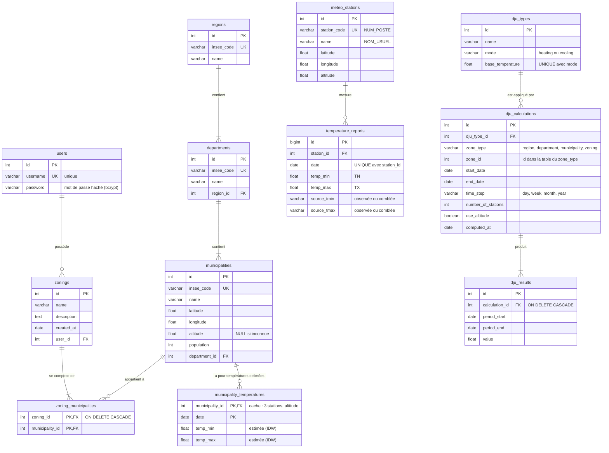

## Explication du modèle de données

### Rôle du modèle

La base de données conserve trois types d'informations : les données de référence (territoire, stations météo et relevés de température), les comptes et zonages des utilisateurs, et les résultats de calcul réutilisables. La couche DAO fait le lien entre ces tables et les objets métier : elle transforme chaque ligne lue en objet (une ligne de `meteo_stations` devient une `MeteoStation`) et, à l'inverse, enregistre les objets dans les tables (un `DjuCalculation` devient une ligne de `dju_calculations` et ses `DjuResult` des lignes de `dju_results`). Les tables correspondent donc aux classes métier, à deux exceptions près : `zoning_municipalities`, qui n'est qu'une table de liaison, et `municipality_temperatures`, qui sert de cache.

### Origine des données

Les données de référence sont chargées une seule fois par l'administrateur (F0), en plusieurs étapes. Le script `init_db.py` télécharge les relevés quotidiens de Météo-France par département, ne garde que les colonnes utiles et les dates à partir de 1990, puis enregistre le tout dans un fichier Parquet. Le script `qualite_meteo.py` relit ce fichier, traite les valeurs manquantes et produit un second fichier Parquet, nettoyé. De son côté, `communes.py` récupère le référentiel des communes (code INSEE, coordonnées, population) et leur altitude. Enfin, `fonction_utiles.py` lit ces fichiers et remplit les tables. Le format Parquet sert donc d'étape intermédiaire entre les scripts : il permet de relancer le nettoyage sans retélécharger plusieurs gigaoctets de données. L'API, elle, ne lit que PostgreSQL. Ce choix donne une seule source de données pendant les calculs, des index pour retrouver rapidement les relevés d'une station sur une période, et des clés étrangères qui garantissent la cohérence entre les tables.

### Territoire et zonages

Les tables `regions`, `departments` et `municipalities` reprennent la hiérarchie administrative : une région contient au moins un département, et un département au moins une commune. Chaque niveau est identifié par son code INSEE, déclaré unique, qui est la clé naturelle utilisée par l'utilisateur et par les fichiers d'import (FO3). La table `municipalities` contient les trois informations nécessaires au calcul sur un territoire (F3) : les coordonnées du centre de la commune, pour estimer sa température, l'altitude, pour corriger cette température, et la population, pour pondérer la moyenne. L'altitude peut être vide lorsque le service d'altimétrie ne l'a pas fournie ; dans ce cas, aucune correction n'est appliquée pour cette commune.

Un zonage personnalisé (F4) appartient à un seul utilisateur, d'où la clé étrangère `user_id` dans `zonings`. Comme un zonage contient plusieurs communes et qu'une commune peut appartenir à plusieurs zonages, la relation passe par la table de liaison `zoning_municipalities`, dont la clé primaire est le couple (`zoning_id`, `municipality_id`) : une commune ne peut donc pas être ajoutée deux fois au même zonage. L'option `ON DELETE CASCADE` supprime automatiquement ces liens lorsqu'un zonage est supprimé.

### Données météo

La table `meteo_stations` décrit les stations ; `station_code` correspond à la colonne `NUM_POSTE` des fichiers Météo-France. La table `temperature_reports` contient un relevé par station et par jour, ce que garantit la contrainte d'unicité sur (`station_id`, `date`). Un index sur ce même couple permet de retrouver rapidement les relevés d'une station sur une période, qui est la requête la plus fréquente de l'application.

Seules les températures minimale (`TN`) et maximale (`TX`) sont stockées. La température moyenne n'est pas enregistrée : la méthode de référence la définit comme (Tmin + Tmax) / 2, et elle est recalculée au moment du calcul des DJU. La stocker reviendrait à garder une information redondante, qui pourrait devenir incohérente. Les colonnes `source_tmin` et `source_tmax` indiquent si chaque valeur a été réellement mesurée ou comblée par `qualite_meteo.py`. Elles assurent la traçabilité du traitement des données manquantes et permettent d'indiquer à l'utilisateur la part de valeurs réellement observées.

### Utilisateurs

La table `users` ne contient que le nom d'utilisateur, déclaré unique, et le mot de passe haché avec bcrypt. Le mot de passe en clair n'est jamais enregistré.

### Choix du cache

Le sujet précise qu'« une grosse partie des calculs sera identique d'une requête à l'autre » et qu'il convient de « conserver les résultats intermédiaires pour pouvoir les réutiliser ». La fonctionnalité optionnelle FO1 demande en outre de conserver les résultats des calculs effectués. Nous ne stockons pas pour autant le résultat de toutes les requêtes : nous ne gardons que ce qui est coûteux à calculer et qui a de bonnes chances d'être réutilisé. Cela donne deux niveaux de cache.

Le premier niveau est la table `municipality_temperatures`, qui contient les températures minimale et maximale estimées pour chaque commune et chaque jour. C'est l'étape la plus coûteuse d'un calcul sur un territoire (F3) : une région compte plusieurs milliers de communes, et l'estimation de chacune demande de lire les relevés de plusieurs stations sur toute la période, puis de les combiner par pondération inverse à la distance. Ces températures ne dépendent ni du seuil, ni du pas de temps, ni du type de DJU : deux demandes aussi différentes que « DJU de chauffage mensuels de la Bretagne à 18 °C » et « DJU de climatisation annuels du Finistère à 22 °C » utilisent exactement les mêmes. C'est donc le résultat intermédiaire le plus réutilisable. Pour limiter le volume, la table n'est pas remplie à l'avance : environ 35 000 communes sur plus de trente ans représenteraient des centaines de millions de lignes. Elle est complétée au fur et à mesure des requêtes, et une commune déjà calculée sur une période n'est plus jamais recalculée. Le cache ne concerne que les paramètres par défaut, à savoir trois stations et la correction d'altitude activée. Ce choix garde une clé simple (commune et date) et un volume raisonnable, puisque la grande majorité des requêtes utilise ces réglages. Une demande avec d'autres paramètres reste possible ; ses températures sont alors calculées sans être stockées.

Le second niveau est formé par les tables `dju_calculations` et `dju_results`, qui conservent les résultats finaux des calculs sur un territoire (FO1). Une ligne de `dju_calculations` décrit un calcul complet : la zone, le type de DJU, la période, le pas de temps, le nombre de stations et la prise en compte de l'altitude. Ces paramètres forment ensemble la clé du cache : si un seul était absent, deux demandes différentes risqueraient de recevoir le même résultat. Chaque `DjuResult` du calcul devient une ligne de `dju_results` (une période et sa valeur). Lorsqu'une demande identique arrive, l'API renvoie directement ces lignes sans rien recalculer. La table `dju_types` enregistre une seule fois chaque couple (mode, seuil), grâce à une contrainte d'unicité, et est partagée par tous les calculs qui l'utilisent.

La zone d'un calcul est désignée par le couple (`zone_type`, `zone_id`), car elle peut être une région, un département, une commune ou un zonage personnalisé, c'est-à-dire des lignes de tables différentes. Ce choix empêche de déclarer une clé étrangère classique : la cohérence est donc assurée par l'application. Lorsqu'un zonage personnalisé est modifié ou supprimé, le service supprime les calculs stockés pour ce zonage, devenus faux ; l'option `ON DELETE CASCADE` supprime alors leurs résultats. Lorsqu'un territoire est calculé avec un niveau d'agrégation plus fin (par exemple une région département par département), chaque sous-zone donne son propre calcul stocké, réutilisable par une demande portant directement sur cette sous-zone.

### Ce qui n'est pas stocké

Trois types de données sont volontairement exclus du stockage. Les calculs ponctuels sur un point GPS (F1) ne sont pas conservés : deux utilisateurs donnent très rarement les mêmes coordonnées, et ces résultats ne seraient presque jamais réutilisés. Les DJU journaliers ne sont pas stockés non plus, car ils dépendent du seuil, qui est libre, et se recalculent par une simple soustraction à partir des températures. Enfin, la liste des stations météo, consultée à chaque requête, est chargée une seule fois en mémoire au démarrage de l'API, ce qui évite de relire la table à chaque calcul.

## Éléments faux ou à changer dans le code

- **`init_db.sql`** :
  - `temperature_reports` contient encore `temp_mean` et n'a pas `source_tmin` ni `source_tmax` ;
  - la table `municipality_temperatures` n'existe pas ;
  - `dju_calculations` contient `latitude`, `longitude` et `user_id`, mais pas `number_of_stations` ni `use_altitude` ;
  - `dju_types` n'a pas de contrainte d'unicité sur (`mode`, `base_temperature`).
- **Tables en double** : `communes` et `meteo_observations` reprennent, sans normalisation, les informations de `municipalities`, `meteo_stations` et `temperature_reports`. Ce sont elles que `fonction_utiles.py` remplit aujourd'hui. Elles sont à supprimer.
- **`communes.py`** ne récupère ni le code INSEE ni la population des communes, ni les noms des départements et des régions. Les tables `municipalities`, `departments` et `regions` ne peuvent donc pas être remplies.
- **`qualite_meteo.py`** traite les valeurs manquantes, mais n'enregistre pas le fichier Parquet nettoyé.
- **`fonction_utiles.py`** retélécharge les données avec `fetch_communes()` et `fetch_meteo_data()` au lieu de lire les fichiers Parquet. Une fois ce script corrigé, `meteo_stations.py` ne sert plus et peut être supprimé.
- **Accès à la base** : `dju_dao.py` est vide, et `GeoZoneDao` ne sait lire que des communes (pas de lecture des régions, des départements ni des zonages, et aucune écriture).

## Modifications par rapport à la version précédente

- `temperature_reports` : colonne `temp_mean` retirée, colonnes `source_tmin` et `source_tmax` ajoutées.
- Nouvelle table `municipality_temperatures`, premier niveau de cache.
- `dju_calculations` :
  - colonnes `latitude`, `longitude` et `user_id` retirées, ainsi que la relation entre `users` et `dju_calculations`, puisque les calculs ponctuels ne sont pas stockés et que les calculs ne sont pas rattachés à un utilisateur ;
  - colonnes `number_of_stations` et `use_altitude` ajoutées pour compléter la clé du cache.
- `dju_types` : unicité du couple (`mode`, `base_temperature`).
- Cardinalités précisées : « un ou plusieurs » (`||--|{`) entre région et départements, entre département et communes, entre zonage et liens, et entre calcul et résultats.
- Colonnes commentées (origine Météo-France, hachage du mot de passe, suppression en cascade) et types SQL réels (`varchar`, `text`) à la place de `string`.

# Diagrammes de séquence

Sept diagrammes couvrent les fonctionnalités F0 à F4 et l'import de zonage (FO3). Chacun représente le scénario principal de la fonctionnalité et ne montre que les échanges entre les couches (contrôleur, services, objets métier, DAO, base de données) ; seul le cas d'erreur le plus important est indiqué. Les appels sont nommés comme dans le code lorsqu'il s'agit des points d'entrée des services, et décrits en langage courant pour les étapes internes.

Par rapport à la version précédente, les noms des points d'entrée sont alignés sur le diagramme de classes et sur les contrôleurs, chaque réponse revient bien à son appelant (la base ne répond plus directement au service), et le cas d'erreur principal est indiqué avec son code HTTP.

## 1. Initialisation des données (F0)

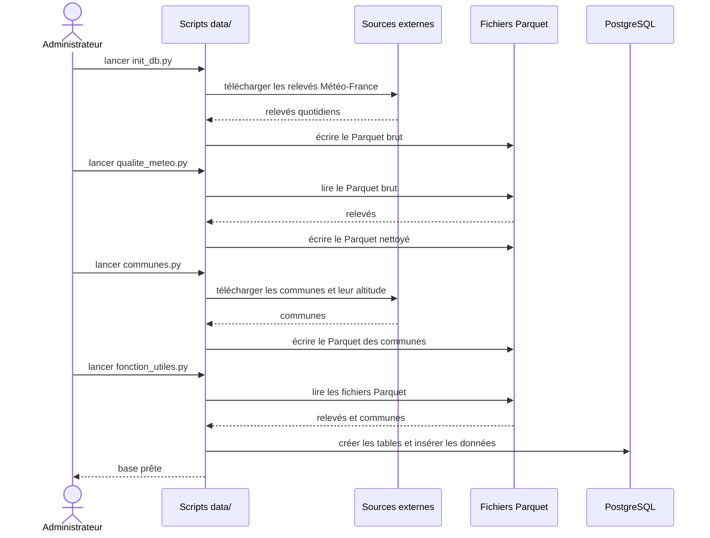

### Explication

L'initialisation est lancée une seule fois par l'administrateur, en dehors de l'API, à l'aide de quatre scripts du dossier `data/`. `init_db.py` télécharge les relevés quotidiens de Météo-France, ne garde que les colonnes utiles et les dates postérieures au 1er janvier 1990, puis les enregistre dans un fichier Parquet brut. `qualite_meteo.py` comble les valeurs manquantes et produit un Parquet nettoyé. `communes.py` récupère le référentiel des communes et leur altitude. Enfin, `fonction_utiles.py` crée les tables et y insère le territoire, les stations et les relevés. Chaque étape écrit son résultat dans un fichier : une erreur dans le nettoyage peut ainsi être corrigée sans retélécharger les données.

### Éléments faux ou à changer dans le code

- `qualite_meteo.py` n'enregistre pas le Parquet nettoyé (son bloc principal affiche seulement des statistiques).
- `communes.py` ne récupère ni le code INSEE, ni la population, ni les noms des départements et des régions.
- `fonction_utiles.py` ne lit pas les fichiers Parquet. Il retélécharge les données (`fetch_communes()`, et `fetch_meteo_data()` de `meteo_stations.py`) et remplit les tables `communes` et `meteo_observations`, au lieu de `regions`, `departments`, `municipalities`, `meteo_stations` et `temperature_reports`.

### Modifications par rapport à la version précédente

- Les fichiers Parquet apparaissent comme étapes intermédiaires, et l'étape de nettoyage (`qualite_meteo.py`) a été ajoutée.
- Les scripts sont nommés dans les messages.
- Les scripts écrivent directement dans PostgreSQL : le passage par la couche DAO de l'API (`save_stations_and_reports`, `save_zones`) a été retiré, car ces méthodes n'existent pas et la DAO sert uniquement à l'API.

## 2. Calcul d'un DJU ponctuel (F1)

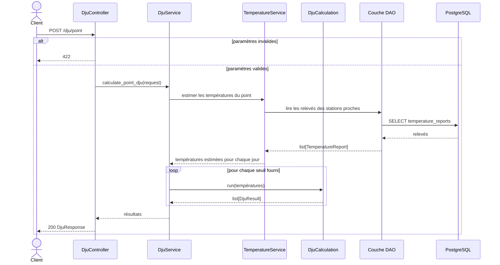

### Explication

Le contrôleur vérifie d'abord le format des paramètres (coordonnées, dates, nombre de stations) et renvoie une erreur 422 s'il est incorrect ; le service renvoie une erreur 400 si aucun seuil n'est fourni ou si les dates sont incohérentes. `DjuService` demande ensuite à `TemperatureService` d'estimer la température du point pour chaque jour de la période. Celui-ci lit les relevés des stations les plus proches, les corrige de l'écart d'altitude lorsque l'altitude du point est fournie et les combine par pondération inverse à la distance. Pour chaque seuil fourni (chauffage, climatisation ou les deux), un `DjuCalculation` calcule les DJU de chaque jour et les cumule selon le pas de temps. Aucun résultat n'est enregistré, car deux requêtes ont très rarement les mêmes coordonnées.

### Éléments faux ou à changer dans le code

- `DjuService.calculate_point_dju()` n'existe pas, et `TemperatureService` est vide.
- Le contrôleur appelle `calculate_point_dju(request, user)` pour rattacher le calcul à l'historique de l'utilisateur. Les calculs ponctuels n'étant pas stockés, le paramètre `user` est à retirer (ou l'équipe décide de garder un historique, et le modèle de données doit alors changer).
- `controllers/dependencies.py`, qui fournit `get_optional_user`, `SERVICE_ERRORS` et `http_error`, n'existe pas : le contrôleur ne peut pas être importé.
- `TemperatureReportDao` crée des `TemperatureReport` avec un `station_id` que la classe ne connaît pas.
- `DjuCalculation` calcule les DJU avec la seule station la plus proche, sans interpolation.
- `TimeStep` n'accepte pas `week`.

### Modifications par rapport à la version précédente

- Tout stockage a été retiré (recherche d'un résultat en cache, sauvegarde de la série et du calcul), conformément au choix de ne pas conserver les calculs ponctuels.
- `TemperatureService` et `DjuCalculation` apparaissent : l'estimation des températures et le calcul des DJU ne sont plus des appels du service à lui-même.
- Ajout de la boucle sur les seuils et du cas d'erreur 422.
- `calculate_point_dju(params)` devient `calculate_point_dju(request)`.

## 3. Consultation des zonages officiels (F2)

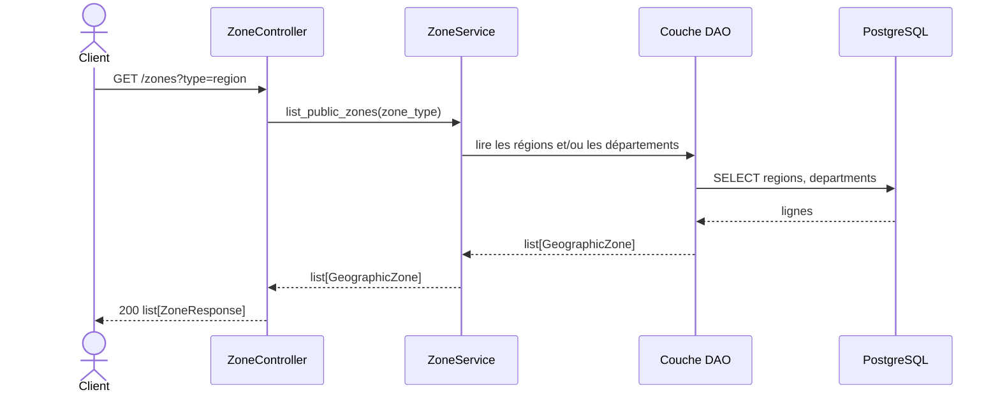

### Explication

Les zonages officiels sont publics : aucune authentification n'est demandée. Le paramètre `type` vaut `department`, `region` ou `all` ; toute autre valeur est refusée par le contrôleur avec une erreur 422. `ZoneService.list_public_zones()` renvoie les zones correspondantes, que le contrôleur transforme en `ZoneResponse`.

### Éléments faux ou à changer dans le code

- `ZoneService` est vide.
- `GeoZoneDao` ne sait pas lire les régions ni les départements.
- `main.py` n'enregistre pas les routeurs de `zone_controller.py` : la route `/zones` n'est pas accessible.

### Modifications par rapport à la version précédente

- Ajout de la valeur `all` et de l'erreur 422.
- L'appel `find_by_type(type)`, qui n'existe pas dans la DAO, est remplacé par la description de l'accès.
- La réponse est typée (`ZoneResponse`).

## 4. Calcul d'un DJU sur un territoire (F3)

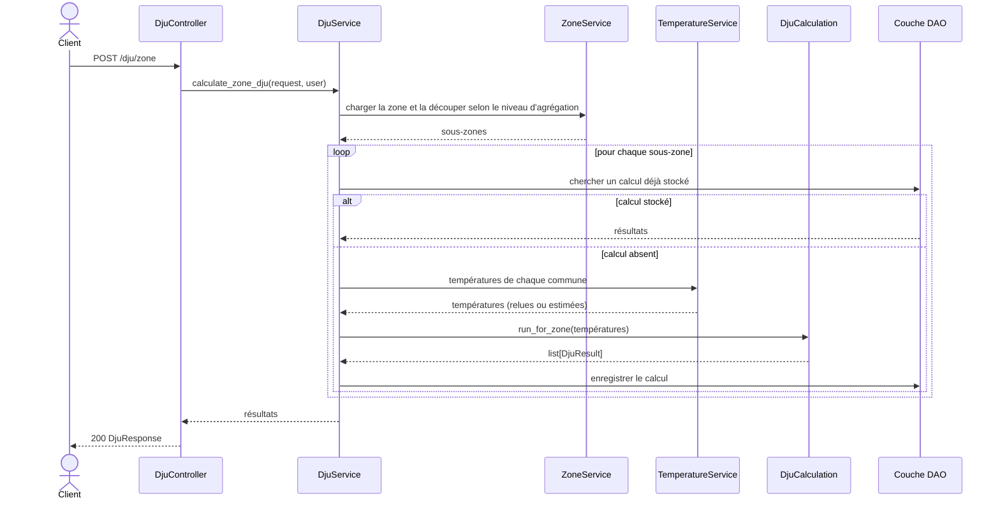

### Explication

La requête précise la zone, la période, les seuils, le pas de temps, le niveau d'agrégation (`aggregation_level`) et l'indicateur d'altitude (`use_altitude`). `ZoneService` charge la zone, vérifie, s'il s'agit d'un zonage personnalisé, que l'utilisateur en est le propriétaire (erreur 401 sans jeton, 403 pour un autre utilisateur, 404 si la zone n'existe pas), puis la découpe selon le niveau d'agrégation : la zone elle-même, ses départements ou ses communes. Pour chaque sous-zone, le service cherche d'abord un calcul déjà stocké avec exactement les mêmes paramètres. S'il n'existe pas, `TemperatureService` fournit les températures de chaque commune, relues dans `municipality_temperatures` lorsqu'elles ont déjà été estimées, et `DjuCalculation.run_for_zone()` calcule les DJU de chaque commune puis les agrège par une moyenne pondérée par la population. Le calcul est enfin enregistré pour les requêtes suivantes.

### Éléments faux ou à changer dans le code

- `DjuService.calculate_zone_dju()` n'existe pas, et `TemperatureService` et `ZoneService` sont vides.
- `DjuZoneRequest` n'a ni `aggregation_level` ni `use_altitude`, deux paramètres demandés par le sujet. Il n'accepte qu'un seul `zone_id`, alors que le sujet cite un « ensemble de régions » comme zone totale : il faut soit accepter une liste, soit passer par un zonage personnalisé.
- `DjuResponse` indexe les résultats par mode seulement : il faut aussi les distinguer par sous-zone.
- `DjuCalculation` fait une moyenne simple des communes avec la seule station la plus proche de chacune, au lieu de l'interpolation et de la pondération par la population.
- `Zoning.is_owned_by()` et `ZoneService.get_sub_zones()` n'existent pas, et `dju_dao.py` est vide.

### Modifications par rapport à la version précédente

- `calculate_zone_dju(zone, params)` devient `calculate_zone_dju(request, user)`.
- `ZoneService` apparaît pour charger la zone, contrôler le propriétaire et découper la zone selon le niveau d'agrégation (ajout de la boucle sur les sous-zones).
- `TemperatureService` et `DjuCalculation` remplacent les appels du service à lui-même (« estimation IDW au centroïde », « Agrégation pondérée »).
- Le participant `PostgreSQL` est retiré pour alléger le diagramme : tous les accès passent par la couche DAO.

## 5. Connexion d'un utilisateur

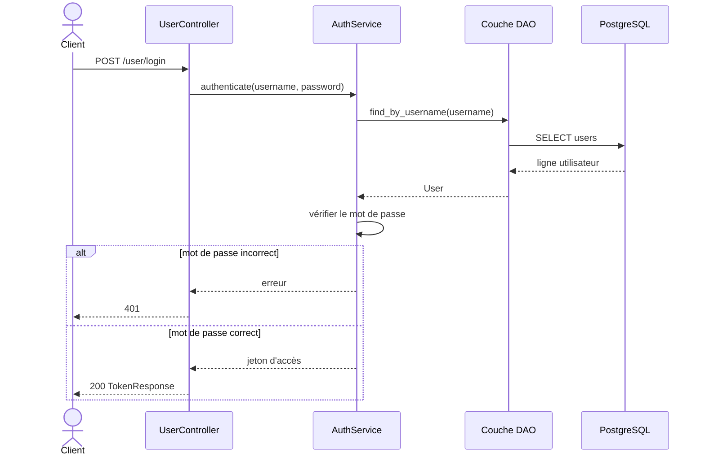

### Explication

`AuthService.authenticate()` retrouve l'utilisateur par son nom, compare le mot de passe reçu au mot de passe haché avec `User.check_password()`, puis renvoie un jeton d'accès. Ce jeton accompagne ensuite les requêtes qui concernent les zonages personnalisés, ce qui permet à l'API d'identifier l'utilisateur. L'inscription (`POST /user/register`, `register()`) suit le même chemin : le service vérifie que le nom est libre, hache le mot de passe avec bcrypt et enregistre le compte (erreur 409 si le nom est déjà pris).

### Éléments faux ou à changer dans le code

- `AuthService` est vide.
- `main.py` n'enregistre pas le routeur de `user_controller.py`.
- `controllers/dependencies.py`, qui doit fournir `get_current_user` et la traduction des erreurs en codes HTTP, n'existe pas.

### Modifications par rapport à la version précédente

- `authenticate(credentials)` devient `authenticate(username, password)`.
- La connexion renvoie un jeton d'accès (`TokenResponse`) au lieu d'une session.
- Ajout du cas d'erreur 401.

## 6. Création d'un zonage personnalisé (F4, FO3)

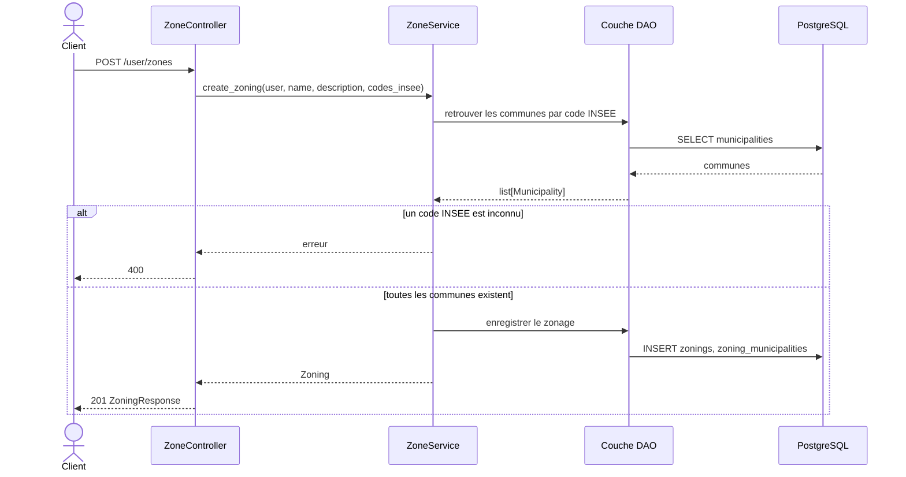

### Explication

L'utilisateur, authentifié par son jeton (erreur 401 sinon), envoie le nom, la description et la liste des codes INSEE de son zonage. `ZoneService` retrouve chaque commune et refuse l'ensemble du zonage avec une erreur 400 si un code est inconnu, afin de ne jamais enregistrer un zonage incomplet. Le zonage est ensuite créé au nom de l'utilisateur (`User.create_zoning()`) et enregistré dans les tables `zonings` et `zoning_municipalities`. L'import depuis un fichier (FO3, `POST /user/zones/import`, `import_zoning()`) suit exactement le même scénario : le service commence simplement par lire les codes INSEE dans le fichier.

### Éléments faux ou à changer dans le code

- `ZoneService` est vide, et aucune méthode de la DAO n'enregistre un zonage.
- `ZoningCreateRequest` et l'appel `create_zoning(user, description, codes_insee)` n'ont pas de `name`, alors que la colonne `zonings.name` est obligatoire.
- `import_zoning(user, filename, content, description)` ne reçoit pas de nom non plus : il faut l'ajouter, ou décider que le nom du fichier sert de nom.
- `User.create_zoning(description)` utilise la description comme nom.

### Modifications par rapport à la version précédente

- Les diagrammes de création (6) et d'import (8) sont réunis, car seule l'obtention des codes INSEE diffère.
- Ajout de la recherche des communes et du cas d'erreur 400.
- `create_zoning(user, description, municipalities)` devient `create_zoning(user, name, description, codes_insee)`.

## 7. Modification ou suppression d'un zonage personnalisé (F4)

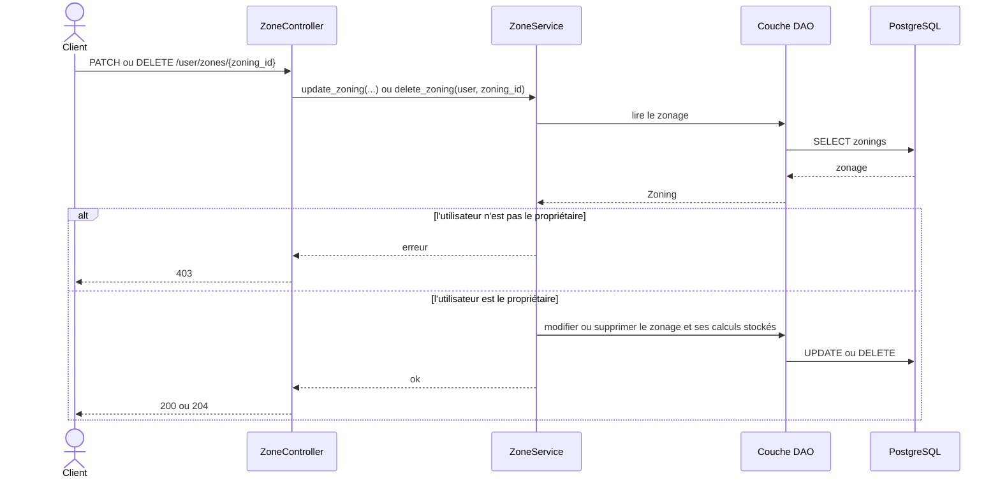

### Explication

Seul le propriétaire d'un zonage peut le modifier ou le supprimer. `ZoneService` charge le zonage puis vérifie avec `Zoning.is_owned_by()` qu'il appartient à l'utilisateur (erreur 403 sinon, 404 si le zonage n'existe pas, 401 sans jeton). Une modification peut changer la description, ajouter des communes et en retirer, par leur code INSEE (`update_zoning(user, zoning_id, description, add_codes_insee, remove_codes_insee)`). Une suppression retire le zonage, et ses liens avec les communes disparaissent automatiquement grâce à `ON DELETE CASCADE`. Dans les deux cas, les calculs stockés pour ce zonage sont supprimés, car ils ne correspondent plus à son contenu.

### Éléments faux ou à changer dans le code

- `ZoneService` est vide, et `Zoning.is_owned_by()` n'existe pas.
- Aucune méthode de la DAO ne lit, ne met à jour ou ne supprime un zonage, ni ne supprime les calculs stockés d'une zone.

### Modifications par rapport à la version précédente

- `get_zoning(id)` est remplacé par `update_zoning()` et `delete_zoning()`, qui sont les appels réels du contrôleur.
- Ajout du contrôle du propriétaire (erreur 403) et de la suppression des calculs stockés.
- Les réponses passent par le service avant de revenir au client.

# Diagrammes d'activité

Les diagrammes d'activité détaillent les étapes et les décisions de chaque traitement. Chacun commence par ses données d'entrée et se termine par le résultat produit ; les méthodes utilisées sont indiquées dans les actions.

Par rapport à la version précédente, tous les diagrammes adoptent les formes de l'UML : nœud initial plein, nœud final cerclé (un par sortie d'erreur), actions aux coins arrondis, losanges pour les décisions et les fusions, conditions entre crochets. Les données d'entrée et de sortie sont représentées, et le flux est vertical pour rester lisible.

## 1. Initialisation des données (F0)

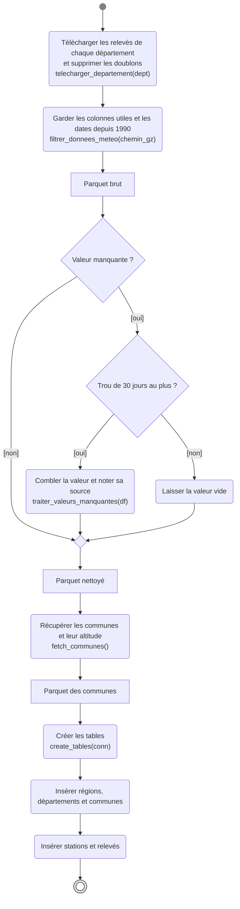

### Explication

**Entrées** : la liste des départements et la date de début (1er janvier 1990). **Sortie** : une base PostgreSQL contenant le territoire, les stations et les relevés.

Le traitement enchaîne trois étapes séparées par des fichiers Parquet : téléchargement et filtrage, nettoyage, puis chargement en base. Lors du nettoyage, chaque valeur manquante est examinée selon la longueur du trou auquel elle appartient. Un trou de 30 jours au plus est comblé, par interpolation pour les trous courts et à l'aide des stations voisines pour les plus longs, et la valeur est marquée comme comblée. Au-delà, la valeur reste vide : l'inventer fausserait les DJU. Le référentiel des communes est récupéré ensuite, puis l'ensemble est inséré dans la base.

### Éléments faux ou à changer dans le code

- `filtrer_donnees_meteo()` garde encore les colonnes `TM` et `TNTXM`, qui ne servent pas au calcul des DJU.
- Les trois défauts de la chaîne relevés pour le diagramme de séquence F0 s'appliquent aussi ici :
  - `qualite_meteo.py` n'enregistre pas le Parquet nettoyé ;
  - `communes.py` ne récupère ni le code INSEE ni la population ;
  - `fonction_utiles.py` ne lit pas les fichiers Parquet et remplit les mauvaises tables.

### Modifications par rapport à la version précédente

- Les deux diagrammes d'initialisation (stations et relevés, zonages officiels) sont réunis, car ils forment une seule chaîne.
- Ajout des fichiers Parquet et de l'étape de nettoyage des valeurs manquantes.
- « Filtrer TN/TX/TM » devient « garder les colonnes utiles » : la température moyenne mesurée (`TM`) n'est pas utilisée.
- La suppression des doublons est intégrée au téléchargement, où elle est réellement faite.

## 2. Estimation des températures d'un lieu

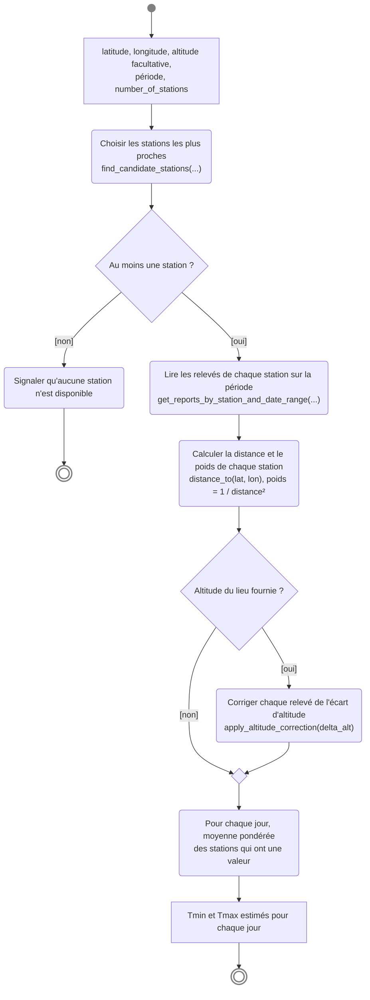

### Explication

**Entrées** : la position du lieu, son altitude si elle est connue, la période et le nombre de stations. **Sortie** : une température minimale et une température maximale estimées pour chaque jour.

Cette activité est commune au calcul ponctuel (F1) et au calcul sur un territoire (F3), qui l'applique au centre de chaque commune. La correction d'altitude n'est appliquée que si l'altitude du lieu est fournie ; elle retire 0,65 °C par 100 m d'écart entre le lieu et la station. Les poids ne dépendent que des distances : ils sont calculés une fois pour toute la période. Lorsqu'une station n'a pas de valeur un jour donné, la moyenne de ce jour est faite sur les autres stations.

### Éléments faux ou à changer dans le code

- `TemperatureService` est vide : aucune interpolation entre stations n'est faite aujourd'hui.
- `find_nearest_stations()` ne vérifie pas que les stations ont des relevés sur la période. Une station fermée peut donc être choisie et ne rien apporter.
- La lecture des relevés échoue à cause de `station_id` (voir le diagramme de classes).

### Modifications par rapport à la version précédente

- La sortie est « Tmin et Tmax » au lieu de « Tmin/Tmax/Tmean ».
- Ajout des entrées, de la lecture des relevés et de la fusion après le choix sur l'altitude.
- Le calcul des poids, fait une seule fois, est séparé de la moyenne journalière.
- Le nœud « Échec » devient un message explicite suivi d'un nœud final.

## 3. Calcul d'un DJU ponctuel (F1)

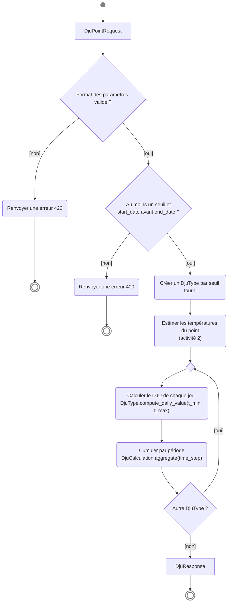

### Explication

**Entrées** : un `DjuPointRequest` (coordonnées, altitude facultative, période, seuils de chauffage et de climatisation facultatifs, nombre de stations, pas de temps). **Sortie** : une `DjuResponse` qui contient, pour chaque type de DJU demandé, la liste des `DjuResult`.

Deux niveaux de validation précèdent le calcul : le format de chaque paramètre, contrôlé automatiquement par le schéma, puis la cohérence entre les paramètres, contrôlée par le service. Les températures sont estimées une seule fois, puis réutilisées pour chaque type de DJU : un calcul avec un seuil de chauffage et un seuil de climatisation ne lit donc les relevés qu'une fois.

### Éléments faux ou à changer dans le code

- `DjuService.calculate_point_dju()` n'existe pas : le contrôle des seuils et des dates n'est écrit nulle part.
- `DjuCalculation` calcule les DJU à partir de la seule station la plus proche.
- Le pas de temps `week` est refusé.

### Modifications par rapport à la version précédente

- La décision « Cache ? » et l'action « Persister » sont retirées : les calculs ponctuels ne sont pas stockés.
- L'erreur de format devient 422 (code renvoyé par FastAPI), et l'erreur 400 est réservée aux incohérences entre paramètres.
- L'action unique « estimate → compute_daily_value → aggregate » est détaillée en étapes, avec une boucle sur les types de DJU.

## 4. Calcul d'un DJU sur un territoire (F3)

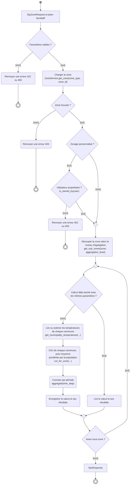

### Explication

**Entrées** : un `DjuZoneRequest` (type et identifiant de la zone, niveau d'agrégation, période, seuils, nombre de stations, indicateur d'altitude, pas de temps) et, pour un zonage personnalisé, le jeton de l'utilisateur. **Sortie** : une `DjuResponse` avec les résultats de chaque sous-zone.

Les contrôles d'accès sont faits avant tout calcul : une zone inexistante, ou un zonage personnalisé demandé par un autre utilisateur que son propriétaire, arrête le traitement. La zone est ensuite découpée selon le niveau d'agrégation, et chaque sous-zone est traitée à son tour. Le calcul utilise les deux niveaux de cache décrits dans le modèle de données : un résultat final déjà stocké est relu directement, et les températures déjà estimées pour une commune sont relues plutôt que recalculées. Les étapes du calcul sont répétées pour chaque type de DJU demandé.

### Éléments faux ou à changer dans le code

- `DjuZoneRequest` n'a ni `aggregation_level` ni `use_altitude`.
- `DjuService.calculate_zone_dju()`, `ZoneService.get_sub_zones()` et `Zoning.is_owned_by()` n'existent pas.
- `DjuCalculation` fait une moyenne simple des communes, sans pondération par la population.

### Modifications par rapport à la version précédente

- Le contrôle du propriétaire est fait avant le chargement des communes, et non après.
- Ajout des erreurs 404 et 401.
- Ajout du découpage selon le niveau d'agrégation et de la boucle sur les sous-zones.
- L'action « DJU communes + agrégation » est détaillée : températures de chaque commune, pondération par la population, cumul par période.
- La décision « Cache ? », qui partageait un nœud avec la fusion, est remplacée par une fusion suivie d'une décision distincte.

## 5. Consultation des zonages officiels (F2)

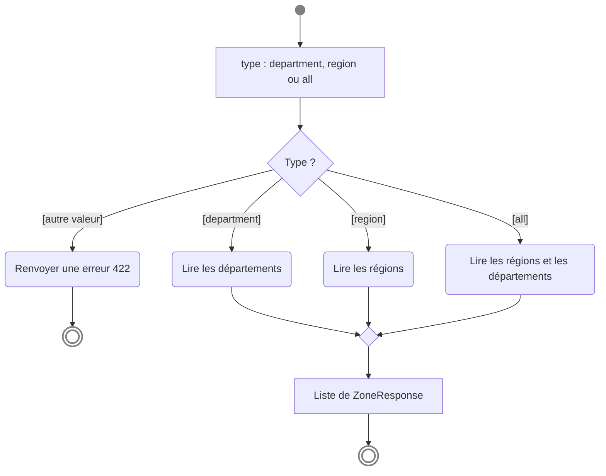

### Explication

**Entrée** : le type de zone souhaité. **Sortie** : la liste des zones correspondantes.

Cette consultation est ouverte à tous et ne modifie aucune donnée. Elle permet à l'utilisateur de connaître les identifiants des régions et des départements avant de lancer un calcul sur un territoire (F3).

### Éléments faux ou à changer dans le code

- `ZoneService.list_public_zones()` n'existe pas, `GeoZoneDao` ne lit ni les régions ni les départements, et la route n'est pas enregistrée dans `main.py`.

### Modifications par rapport à la version précédente

- Ajout de l'entrée, de la sortie, de la fusion et de l'erreur 422 pour un type inconnu.

## 6. Création ou import d'un zonage personnalisé (F4, FO3)

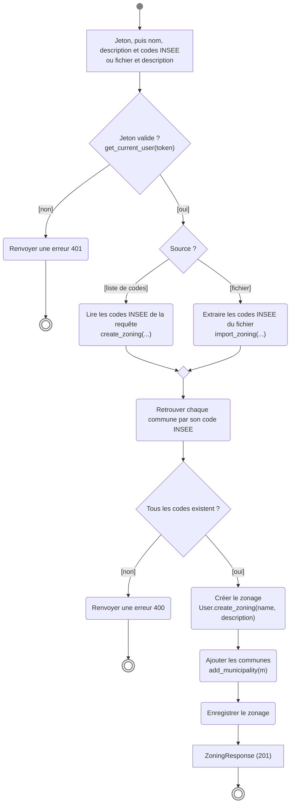

### Explication

**Entrées** : le jeton de l'utilisateur et, selon le cas, une liste de codes INSEE ou un fichier. **Sortie** : le zonage créé.

La création et l'import ne diffèrent que par la façon d'obtenir les codes INSEE ; le reste du traitement est commun. Le zonage n'est enregistré que si toutes les communes existent, ce qui évite de créer un zonage partiellement faux sans que l'utilisateur s'en aperçoive.

### Éléments faux ou à changer dans le code

- Le nom du zonage manque dans `ZoningCreateRequest`, dans `import_zoning()` et dans `User.create_zoning()`.
- `ZoneService` est vide, et aucune méthode de la DAO n'enregistre un zonage.

### Modifications par rapport à la version précédente

- Le nom du zonage est ajouté aux entrées, et la méthode `User.create_zoning()` est indiquée.
- L'action « Résoudre communes » est détaillée : recherche par code INSEE puis contrôle de l'existence de tous les codes.
- L'ajout des communes (`add_municipality`) et l'enregistrement deviennent des étapes distinctes.

## 7. Modification ou suppression d'un zonage personnalisé (F4)

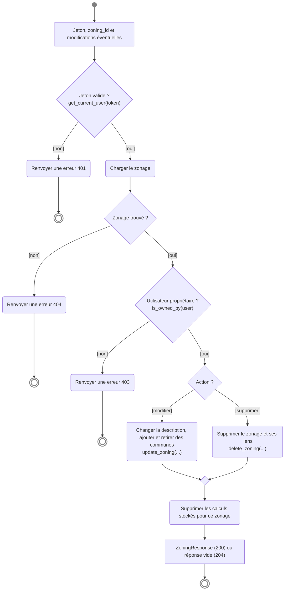

### Explication

**Entrées** : le jeton de l'utilisateur, l'identifiant du zonage et, pour une modification, la nouvelle description et les codes INSEE à ajouter ou à retirer. **Sortie** : le zonage modifié, ou une réponse vide après une suppression.

Les trois contrôles (authentification, existence, propriété) sont faits dans cet ordre, avant toute modification. La dernière étape est commune aux deux actions : les résultats stockés pour l'ancien contenu du zonage sont supprimés, pour qu'un calcul ultérieur ne renvoie jamais un résultat qui ne correspond plus aux communes du zonage.

### Éléments faux ou à changer dans le code

- `Zoning.is_owned_by()` n'existe pas, `ZoneService` est vide, et aucune méthode de la DAO ne met à jour ou ne supprime un zonage ni ses calculs stockés.

### Modifications par rapport à la version précédente

- Ajout de l'erreur 404, de la fusion après le choix de l'action et de la suppression des calculs stockés.
- La modification d'un zonage peut aussi changer sa description (et pas seulement ses communes), comme le permet `update_zoning()`.
