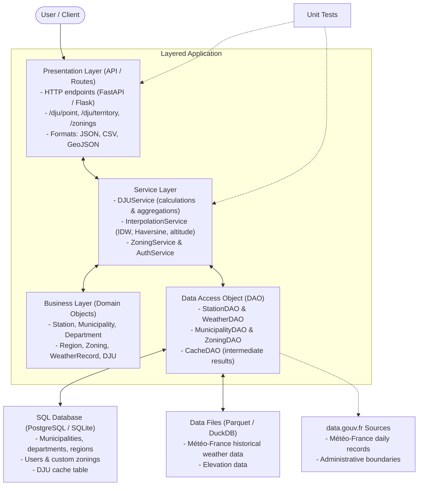

```mermaid
graph TD
    User([User / Client]) --> PresentationLayer

    subgraph Application ["Layered Application"]
        PresentationLayer["Presentation Layer (API / Routes)<br/>- HTTP endpoints (FastAPI / Flask)<br/>- /dju/point, /dju/territory, /zonings<br/>- Formats: JSON, CSV, GeoJSON"]
        
        ServiceLayer["Service Layer<br/>- DJUService (calculations & aggregations)<br/>- InterpolationService (IDW, Haversine, altitude)<br/>- ZoningService & AuthService"]
        
        BusinessLayer["Business Layer (Domain Objects)<br/>- Station, Municipality, Department<br/>- Region, Zoning, WeatherRecord, DJU"]
        
        DAO["Data Access Object (DAO)<br/>- StationDAO & WeatherDAO<br/>- MunicipalityDAO & ZoningDAO<br/>- CacheDAO (intermediate results)"]

        PresentationLayer <--> ServiceLayer
        ServiceLayer <--> BusinessLayer
        ServiceLayer <--> DAO
    end

    SQL["SQL Database (PostgreSQL / SQLite)<br/>- Municipalities, departments, regions<br/>- Users & custom zonings<br/>- DJU cache table"]
    DataFiles["Data Files (Parquet / DuckDB)<br/>- Météo-France historical weather data<br/>- Elevation data"]
    DataGouv["data.gouv.fr Sources<br/>- Météo-France daily records<br/>- Administrative boundaries"]
    Tests["Unit Tests"]

    DAO <--> SQL
    DAO <--> DataFiles
    DAO -.-> DataGouv
    
    Tests -.-> PresentationLayer
    Tests -.-> ServiceLayer
```