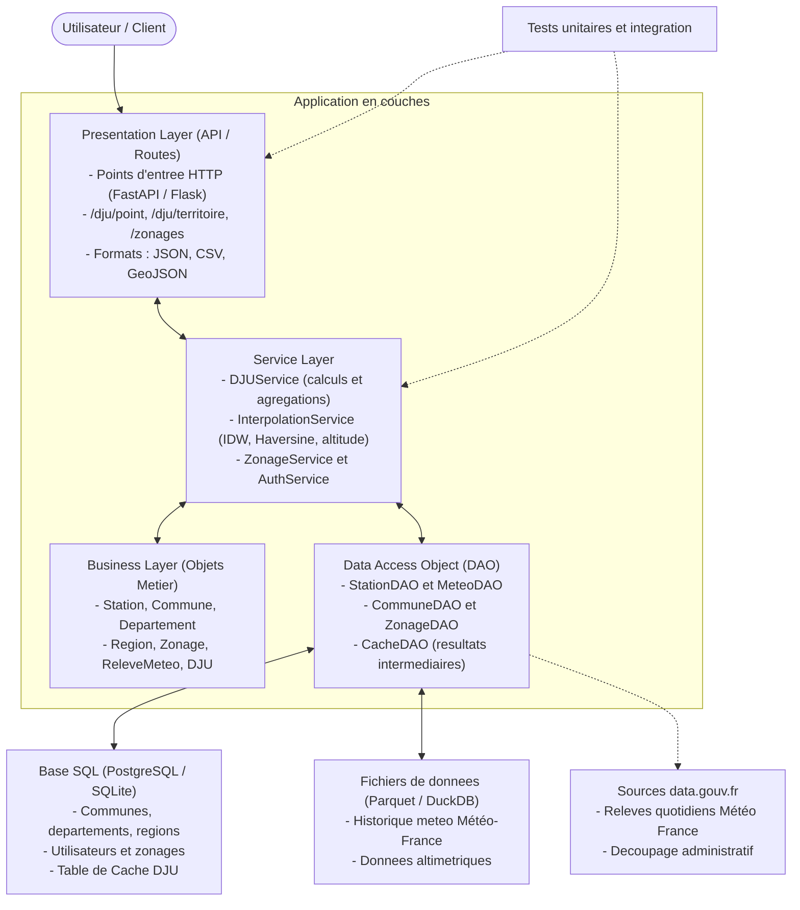

```mermaid
graph TD
    User([Utilisateur / Client]) --> PresentationLayer

    subgraph Application ["Application en couches"]
        PresentationLayer["Presentation Layer (API / Routes)<br/>- Points d'entree HTTP (FastAPI / Flask)<br/>- /dju/point, /dju/territoire, /zonages<br/>- Formats : JSON, CSV, GeoJSON"]
        
        ServiceLayer["Service Layer<br/>- DJUService (calculs et agregations)<br/>- InterpolationService (IDW, Haversine, altitude)<br/>- ZonageService et AuthService"]
        
        BusinessLayer["Business Layer (Objets Metier)<br/>- Station, Commune, Departement<br/>- Region, Zonage, ReleveMeteo, DJU"]
        
        DAO["Data Access Object (DAO)<br/>- StationDAO et MeteoDAO<br/>- CommuneDAO et ZonageDAO<br/>- CacheDAO (resultats intermediaires)"]

        PresentationLayer <--> ServiceLayer
        ServiceLayer <--> BusinessLayer
        ServiceLayer <--> DAO
    end

    SQL["Base SQL (PostgreSQL / SQLite)<br/>- Communes, departements, regions<br/>- Utilisateurs et zonages<br/>- Table de Cache DJU"]
    DataFiles["Fichiers de donnees (Parquet / DuckDB)<br/>- Historique meteo Météo-France<br/>- Donnees altimetriques"]
    DataGouv["Sources data.gouv.fr<br/>- Releves quotidiens Météo France<br/>- Decoupage administratif"]
    Tests["Tests unitaires et integration"]

    DAO <--> SQL
    DAO <--> DataFiles
    DAO -.-> DataGouv
    
    Tests -.-> PresentationLayer
    Tests -.-> ServiceLayer
```