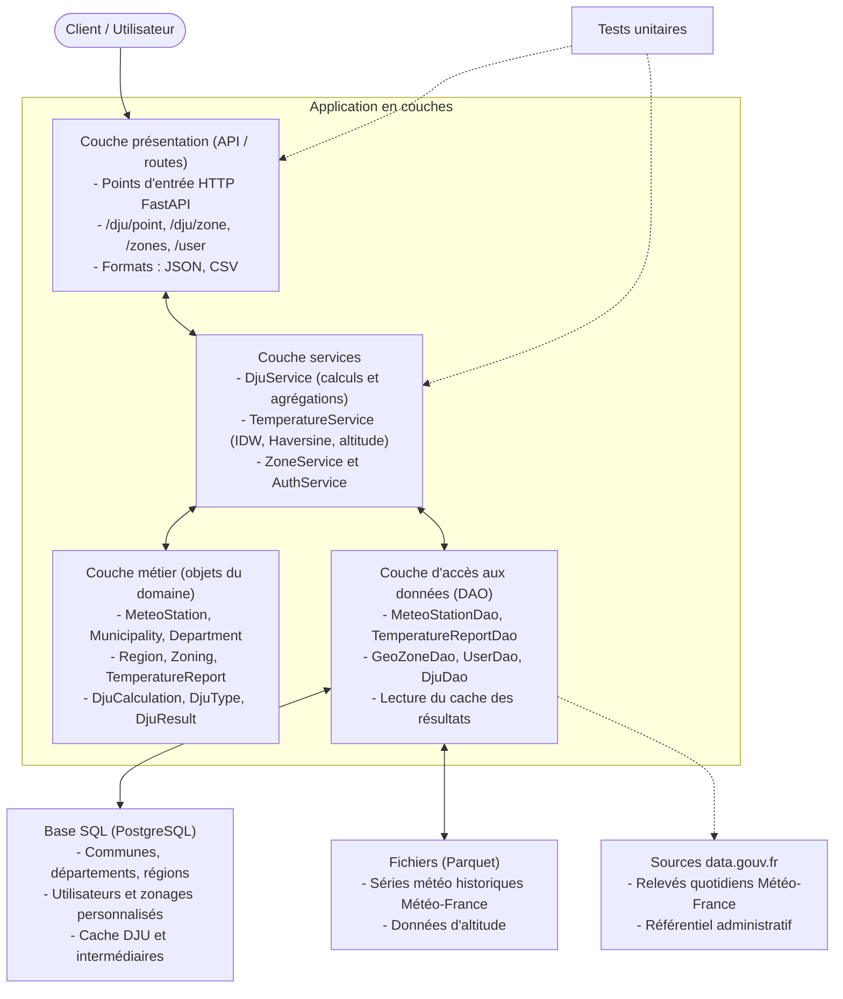

# Diagramme de packages

```mermaid
graph TD
    Client([Client / Utilisateur]) --> PresentationLayer

    subgraph Application ["Application en couches"]
        PresentationLayer["Couche présentation (API / routes)<br/>- Points d'entrée HTTP FastAPI<br/>- /dju/point, /dju/zone, /zones, /user<br/>- Formats : JSON, CSV"]

        ServiceLayer["Couche services<br/>- DjuService (calculs et agrégations)<br/>- TemperatureService (IDW, Haversine, altitude)<br/>- ZoneService et AuthService"]

        BusinessLayer["Couche métier (objets du domaine)<br/>- MeteoStation, Municipality, Department<br/>- Region, Zoning, TemperatureReport<br/>- DjuCalculation, DjuType, DjuResult"]

        DAO["Couche d'accès aux données (DAO)<br/>- MeteoStationDao, TemperatureReportDao<br/>- GeoZoneDao, UserDao, DjuDao<br/>- Lecture du cache des résultats"]

        PresentationLayer <--> ServiceLayer
        ServiceLayer <--> BusinessLayer
        ServiceLayer <--> DAO
    end

    SQL["Base SQL (PostgreSQL)<br/>- Communes, départements, régions<br/>- Utilisateurs et zonages personnalisés<br/>- Cache DJU et intermédiaires"]
    DataFiles["Fichiers (Parquet)<br/>- Séries météo historiques Météo-France<br/>- Données d'altitude"]
    DataGouv["Sources data.gouv.fr<br/>- Relevés quotidiens Météo-France<br/>- Référentiel administratif"]
    Tests["Tests unitaires"]

    DAO <--> SQL
    DAO <--> DataFiles
    DAO -.-> DataGouv

    Tests -.-> PresentationLayer
    Tests -.-> ServiceLayer
```
