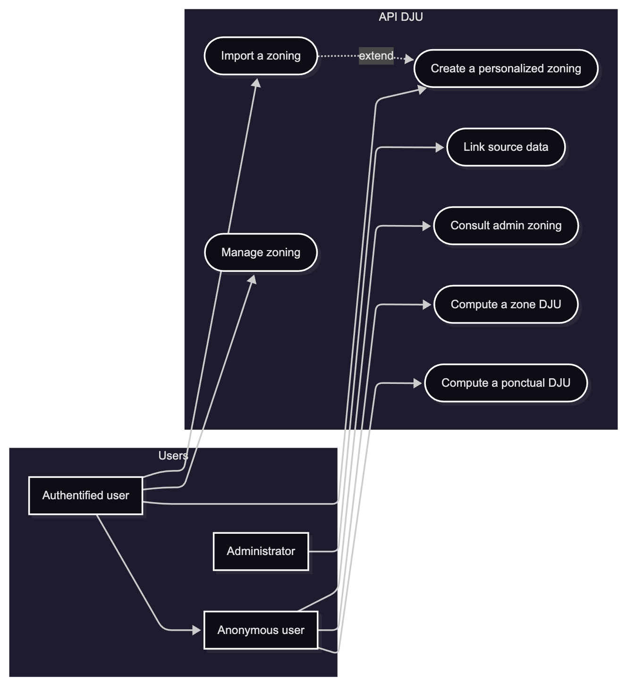
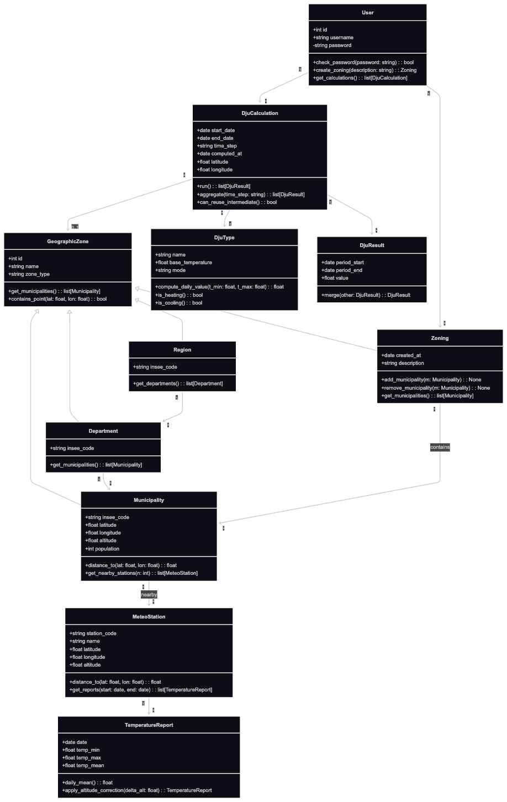
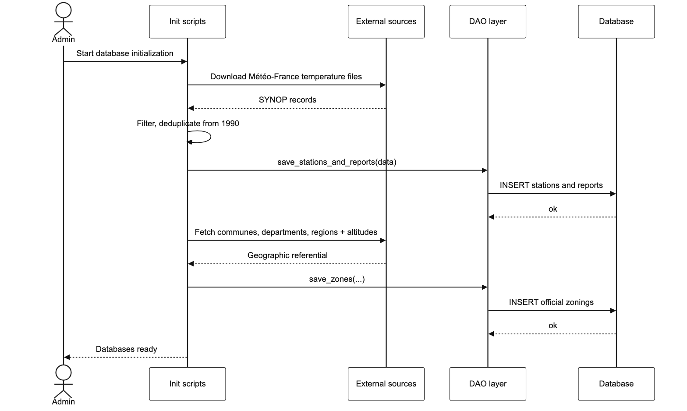
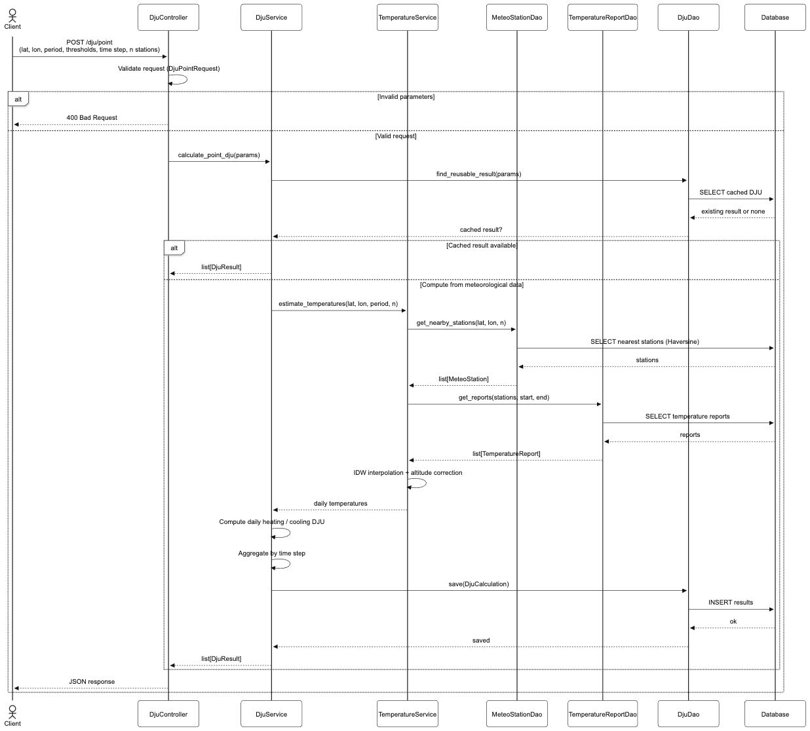
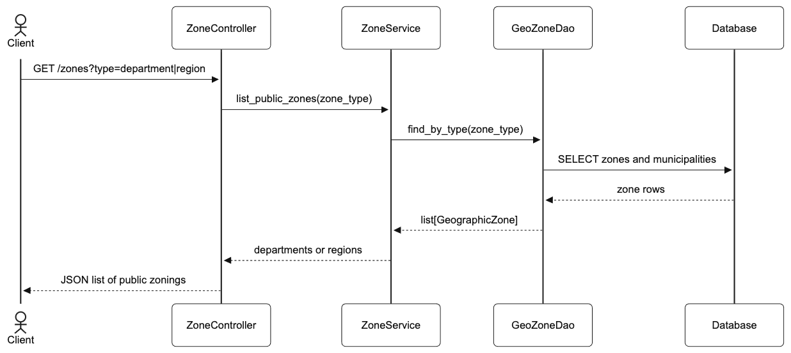
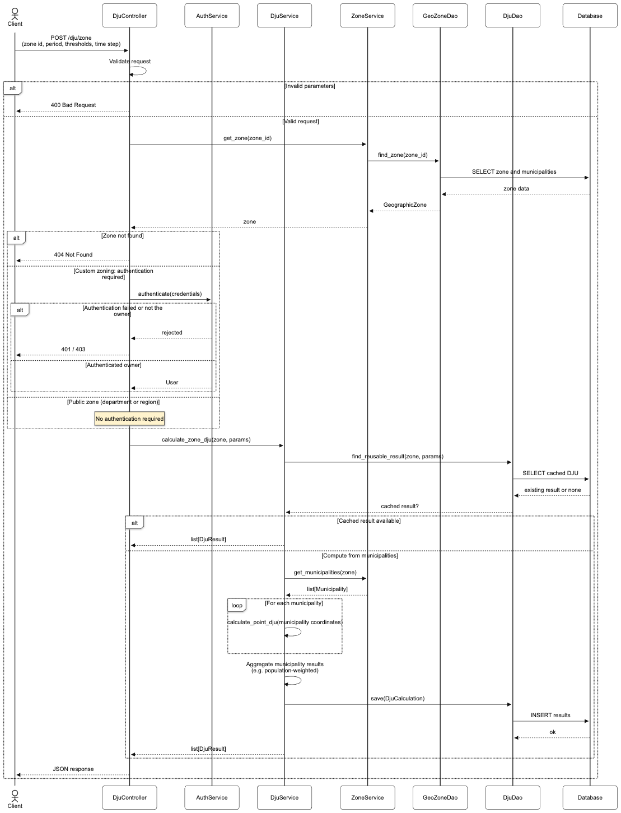
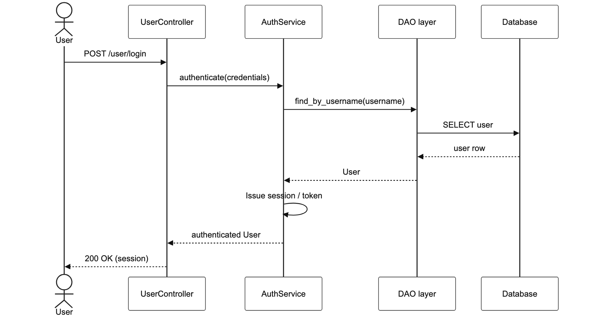
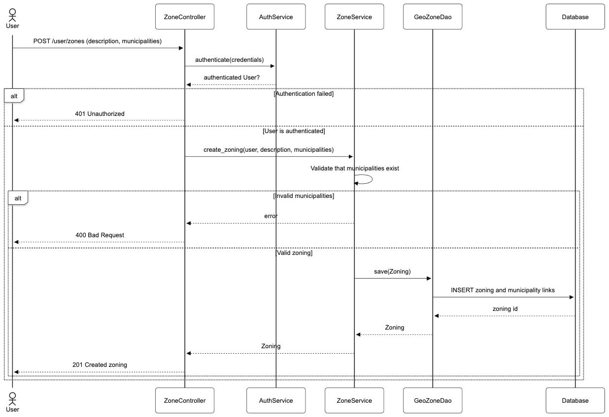
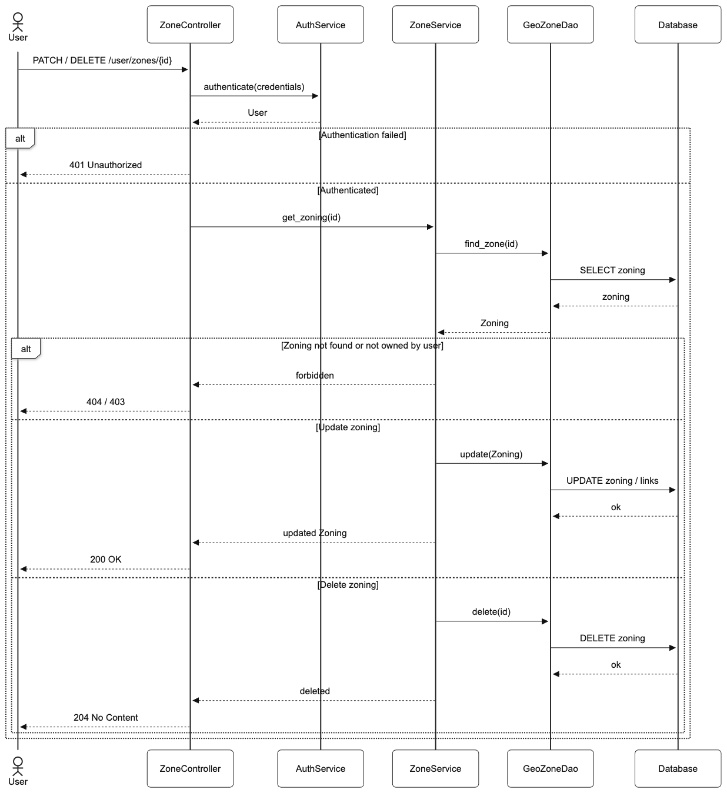
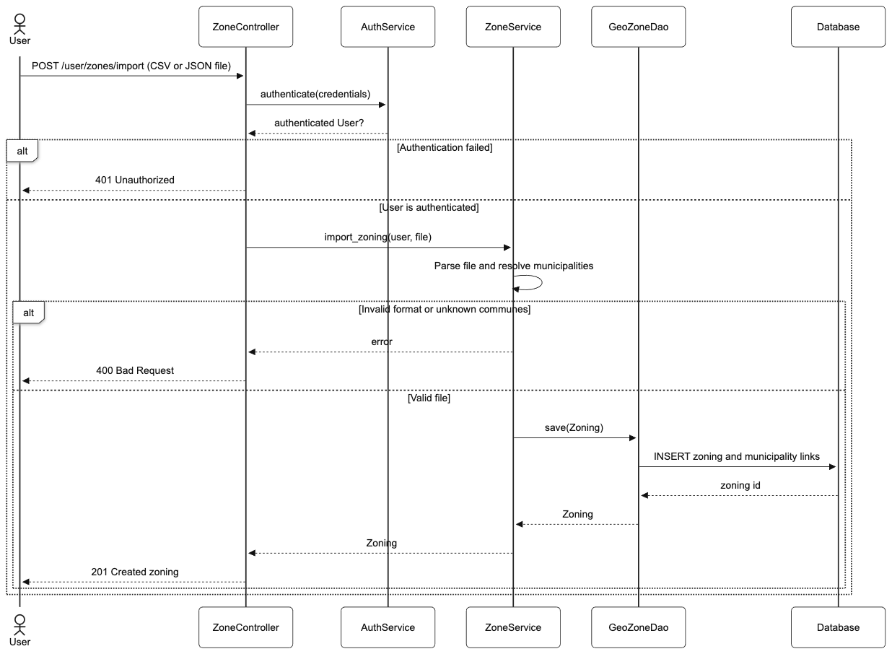

<!-- Partie document -->

\begin{titlepage}
\centering

\begin{flushright}
\tiny Campus de Ker Lann rue Blaise Pascal\\
BP37203 35172 BRUZ CEDEX\\
Tél : +33 (0) 2 99 05 32 32\\
communication@ensai.fr\\
www.ensai.fr\\
\end{flushright}

\includegraphics{resources/ensai_logo.png}\\
\vspace{1.0cm}

{\LARGE\textsc{Rapport Intermédiaire}}\\
\vspace{0.3cm}
{\LARGE Dossier d'Analyse}\\

\vspace{2.5cm}

\rule{\textwidth}{0.5mm}\\
\vspace{0.8cm}

\begin{flushleft}
\emph{Sujet :}\\
\textbf{API de calcul de DJU}\\
\end{flushleft}

\vspace{0.8cm}
\rule{\textwidth}{0.5mm}\\

\vspace{2.5cm}

\begin{flushleft}
\emph{Groupe 12 :}\\
\textbf{Aziz Yousfi}\\
\textbf{Eudes Sterlin}\\
\textbf{Gabriel Dahan}\\
\textbf{Gwenaël Lassalle}\\
\textbf{Marceau Feral}
\end{flushleft}

\begin{flushright}
\emph{Tuteur :}\\
\textbf{Thierry Mathé}\\
\end{flushright}

\vfill 
\begin{center}
ENSAI\\
2026--2027
\end{center}
\end{titlepage}

\tableofcontents

# Introduction {.unnumbered}

Dans les secteurs résidentiel et tertiaire, les consommations d’énergie sont liées aux conditions météorologiques, principalement en raison des besoins de chauffage en hiver et de climatisation en été. Cependant, cette forte thermosensibilité complique considérablement l’analyse des données énergétiques au fil des années. En effet, face à une baisse ou à une hausse des consommations observées, il est difficile de faire la part entre l’impact direct des variations de températures et celui de facteurs structurels ou comportementaux (comme la rénovation thermique des bâtiments, le remplacement de chaudières énergivores ou l'évolution des habitudes des usagers).

Afin de corriger cet effet météo et d’évaluer objectivement l'efficacité énergétique, le Degré Jour Unifié (DJU) s’impose comme l’indicateur de référence. En mesurant l’écart quotidien entre la température extérieure et un seuil de confort thermique donné, les DJU permettent d’estimer la rigueur du climat et de calculer des consommations corrigées des variations climatiques (CVC). Cette correction permet de s'affranchir du biais météorologique pour n’observer que les véritables évolutions de la performance énergétique.

C’est dans ce contexte que s’inscrit notre projet. Il a pour but de concevoir et de développer une application sous forme d'API performante et modulaire, capable de calculer et d’agréger automatiquement les DJU. L’utilisateur doit pouvoir interroger le système aussi bien sur un point précis repéré par ses coordonnées géographiques (via une méthode d'interpolation spatiale et altimétrique à partir des stations Météo-France) que sur des découpages territoriaux administratifs (communes, départements, régions) ou sur des zonages personnalisés.

Dans un premier temps, nous détaillerons le cahier des charges, en précisant le périmètre du système, les besoins fonctionnels et les contraintes techniques. Dans un second temps, nous présenterons la conception générale et l'architecture logicielle de notre application à travers les différents diagrammes de modélisation et la structuration des bases de données.

# Organisation

Cette partie est consacrée au pilotage du projet. Elle formalise les spécifications du cahier des charges, justifie les choix fonctionnels de l'application et présente l'organisation du travail en groupe.

## Cahier des charges

**Fonctionnalités de base**

Les fonctionnalités minimales de l'application sont :

- La création des bases de données à partir des relevés de température des stations de Météo France et du référentiel des communes disponibles sur data.gouv.fr
- Le calcul des DJU localisés sur une période et une périodicité donnée. Par exemple calcul des DJU mensuels du 1er janvier 2010 au 31 décembre 2025.
- Intégrer les zonages Département, Région pour tous les utilisateurs
- Le calcul des DJU sur un territoire avec une granularité, une période et une périodicité données. Par exemple calculer les DJU annuels des départements d'Ile-de-France du 1er janvier.
- Permettre à un utilisateur authentifié de créer et de conserver ses propres zonages constitués d'ensemble de commune.

**Fonctionnalités optionnelles**

Les fonctionnalités optionnelles de l'application sont :

- Conserver les résultats des calculs effectués
- Mise en forme des résultats sous différents formats
- Importer des zonages à partir de fichiers csv, json

## Questionnement et choix 

La mise en place de l’architecture et du moteur de calcul a nécessité de répondre à plusieurs problématiques techniques et méthodologiques dès la phase de conception. Celles-ci concernent l’authentification des utilisateurs, le stockage et le format des données massives, les méthodes géométriques d’estimation des températures, ainsi que les stratégies de mise en cache.

Le premier questionnement a porté sur la gestion des droits et l’accès à l’API : fallait-il concevoir une application totalement ouverte ou intégrer un système de comptes authentifiés ? Contrairement aux fonctionnalités de consultation pure des DJU (ponctuels ou par divisions administratives standard comme les départements et régions) qui doivent rester accessibles de manière directe, le cahier des charges impose de permettre à un utilisateur de sauvegarder ses propres découpages territoriaux. Nous avons donc arbitré en faveur d'un système à double niveau :  

 - Un accès public ("visiteur") : permettant d'effectuer un calcul ponctuel (coordonnées GPS) ou territorial standard sans contrainte d'authentification.  

 - Un accès authentifié ("utilisateur enregistré") : permettant à l'utilisateur de créer, consulter, modifier et supprimer ses zonages personnalisés sans interférer avec les données des autres usagers.  
 
Le second questionnement a concerné l’ingestion et la persistance des relevés de température issus de Météo-France. Les fichiers sources départementaux représentent un volume considérable de données compressées au format CSV. L'utilisation directe de ces fichiers bruts à chaque requête aurait provoqué des temps de latence.

Pour les données de référence géographiques et la gestion des comptes/zonages utilisateurs, nous avons opté pour une base de données relationnelle SQL (accessible via notre couche DAO), garantissant l'intégrité référentielle des communes et des utilisateurs.  Pour les séries temporelles de températures, la conversion vers un format analytique optimisé (fichiers Parquet indexés par station et par date) a été privilégiée pour accélérer les opérations de filtrage temporel et de jointures spatiales.  

De plus, ces jeux de données comportent des valeurs manquantes. Nous avons décidé d'appliquer une interpolation temporelle locale sur les relevés immédiatement voisins pour combler des absences ponctuelles quand cela sera possible.
 
Il est rare de disposer d'une station météo sur place pour évaluer la température en un point donné. Le calcul nécessite donc d'interpoler les valeurs mesurées par les stations environnantes.  

Les coordonnées étant fournies sous forme de latitude et longitude, nous utiliserons la méthode d'Haversine pour calculer les distances. Ensuite, la méthode de pondération inverse des distances a été choisie pour affecter un poids prépondérant aux stations les plus proches. Enfin, pour respecter la réalité physique du climat, nous avons intégré la correction altimétrique standard préconisée, consistant à soustraire 0,65 °C par tranche de 100 mètres d'élévation entre les stations et le point cible.

Enfin, le dernier point critique concerne le coût en calcul des agrégations géographiques. Calculer les DJU d'une région ou d'un département implique d'estimer les DJU de chaque commune membre, puis de pondérer ces valeurs par la population communale respective. Répéter cette série de calculs pour des requêtes identiques sur les mêmes périodes aurait saturé le serveur.  Nous avons donc fait le choix de concevoir un mécanisme de cache et de persistance des résultats intermédiaires : les températures quotidiennes interpolées par commune ainsi que les agrégations annuelles ou mensuelles standard sont conservées après leur premier calcul, transformant les requêtes ultérieures en de simples lectures optimisées en base de données.  

## Description des fonctionnalités

La première fonctionnalité de notre application consiste en l’ingestion et la structuration des données sources nécessaires aux calculs. L’application doit pouvoir charger, nettoyer et intégrer deux grands ensembles de données ouverts issus de data.gouv.fr : d'une part, les relevés climatologiques quotidiens des stations de Météo-France (températures minimales, maximales, coordonnées géographiques et altitudes), et d'autre part, le référentiel administratif et démographique des communes françaises. Cette étape préliminaire constitue le socle indispensable au fonctionnement du moteur de calcul.

Sur cette base, le cœur de l’application repose sur le calcul des DJU ponctuels. À partir de coordonnées géographiques (latitude, longitude, altitude), le système évalue la température locale via une interpolation spatiale par pondération inverse des distances prenant en compte les stations météo environnantes. L'utilisateur peut alors paramétrer les seuils de confort thermique souhaités (par exemple 15 °C ou 18 °C pour le chauffage, et un seuil dédié pour la climatisation) ainsi que l'horizon temporel (dates de début et de fin) et le pas d'agrégation temporelle (cumuls quotidiens, mensuels ou annuels).

L’application propose également une dimension d’agrégation territoriale. En effet, l’utilisateur doit pouvoir obtenir les DJU d’un territoire administratif complet (départements, régions ou France métropolitaine). Le calcul ne s’effectue plus ici en un point unique, mais nécessite de calculer les DJU de l'ensemble des communes composant le territoire visé, puis de réaliser une agrégation spatiale par moyenne pondérée par la population de chaque commune. Cela permet d’obtenir un indicateur représentatif de l'exposition réelle des populations aux variations climatiques.

Enfin, pour offrir un service modulable et adapté aux besoins métiers, un espace utilisateur authentifié est intégré. Il permet à un utilisateur de concevoir, sauvegarder et administrer ses propres zonages territoriaux sur mesure (regroupements spécifiques de communes, territoires de contrats de transition écologique, zones d'études privées), afin de pouvoir relancer des calculs récurrents sur ces périmètres sans avoir à redéfinir la liste des communes à chaque requête.

## Organisation du groupe

## Organisation du travail

...

# Modélisation UML

## Diagramme des cas d'utilisation

Le diagramme des cas d'utilisation identifie trois profils. L'utilisateur anonyme peut calculer un DJU ponctuel ou zonal et consulter les zonages officiels (départements et régions). L'utilisateur authentifié hérite de ces droits et peut en outre créer, importer et gérer des zonages personnalisés constitués d'ensembles de communes. L'administrateur est chargé d'alimenter l'application à partir des données sources (relevés Météo-France et référentiel géographique). L'import d'un fichier de zonage étend le cas d'utilisation de création d'un zonage personnalisé.

{fig-align="center" width="90%" fig-pos="H"}

\clearpage

## Diagramme d'activité

Les diagrammes d'activité décrivent l'enchaînement des traitements métier, sans entrer dans le détail des couches logicielles. Ils couvrent l'initialisation des données, l'estimation des températures, le calcul des DJU et la gestion des zonages.

L'initialisation des bases de données (figure~\ref{fig:act-init}) charge les fichiers de températures Météo-France par département, filtre les colonnes utiles et les dates à partir de 1990, déduplique les relevés, puis enregistre les stations et les observations quotidiennes. Le référentiel des communes est ensuite téléchargé, enrichi en altitude et structuré en départements et régions. L'estimation des températures locales (figure~\ref{fig:act-temp}) sélectionne les stations les plus proches, applique éventuellement une correction d'altitude, puis interpole les séries quotidiennes par pondération inverse de la distance (IDW).

\begin{figure}[H]
\centering
\begin{minipage}[b]{0.48\textwidth}
\centering
\includegraphics[width=\linewidth,height=0.70\textheight,keepaspectratio]{resources/diagrams/activity_diagram_1.png}
\caption{Initialisation des bases de données}
\label{fig:act-init}
\end{minipage}\hfill
\begin{minipage}[b]{0.48\textwidth}
\centering
\includegraphics[width=\linewidth,height=0.70\textheight,keepaspectratio]{resources/diagrams/activity_diagram_2.png}
\caption{Estimation des températures locales}
\label{fig:act-temp}
\end{minipage}
\end{figure}

Le calcul d'un DJU ponctuel (figure~\ref{fig:act-point}) part d'une requête sur des coordonnées GPS. Après validation des paramètres, un résultat déjà calculé peut être réutilisé ; sinon les températures quotidiennes sont estimées, les DJU de chauffage (et éventuellement de climatisation) sont obtenus jour par jour, puis agrégés selon le pas de temps demandé. Le calcul d'un DJU zonal (figure~\ref{fig:act-zone}) charge d'abord le territoire et ses communes. Les zonages officiels sont publics, tandis qu'un zonage personnalisé n'est accessible qu'à son propriétaire. Les DJU communaux sont ensuite agrégés, par exemple en les pondérant par la population.

\begin{figure}[H]
\centering
\begin{minipage}[b]{0.48\textwidth}
\centering
\includegraphics[width=\linewidth,height=0.70\textheight,keepaspectratio]{resources/diagrams/activity_diagram_3.png}
\caption{Calcul d'un DJU ponctuel}
\label{fig:act-point}
\end{minipage}\hfill
\begin{minipage}[b]{0.48\textwidth}
\centering
\includegraphics[width=\linewidth,height=0.70\textheight,keepaspectratio]{resources/diagrams/activity_diagram_4.png}
\caption{Calcul d'un DJU zonal}
\label{fig:act-zone}
\end{minipage}
\end{figure}

La consultation des zonages (figure~\ref{fig:act-consult}) permet de lister les départements, les régions ou l'ensemble des zonages officiels. La création ou l'import d'un zonage personnalisé (figure~\ref{fig:act-create}) exige une authentification : l'utilisateur fournit une liste de communes ou un fichier CSV / JSON, que l'application contrôle avant d'enregistrer le zonage.

\begin{figure}[H]
\centering
\begin{minipage}[b]{0.48\textwidth}
\centering
\includegraphics[width=\linewidth,height=0.70\textheight,keepaspectratio]{resources/diagrams/activity_diagram_5.png}
\caption{Consultation des zonages}
\label{fig:act-consult}
\end{minipage}\hfill
\begin{minipage}[b]{0.48\textwidth}
\centering
\includegraphics[width=\linewidth,height=0.70\textheight,keepaspectratio]{resources/diagrams/activity_diagram_6.png}
\caption{Création ou import d'un zonage personnalisé}
\label{fig:act-create}
\end{minipage}
\end{figure}

La gestion d'un zonage personnalisé (figure~\ref{fig:act-manage}) est réservée au propriétaire. Après authentification, celui-ci peut modifier la description et la composition communale du zonage, ou le supprimer.

\begin{figure}[H]
\centering
\includegraphics[width=0.48\textwidth,height=0.70\textheight,keepaspectratio]{resources/diagrams/activity_diagram_7.png}
\caption{Gestion d'un zonage personnalisé}
\label{fig:act-manage}
\end{figure}

\clearpage

## Diagramme de classe

Le diagramme de classes structure le domaine de l'application. `GeographicZone` factorise les zonages officiels : une région agrège des départements, un département agrège des communes. `Zoning` représente un territoire personnalisé, ensemble de communes associé à un `User`. Les stations météorologiques et leurs relevés quotidiens (`MeteoStation`, `TemperatureReport`) alimentent un `DjuCalculation`, qui produit des `DjuResult` selon un `DjuType` (chauffage ou climatisation) et un pas de temps d'agrégation.

{fig-align="center" width="85%" fig-pos="H"}

\clearpage

## Diagramme de séquence

Les diagrammes de séquence décrivent les échanges entre le client, les couches de l'API (contrôleur, service, DAO) et la base de données. Ils couvrent les fonctionnalités F0 à F4, ainsi que l'import optionnel d'un zonage (FO3).

L'administrateur déclenche l'initialisation des bases (F0). Les scripts d'alimentation téléchargent les fichiers de températures Météo-France, les filtrent et les enregistrent, puis construisent le référentiel géographique à partir de geo.api.gouv.fr et d'une API d'altimétrie.

{fig-align="center" width="100%" fig-pos="H"}

Un client, anonyme ou authentifié, demande un DJU ponctuel (F1) pour des coordonnées GPS, une période et un pas de temps. Si un résultat comparable est déjà stocké, il est renvoyé directement ; sinon les températures sont interpolées à partir des stations voisines avant le calcul et la sauvegarde des DJU.

{fig-align="center" width="100%" fig-pos="H"}

Tout client peut consulter les zonages publics (F2) : départements et régions, ainsi que les communes qui les composent.

{fig-align="center" width="100%" fig-pos="H"}

Le calcul d'un DJU zonal (F3) s'applique à un département, une région ou un zonage personnalisé. Les zonages officiels sont accessibles sans authentification ; un zonage personnel n'est calculable que par son propriétaire. Les DJU communaux sont ensuite agrégés sur le territoire.

{fig-align="center" width="100%" fig-pos="H"}

L'authentification précède toute opération sur les zonages personnels (F4). L'API vérifie l'identifiant et le mot de passe, puis ouvre une session en cas de succès, ou renvoie une erreur 401 sinon.

{fig-align="center" width="100%" fig-pos="H"}

Un utilisateur authentifié crée un zonage personnalisé (F4) en envoyant une description et une liste de communes. L'application vérifie que toutes les communes existent avant d'enregistrer le zonage.

{fig-align="center" width="100%" fig-pos="H"}

Le propriétaire peut ensuite modifier la description ou la composition d'un zonage, ou le supprimer. Les tentatives sur un zonage inexistant ou appartenant à un tiers sont rejetées (404 ou 403).

{fig-align="center" width="100%" fig-pos="H"}

Enfin, l'import optionnel (FO3) permet de constituer un zonage à partir d'un fichier CSV ou JSON. Après authentification, le fichier est analysé, les communes sont résolues, puis le zonage est enregistré selon le même chemin que la création manuelle.

{fig-align="center" width="100%" fig-pos="H"}

## Diagramme de packages

Afin de structurer efficacement notre projet, nous avons opté pour une architecture logicielle en couches qui garantit une nette séparation des responsabilités. La couche de présentation (Presentation Layer) expose l'API REST développée sous Python ; elle réceptionne les requêtes HTTP (calculs ponctuels, territoriaux ou gestion des zonages), valide les paramètres d'entrée et formate les réponses en JSON, CSV sans porter de logique métier. Elle transmet ces demandes à la couche de service (Service Layer), le cœur algorithmique de l'application, qui orchestre le calcul des DJU, l'interpolation spatiale IDW corrigée de l'altitude, l'authentification des utilisateurs et le contrôle préalable du cache pour éviter les recalculs redondants. Cette couche manipule des entités pivots définies dans la couche métier (Business Layer), telles que les stations météo, les communes ou les résultats de DJU. Enfin, les échanges avec les supports de persistance sont entièrement délégués à la couche d'accès aux données (DAO), qui abstrait à la fois l'interrogation de la base relationnelle SQL et la lecture des températures stockés aux formats Parquet. Enfin, un module de tests unitaires permet de vérifier la justesse de nos calculs et le bon fonctionnement de l'API.

# 3. Fonctionnalités de l'API

Cette section présente la surface fonctionnelle exposée par l'API, c'est-à-dire la manière
dont un client externe consomme les fonctionnalités décrites dans le cahier des charges
et modélisées dans la section 2 (Modélisation UML). Le détail technique des formats de
requête et de réponse (schémas JSON, codes d'erreur exhaustifs) fera l'objet d'une
spécification dédiée (annexe ou documentation OpenAPI) et n'est pas repris ici.

## 3.1 Architecture générale

Chaque route HTTP est prise en charge par un *contrôleur* (`DjuController`,
`ZoneController`, `UserController`), qui valide la requête puis délègue le traitement
métier à une couche de *services* (`DjuService`, `ZoneService`, `AuthService`,
`TemperatureService`), comme le montrent les diagrammes de séquence (figures 2.10 à
2.17). Ces services orchestrent les objets métier du diagramme de classes — en
particulier `DjuCalculation.run()`, qui pilote l'estimation des températures puis le
calcul et l'agrégation des DJU, et `GeographicZone`/`Zoning`, qui exposent la liste des
communes d'un territoire via `get_municipalities()` — et s'appuient sur la couche DAO
pour la persistance.

## 3.2 Accès public

Sans authentification, un client peut :

- calculer un DJU ponctuel à partir de coordonnées GPS (F1) ;
- consulter les zonages officiels — départements et régions — et les communes
  qui les composent (F2) ;
- calculer un DJU sur un zonage officiel (F3).

## 3.3 Espace utilisateur authentifié

Après création d'un compte et authentification, un utilisateur accède en plus à la
gestion de ses zonages personnalisés (F4) : création, consultation, modification et
suppression, ainsi que le calcul de DJU sur ces zonages. Ces opérations s'appuient sur
`User.create_zoning()` et sur les méthodes `add_municipality()` / `remove_municipality()`
de `Zoning`. L'import d'un zonage depuis un fichier CSV ou JSON (FO3) suit le même
chemin que la création manuelle, une fois les communes du fichier résolues.

## 3.4 Persistance et mise en forme des résultats

Conformément au choix de conception décrit en section 1.2, chaque calcul de DJU est
transparent pour le client mais persisté côté serveur (FO1) : une requête portant sur des
paramètres déjà calculés renvoie directement le résultat en base plutôt que de relancer
l'estimation des températures et l'agrégation — capacité déjà présente au niveau métier
via `DjuCalculation.can_reuse_intermediate()`. La mise en forme des résultats (FO2) est
négociable au niveau du format de sortie (JSON par défaut), sans route dédiée distincte.

## 3.5 Synthèse

| Fonct. | Route | Authentification | Description |
|---|---|---|---|
| F1 | `POST /dju/point` | Optionnelle | Calcul DJU sur un point GPS |
| F2 | `GET /zones` | Aucune | Liste des zonages officiels et de leurs communes |
| F3 | `POST /dju/zone` | Optionnelle¹ | Calcul DJU sur un territoire |
| F4 | `POST /user/register` | Aucune | Création d'un compte |
| F4 | `POST /user/login` | Aucune | Authentification, émission d'une session |
| F4 | `GET /user/zones` | Requise | Liste des zonages de l'utilisateur |
| F4 | `POST /user/zones` | Requise | Création d'un zonage personnalisé |
| F4 | `PATCH /user/zones/{id}` | Requise (propriétaire) | Modification d'un zonage |
| F4 | `DELETE /user/zones/{id}` | Requise (propriétaire) | Suppression d'un zonage |
| FO1 | — | — | Résultats mis en cache automatiquement, réutilisés par F1/F3 |
| FO2 | — | — | Format de sortie négociable (JSON par défaut) |
| FO3 | `POST /user/zones/import` | Requise | Import d'un zonage depuis un fichier CSV/JSON |

¹ Authentification obligatoire lorsque la zone ciblée est un zonage personnalisé.

# Conclusion Intermédiaire

...
