<!-- Partie document -->

\begin{titlepage}
\centering

\begin{flushright}
\tiny Campus de Ker Lann rue Blaise Pascal\\
BP37203 35172 BRUZ CEDEX\\
Tél : +33 (0) 2 99 05 32 32\\
communication@ensai.fr\\
www.ensai.fr\\
\end{flushright}

\includegraphics{resources/ensai_logo.png}\\
\vspace{1.0cm}

{\LARGE\textsc{Rapport Intermédiaire}}\\
\vspace{0.3cm}
{\LARGE Dossier d'Analyse}\\

\vspace{2.5cm}

\rule{\textwidth}{0.5mm}\\
\vspace{0.8cm}

\begin{flushleft}
\emph{Sujet :}\\
\textbf{API de calcul de DJU}\\
\end{flushleft}

\vspace{0.8cm}
\rule{\textwidth}{0.5mm}\\

\vspace{2.5cm}

\begin{flushleft}
\emph{Groupe 12 :}\\
\textbf{Aziz Yousfi}\\
\textbf{Eudes Sterlin}\\
\textbf{Gabriel Dahan}\\
\textbf{Gwenaël Lassalle}\\
\textbf{Marceau Feral}
\end{flushleft}

\begin{flushright}
\emph{Tuteur :}\\
\textbf{Thierry Mathé}\\
\end{flushright}

\vfill 
\begin{center}
ENSAI\\
2026--2027
\end{center}
\end{titlepage}

\tableofcontents

# Introduction {.unnumbered}

Dans les secteurs résidentiel et tertiaire, les consommations d'énergie dépendent beaucoup de la météo : on chauffe davantage quand il fait froid, et on climatise davantage quand il fait chaud. Ainsi, lorsque l'on compare les consommations d'une année sur l'autre, il n'est pas toujours facile de savoir si une baisse vient d'une amélioration réelle (travaux, changements d'habitudes) ou simplement d'un hiver plus doux.

Pour tenir compte de cet effet, on utilise un indicateur appelé *Degré Jour Unifié (DJU)*. Jour après jour, on mesure l'écart entre la température extérieure et un *seuil* de confort thermique. Ce seuil est une température de référence fournie par l'utilisateur dans sa requête (par exemple $18$ °C pour le chauffage, ou un seuil distinct pour la climatisation). Plus le climat est rigoureux par rapport à ce seuil, plus les DJU sont élevés. Cela permet ensuite de comparer des consommations en corrigeant, au moins en partie, l'influence de la météo.

En pratique, on calcule d'abord la température moyenne quotidienne $T_m = (T_{\min} + T_{\max}) / 2$. Pour un seuil de chauffage $S_c$ et un seuil de climatisation $S_f$, le DJU journalier s'écrit :

$$
\mathrm{DJU}_{\mathrm{chauffage}} = \max(0,\, S_c - T_m),
\qquad
\mathrm{DJU}_{\mathrm{climatisation}} = \max(0,\, T_m - S_f).
$$

Les valeurs quotidiennes sont ensuite sommées (ou agrégées) sur la période et le pas de temps demandés.

Notre projet vise à concevoir une API capable de calculer et d'agréger automatiquement ces DJU. L'utilisateur peut interroger le système sur un point GPS, sur un *zonage* officiel (ensemble de communes regroupées en département ou en région), ou sur un zonage personnalisé qu'il a lui-même défini. Un *Administrateur* est chargé d'alimenter l'application à partir des données sources (relevés Météo-France et référentiel géographique) avant toute utilisation métier.

Dans un premier temps, nous précisons le cahier des charges, structuré par fonctionnalités, ainsi que les choix techniques et le traitement des données manquantes. Dans un second temps, nous présentons la conception de l'API : architecture, modèle de données, cas d'utilisation, modèle du domaine, puis chaque fonctionnalité avec les diagrammes qui la décrivent.

# Spécifications et organisation

Cette partie formalise le périmètre, les acteurs, les fonctionnalités et l'organisation du travail.

## Acteurs et concepts de base

Trois profils interagissent avec le système.

L'*utilisateur anonyme* calcule des DJU et consulte les zonages officiels sans compte.

L'*utilisateur authentifié* peut créer, modifier, supprimer ou importer des zonages personnalisés.

L'*Administrateur* n'utilise pas l'API métier au quotidien : il déclenche l'initialisation des bases (chargement des stations, des relevés et du référentiel communal).

Un *zonage* désigne un ensemble de communes. On distingue les zonages officiels (départements, régions), publics pour tous, et les zonages personnalisés, propres à un utilisateur authentifié.

Le *seuil* de calcul est toujours fourni dans la requête. Si l'utilisateur ne fournit qu'un seuil de climatisation, seuls les DJU de climatisation sont calculés. S'il ne fournit qu'un seuil de chauffage, seuls les DJU de chauffage sont calculés. Les deux seuils peuvent être demandés simultanément.

## Fonctionnalités de base

Les fonctionnalités minimales sont décrites ci-dessous, classe par classe d'usage. Deux notions de période coexistent : la période des données disponibles (relevés Météo-France conservés à partir du 1er janvier 1990) et la période de calcul demandée par l'utilisateur (intervalle `[date_début, date_fin]` de la requête, avec un pas d'agrégation quotidien, mensuel ou annuel).

**F0 — Initialisation des bases.** L'Administrateur charge les relevés quotidiens des stations Météo-France et le référentiel des communes (data.gouv.fr / geo.api.gouv.fr), puis ajoute stations, observations à la base de données.

**F1 — Calcul d'un DJU ponctuel.** À partir de coordonnées GPS (latitude, longitude, altitude optionnelle), le système estime la température locale puis calcule les DJU sur la période de calcul et le pas de temps demandés. Exemple : DJU mensuels du 1er janvier 2010 au 31 décembre 2025.

**F2 — Consultation des zonages officiels.** Tout client peut lister les départements ou les régions et les communes qui les composent.

**F3 — Calcul d'un DJU zonal.** Le calcul porte sur un territoire (département, région, ou zonage personnalisé). Les DJU communaux sont agrégés, typiquement en les pondérant par la population. Exemple : DJU annuels des départements d'Île-de-France sur une période de calcul donnée.

**F4 — Zonages personnalisés.** Un utilisateur authentifié crée et conserve ses propres zonages (ensembles de communes), puis peut les modifier ou les supprimer et lancer des calculs DJU dessus.

## Fonctionnalités optionnelles

Les fonctionnalités optionnelles seront développées selon l'ordre de priorité suivant.

**FO1 — Persistance et cache des résultats** (priorité haute). Déjà intégrée dans la conception de F1 et F3 : réutilisation des résultats finaux et des séries quotidiennes intermédiaires. Elle sera implémentée en même temps que le moteur de calcul.

**FO3 — Import de zonages** (priorité moyenne). Import CSV ou JSON d'une liste de communes. Développée juste après F4, dont elle étend le parcours de création.

**FO2 — Mise en forme des résultats** (priorité basse). Négociation du format de sortie (JSON par défaut, CSV éventuellement). Pas de route dédiée distincte ; traitée en dernier.

La correction saisonnière évoquée pour les gaps météo longs n'est pas une fonctionnalité API distincte : elle intervient uniquement lors du comblement hors-ligne des trous de 7 à 30 jours, si un historique multi-années est disponible (voir section 1.5).

## Questionnement et choix

La conception a nécessité plusieurs arbitrages techniques.

### Authentification et droits

Fallait-il une API totalement ouverte ou des comptes authentifiés ?

Les consultations de DJU ponctuels ou sur zonages officiels restent publiques. En revanche, la sauvegarde de zonages personnalisés impose un compte. Nous retenons donc un double niveau : accès public pour F1, F2 et F3 sur territoire officiel ; accès authentifié pour F4 et pour F3 sur zonage personnel.

### Stockage SQL versus Parquet

Les fichiers Météo-France départementaux sont volumineux. Les relire en CSV à chaque requête serait trop lent.

Les données de référence (communes, utilisateurs, zonages, cache DJU) sont stockées en SQL via la couche DAO, pour l'intégrité référentielle. Les séries temporelles de températures sont converties en Parquet pour accélérer filtrage temporel et jointures spatiales.

### Interpolation spatiale et altitude

Il est rare d'avoir une station exactement sur le point demandé. Les distances sont calculées par la formule d'Haversine ; les températures sont estimées par pondération inverse de la distance (IDW).

L'altitude cible est optionnelle dans la requête. Si elle est absente, aucune correction altimétrique n'est appliquée. Si elle est fournie, on applique la correction standard de $0{,}65$ °C par tranche de 100 m d'écart d'altitude entre la station et le point cible.

Le nombre $n$ de stations voisines est un paramètre de requête optionnel (défaut système : $n = 3$). Ce n'est pas un choix libre d'algorithme par l'utilisateur.

### Cache et réutilisation

Calculer les DJU d'une région implique d'estimer chaque commune, ce qui est coûteux. Nous ne mettons pas en cache le résultat de *toute* requête reçue. Nous persistons :

- les séries quotidiennes intermédiaires estimées pour un point ou une commune ;
- les résultats finaux (`DjuCalculation` / `DjuResult`) pour une clé de paramètres donnée.

Ainsi, les températures moyennes communales ne sont pas recalculées à chaque requête si elles existent déjà.

## Gestion des données manquantes

Les fichiers Météo-France bruts comportent des périodes sans données. Le traitement se déroule avant l'exposition des séries aux calculs DJU, dans l'ordre : nettoyage → comblement → persistance → calculs.

**Nettoyage.** Les stations couvrant moins de $65\,\%$ de la période d'intérêt voient leur **série entière écartée**. Les doublons spatiaux distants de moins de $500$ m sont réduits à la station la plus complète. Les anomalies évidentes (température constante sur 30 jours, valeurs physiquement impossibles) invalident les **valeurs ou segments aberrants**, pas nécessairement toute la série de la station.

**Comblement.** La méthode est choisie automatiquement par le système selon la durée du gap, pas par l'utilisateur. Pour 1 à 2 jours : interpolation linéaire. Pour 3 à 7 jours : interpolation hybride ($70\,\%$ tendance locale, $30\,\%$ moyenne des 3 à 5 stations voisines). Pour 7 à 30 jours : régression linéaire multi-stations. A ce moment seulement, si un historique multi-années est disponible, une correction saisonnière optionnelle peut être ajoutée. Au-delà de 30 jours, le gap est rejeté.

**Traçabilité.** Chaque résultat inclut un rapport de qualité (part de jours originaux, interpolés, spatialisés ou rejetés).

## Organisation du travail

La coordination s'appuie sur GitHub : dépôt commun et *issues* pour tracer fonctionnalités et correctifs.

En complément, un suivi hebdomadaire est tenu dans `doc/tracking/` : chaque jeudi, un fichier récapitule les tâches réalisées et le backlog.

# Conception de l'API

Cette partie décrit l'architecture et, pour chaque fonctionnalité, les diagrammes qui la précisent. Les identifiants de classes et de méthodes restent ceux du code ; les libellés métier des diagrammes sont en français.

## Architecture en couches

L'application suit une architecture en couches. La couche de présentation expose l'API REST FastAPI, valide les entrées et formate les réponses. Elle délègue à la couche de services (`DjuService`, `ZoneService`, `AuthService`, `TemperatureService`), qui orchestre le métier. Les objets du domaine (`DjuCalculation`, `GeographicZone`, `Zoning`, etc.) encapsulent les règles de calcul. La couche DAO abstrait PostgreSQL et la lecture Parquet.

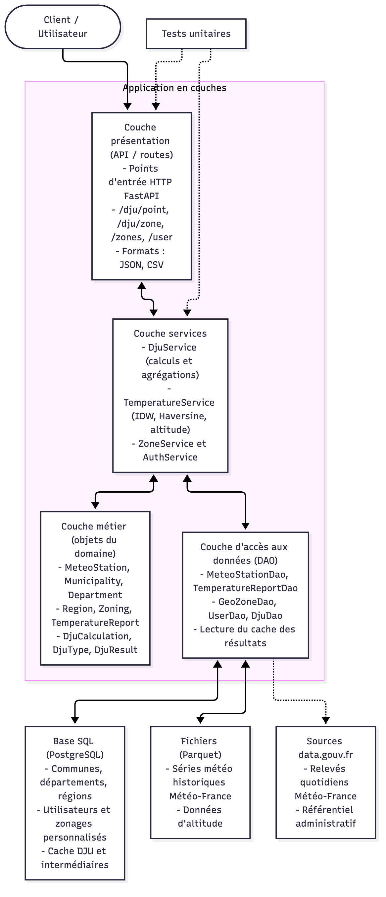{fig-align="center" width="100%" fig-pos="H"}

Chaque route HTTP est prise en charge par un contrôleur (`DjuController`, `ZoneController`, `UserController`), qui valide la requête puis délègue au service correspondant. Le fichier principal enregistre ces contrôleurs. Cette séparation facilite maintenance et tests.

## Modèle de données

Le schéma relationnel reprend les entités du domaine : utilisateurs, hiérarchie administrative, zonages personnalisés, stations, relevés, types et résultats de DJU. Les séries brutes massives restent en Parquet ; SQL sert de référence et de cache.

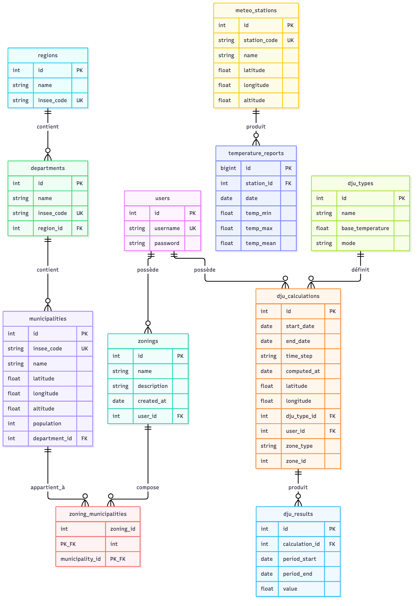{fig-align="center" width="95%" fig-pos="H"}

## Vue des cas d'utilisation

Le diagramme des cas d'utilisation reprend les acteurs définis en section 1.1 et les aligne sur F0 à F4 et FO3. L'utilisateur authentifié hérite des droits de l'utilisateur anonyme (flèche d'héritage UML). « Gérer un zonage » couvre la modification de la description, l'ajout ou le retrait de communes, et la suppression. « Importer un zonage » étend la création en partant d'un fichier CSV ou JSON.

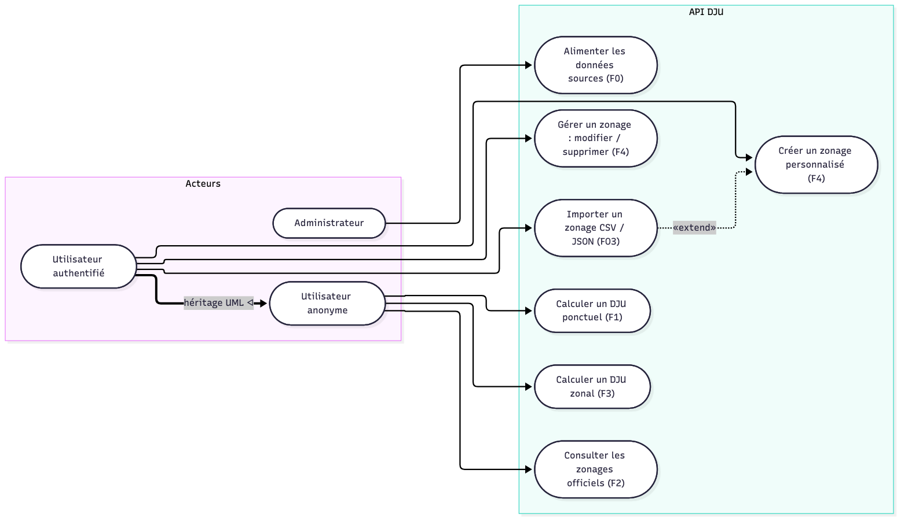{fig-align="center" width="90%" fig-pos="H"}

\clearpage

## Modèle du domaine

Le modèle du domaine structure les objets métier. `GeographicZone` factorise les zonages officiels : une région agrège des départements, un département agrège des communes. `Zoning` représente un territoire personnalisé associé à un `User`.

Les stations et relevés (`MeteoStation`, `TemperatureReport`) alimentent un `DjuCalculation`. Celui-ci utilise exactement un `DjuType` (chauffage ou climatisation), produit une collection de `DjuResult`, et porte sur au plus une `GeographicZone` (calcul zonal) ou sur des coordonnées (calcul ponctuel). Un `User` possède zéro à plusieurs `DjuCalculation`.

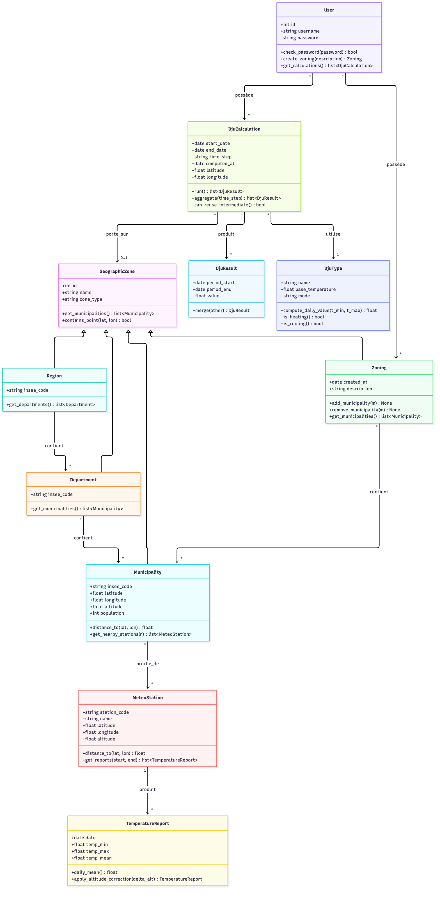{fig-align="center" width="85%" fig-pos="H"}

\clearpage

## F0 — Initialisation des données

L'initialisation est séparée en deux traitements.

Le premier charge les fichiers Météo-France, conserve les colonnes utiles (`NUM_POSTE`, `DATE`, `TN`, `TX`, `TM`, plus `LAT` / `LON` / `ALTI` pour les stations), renomme les températures en `tmin`, `tmax`, `tmean`, filtre à partir de 1990, déduplique, puis enregistre stations et relevés.

Le second télécharge le référentiel communal, enrichit les altitudes et structure la hiérarchie départements / régions.

\begin{figure}[H]
\centering
\begin{minipage}[b]{0.48\textwidth}
\centering
\includegraphics[width=\linewidth,height=0.70\textheight,keepaspectratio]{resources/diagrams/activity_diagram_1.png}
\caption{Initialisation des stations et observations}
\label{fig:act-init-meteo}
\end{minipage}\hfill
\begin{minipage}[b]{0.48\textwidth}
\centering
\includegraphics[width=\linewidth,height=0.70\textheight,keepaspectratio]{resources/diagrams/activity_diagram_2.png}
\caption{Initialisation des zonages officiels}
\label{fig:act-init-geo}
\end{minipage}
\end{figure}

Du point de vue des échanges, l'Administrateur déclenche les scripts d'alimentation, qui dialoguent avec les sources externes puis avec la couche DAO.

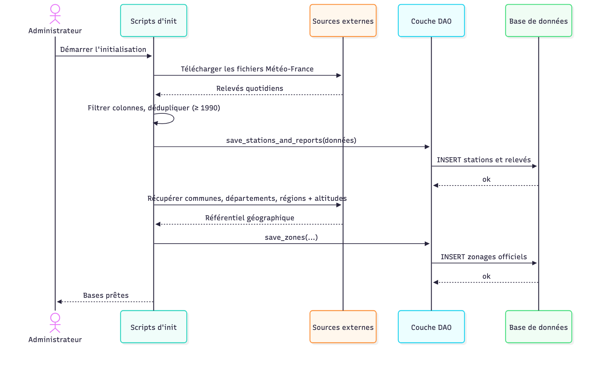{fig-align="center" width="100%" fig-pos="H"}

\clearpage

## Estimation des températures locales

Avant tout calcul DJU hors station, le système estime une série quotidienne au point demandé.

Les $n$ stations les plus proches sont sélectionnées ($n$ optionnel, défaut 3). Les distances Haversine et les poids IDW sont calculés une seule fois, hors de la boucle journalière, et peuvent être vectorisés avec Pandas. La correction d'altitude n'intervient que si l'altitude cible est fournie ; sinon les températures des stations sont utilisées telles quelles. Les méthodes concernées sont notamment `MeteoStation.get_reports` et `TemperatureReport.apply_altitude_correction`.

\begin{figure}[H]
\centering
\includegraphics[width=0.55\textwidth,height=0.75\textheight,keepaspectratio]{resources/diagrams/activity_diagram_3.png}
\caption{Estimation des températures locales}
\label{fig:act-temp}
\end{figure}

\clearpage

## F1 — Calcul d'un DJU ponctuel

La requête `POST /dju/point` fournit latitude, longitude, éventuellement altitude, la période de calcul, le pas de temps, et au moins un seuil (chauffage et/ou climatisation).

La validation contrôle la présence de `lat` et `lon`, que `date_début ≤ date_fin`, que `time_step ∈ \{day, month, year\}`, qu'au moins un seuil est fourni, et que la période est compatible avec les données disponibles depuis 1990.

Le cache est consulté en deux temps : résultat final, puis série quotidienne intermédiaire. À défaut, les températures sont estimées, les DJU quotidiens calculés via `DjuType.compute_daily_value`, agrégés par `DjuCalculation.aggregate`, puis persistés.

\begin{figure}[H]
\centering
\includegraphics[width=0.55\textwidth,height=0.75\textheight,keepaspectratio]{resources/diagrams/activity_diagram_4.png}
\caption{Calcul d'un DJU ponctuel}
\label{fig:act-point}
\end{figure}

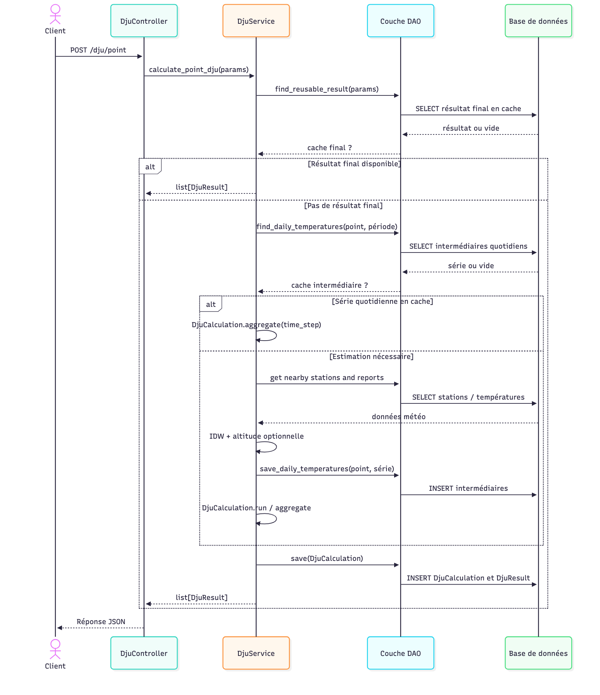{fig-align="center" width="100%" fig-pos="H"}

\clearpage

## F2 — Consultation des zonages officiels

Tout client peut lister les départements, les régions, ou l'ensemble des zonages officiels, avec les communes associées (`GeographicZone.get_municipalities`).

\begin{figure}[H]
\centering
\includegraphics[width=0.50\textwidth,height=0.60\textheight,keepaspectratio]{resources/diagrams/activity_diagram_6.png}
\caption{Consultation des zonages officiels}
\label{fig:act-consult}
\end{figure}

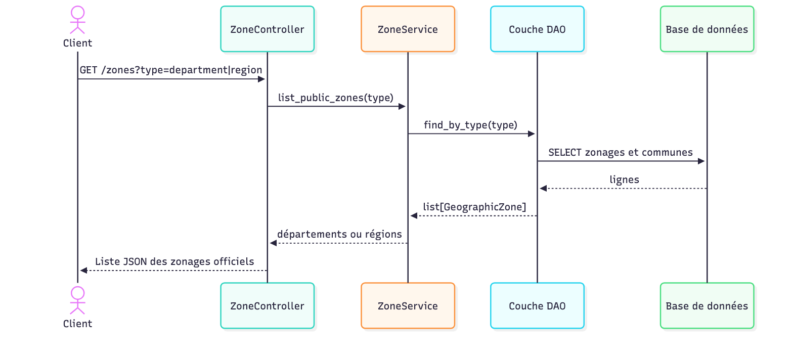{fig-align="center" width="100%" fig-pos="H"}

\clearpage

## F3 — Calcul d'un DJU zonal

La requête `POST /dju/zone` cible un `zone_type` et un `zone_id`, avec la même période, le même pas de temps et les mêmes seuils qu'en F1.

Les zonages officiels sont publics. Un zonage personnalisé exige que l'appelant soit authentifié et propriétaire. Pour chaque commune, le service réutilise d'abord les températures quotidiennes en cache ; il n'estime (IDW) et ne persiste les intermédiaires que si nécessaire. Les DJU communaux sont ensuite agrégés, par exemple en les pondérant par la population.

\begin{figure}[H]
\centering
\includegraphics[width=0.55\textwidth,height=0.75\textheight,keepaspectratio]{resources/diagrams/activity_diagram_5.png}
\caption{Calcul d'un DJU zonal}
\label{fig:act-zone}
\end{figure}

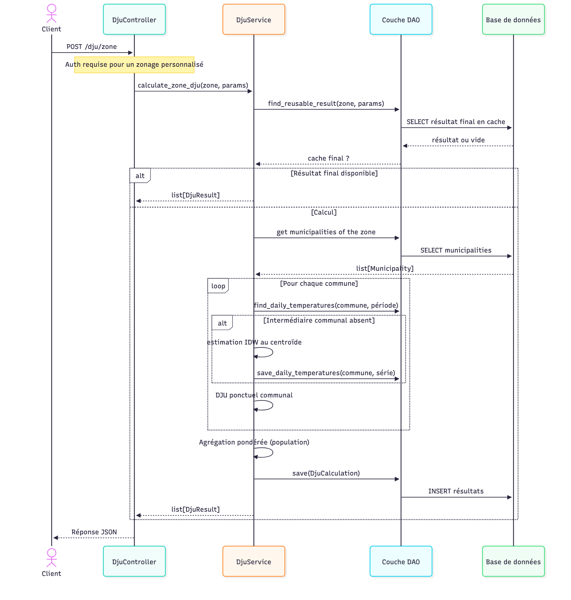{fig-align="center" width="100%" fig-pos="H"}

\clearpage

## F4 — Espace utilisateur authentifié

Après inscription et authentification (`User.check_password`), l'utilisateur gère ses zonages via `User.create_zoning`, `Zoning.add_municipality` et `Zoning.remove_municipality`.

La création manuelle envoie une description et une liste de codes INSEE. L'import FO3 suit le même chemin une fois le fichier CSV ou JSON analysé et les communes résolues. La gestion permet de modifier la composition ou de supprimer le zonage, sous réserve d'être propriétaire.

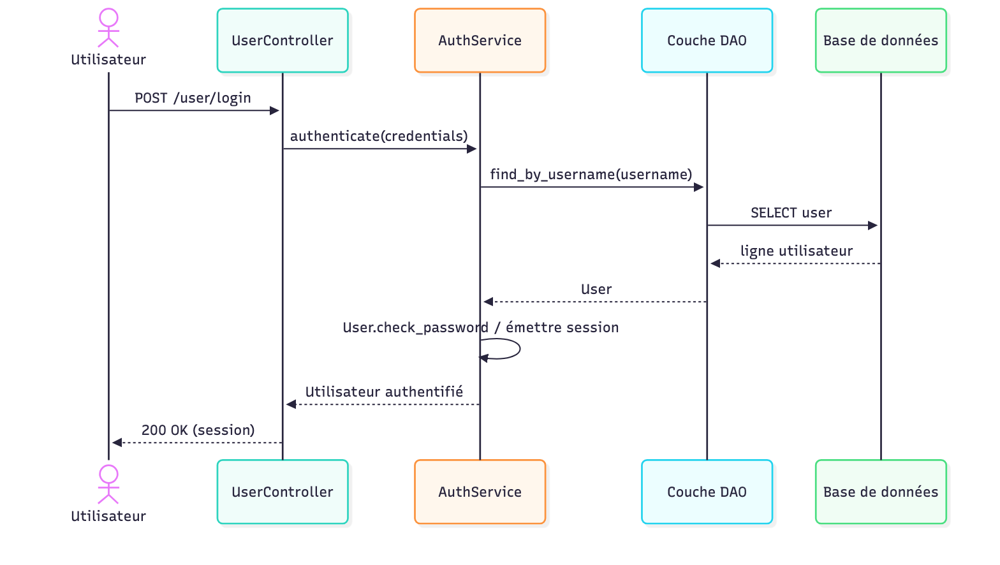{fig-align="center" width="100%" fig-pos="H"}

\begin{figure}[H]
\centering
\begin{minipage}[b]{0.48\textwidth}
\centering
\includegraphics[width=\linewidth,height=0.65\textheight,keepaspectratio]{resources/diagrams/activity_diagram_7.png}
\caption{Création ou import d'un zonage}
\label{fig:act-create}
\end{minipage}\hfill
\begin{minipage}[b]{0.48\textwidth}
\centering
\includegraphics[width=\linewidth,height=0.65\textheight,keepaspectratio]{resources/diagrams/activity_diagram_8.png}
\caption{Gestion d'un zonage personnalisé}
\label{fig:act-manage}
\end{minipage}
\end{figure}

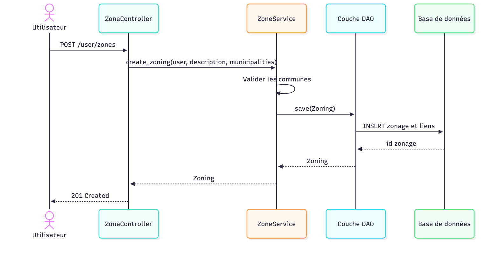{fig-align="center" width="100%" fig-pos="H"}

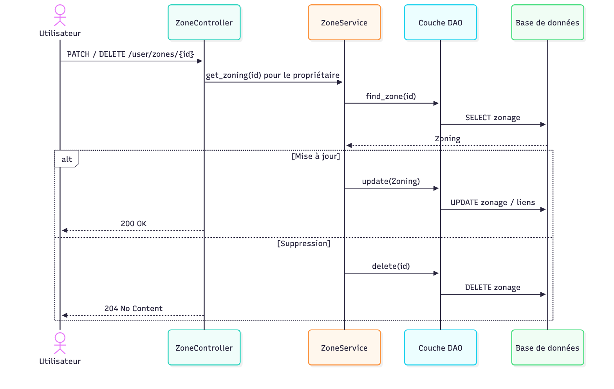{fig-align="center" width="100%" fig-pos="H"}

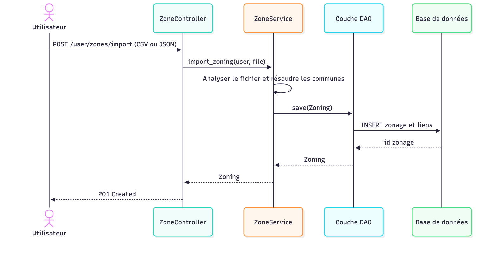{fig-align="center" width="100%" fig-pos="H"}

\clearpage

## Synthèse

| Fonct. | Route | Auth. | Paramètres d'entrée | Description |
|:--------------|:--------------|:--------------|:--------------|:--------------|
| F1 | `POST /dju/point` | Optionnelle | `lat`, `lon`, `altitude?`, `date_début`, `date_fin`, `time_step`, `seuil_chauffage?`, `seuil_clim?`, `n?` | DJU sur un point GPS |
| F2 | `GET /zones` | Aucune | `type` (`department` \| `region` \| `all`) | Liste des zonages officiels |
| F3 | `POST /dju/zone` | Optionnelle¹ | `zone_type`, `zone_id`, `date_début`, `date_fin`, `time_step`, `seuil_chauffage?`, `seuil_clim?` | DJU sur un territoire |
| F4 | `POST /user/register` | Aucune | `username`, `password` | Création de compte |
| F4 | `POST /user/login` | Aucune | `username`, `password` | Authentification |
| F4 | `GET /user/zones` | Requise | — (session) | Liste des zonages de l'utilisateur |
| F4 | `POST /user/zones` | Requise | `description`, `codes_insee[]` | Création d'un zonage |
| F4 | `PATCH /user/zones/{id}` | Propriétaire | `description?`, communes à ajouter/retirer | Modification d'un zonage |
| F4 | `DELETE /user/zones/{id}` | Propriétaire | `id` | Suppression d'un zonage |
| FO1 | — | — | Clé de paramètres de F1/F3 | Cache automatique des résultats et intermédiaires |
| FO2 | — | — | En-tête de format (JSON par défaut) | Mise en forme de la sortie |
| FO3 | `POST /user/zones/import` | Requise | Fichier CSV ou JSON | Import d'un zonage |

¹ Authentification obligatoire lorsque la zone ciblée est un zonage personnalisé. Au moins un des deux seuils (`seuil_chauffage`, `seuil_clim`) est requis pour F1 et F3.

# Conclusion Intermédiaire {.unnumbered}

Ce rapport d'étape formalise les choix architecturaux et fonctionnels retenus pour l'API de calcul de DJU. La conception propose un double niveau d'accès : public pour les consultations ponctuelles et les territoires officiels, authentifié pour les zonages personnalisés.

L'architecture en couches sépare présentation, services, métier et persistance. Le stockage dual (SQL pour le référentiel et le cache, Parquet pour les séries volumineuses) et la stratégie de cache à deux niveaux (intermédiaires quotidiens puis résultats finaux) limitent les recalculs.

Les prochaines étapes portent sur l'implémentation des schémas, des services de calcul et d'interpolation, de l'authentification, puis des tests. Une attention particulière sera accordée au traitement des données manquantes et à la validation numérique des DJU.