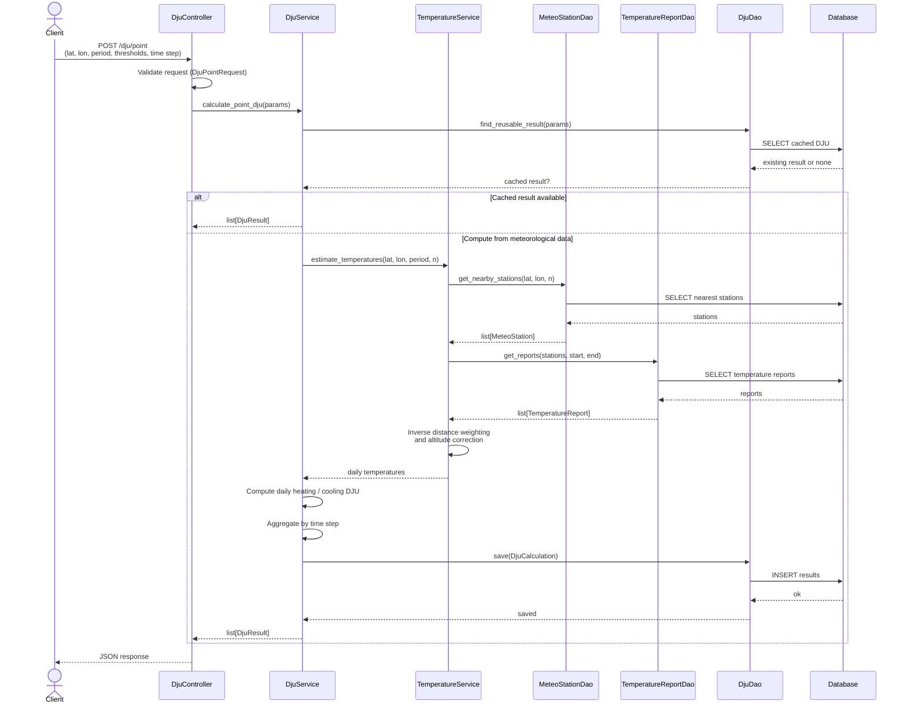
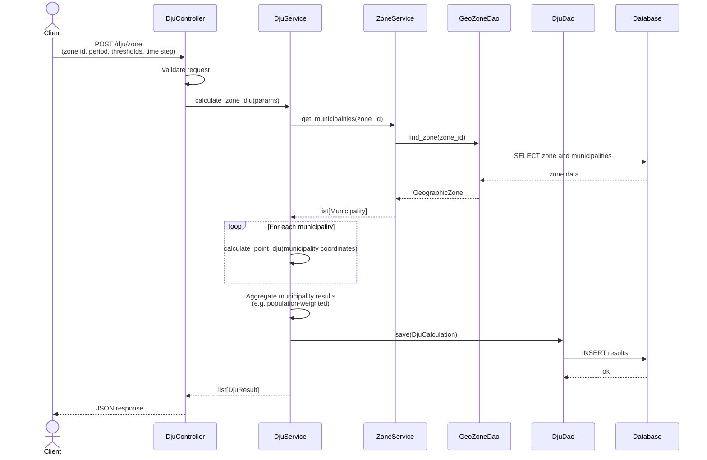
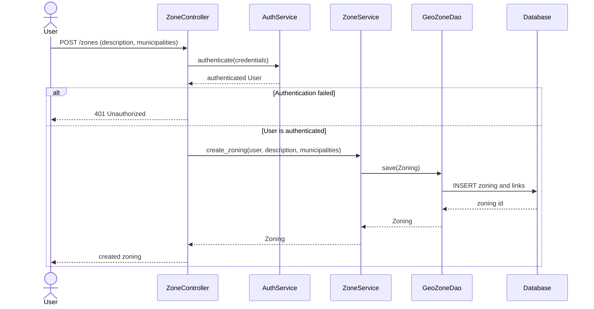

# Sequence diagrams

## 1. Compute a punctual DJU

## 2. Compute a zone DJU

Anonymous users can request DJU for an administrative territory (municipality, department, region) or a stored zoning. The zone is expanded into municipalities, then results are aggregated (for example with a population-weighted average).

## 3. Create a personalized zoning

Authenticated users can build a custom zoning from municipalities. Importing a zoning is an extension of this flow.

