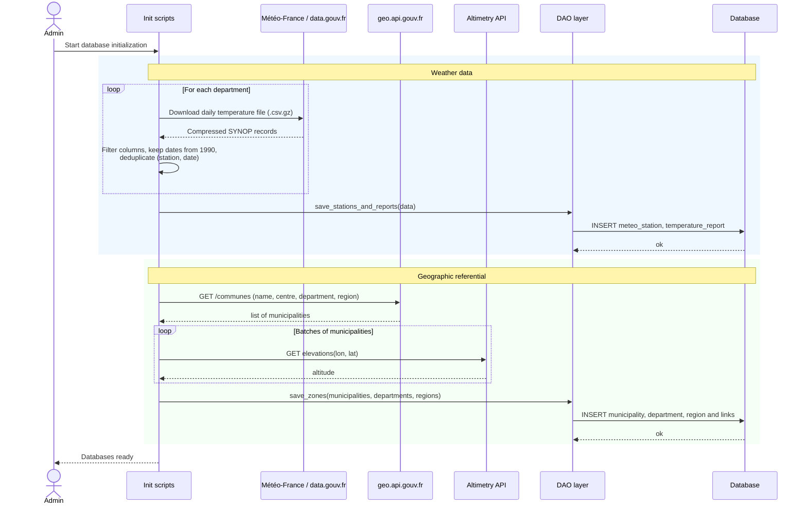
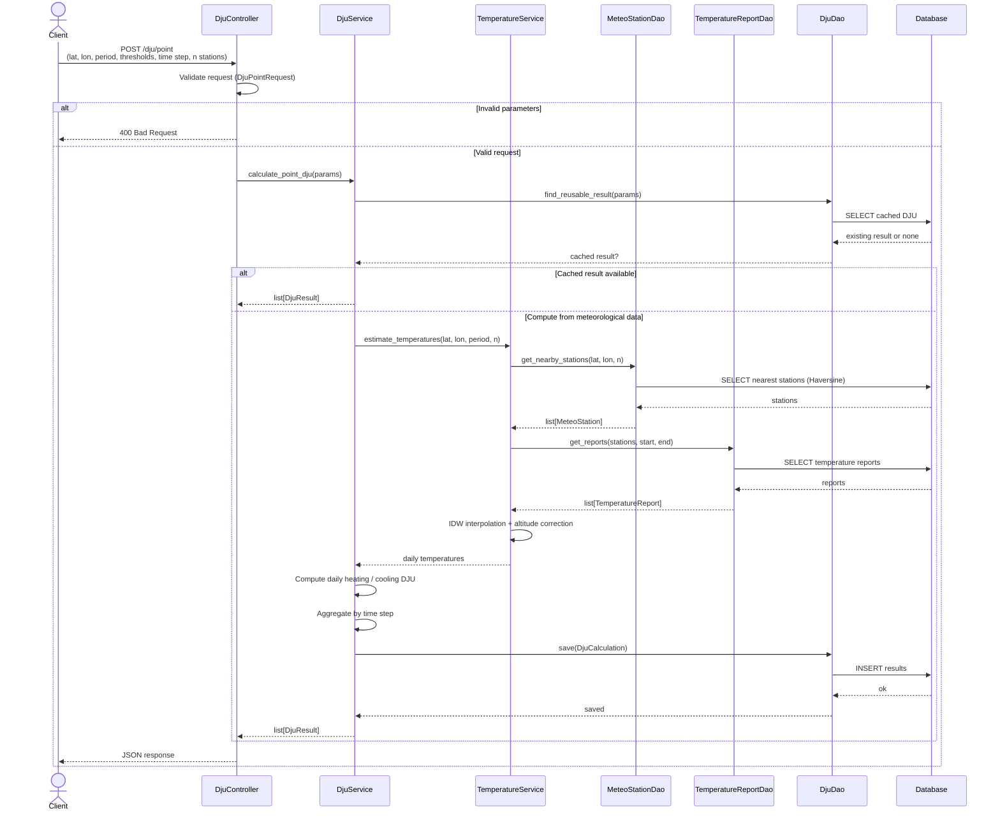
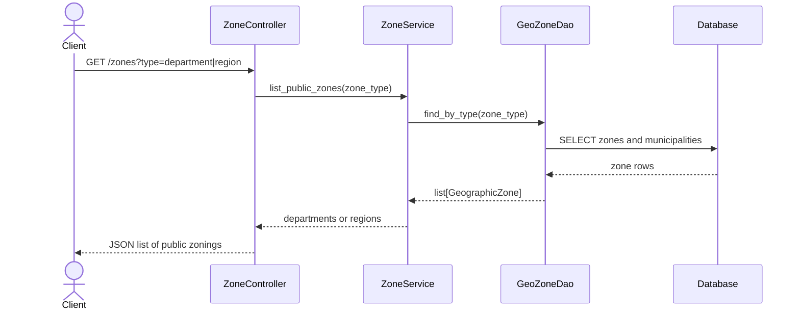
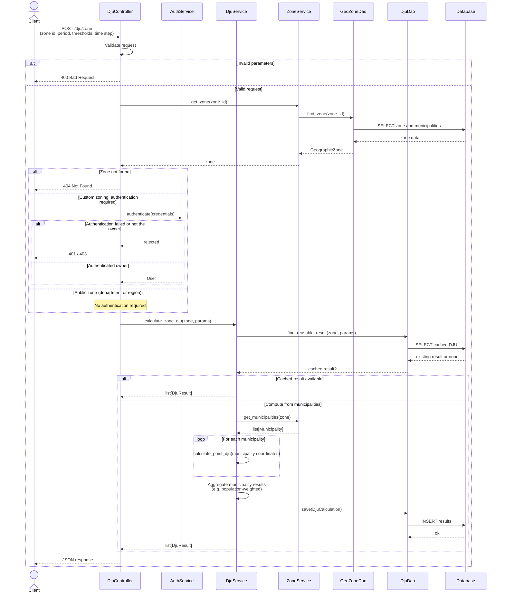
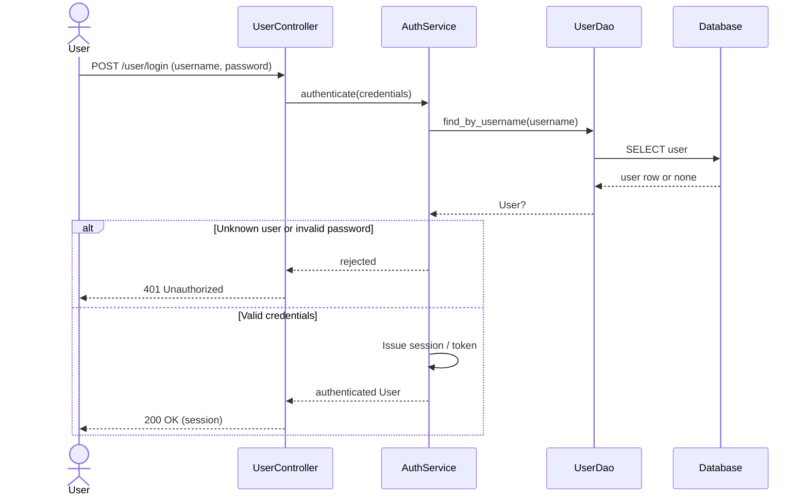
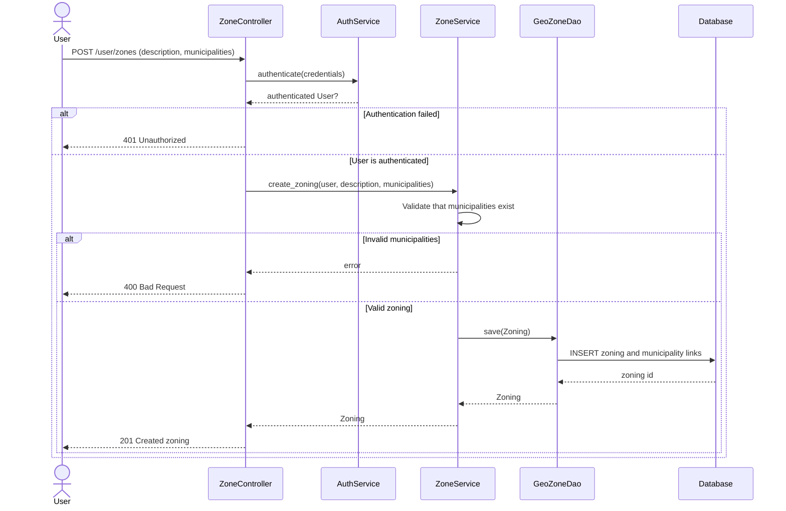
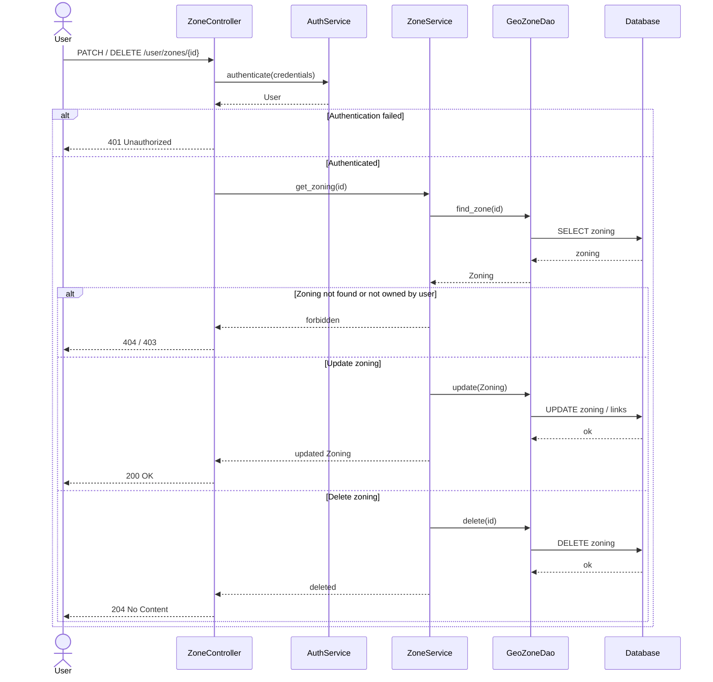
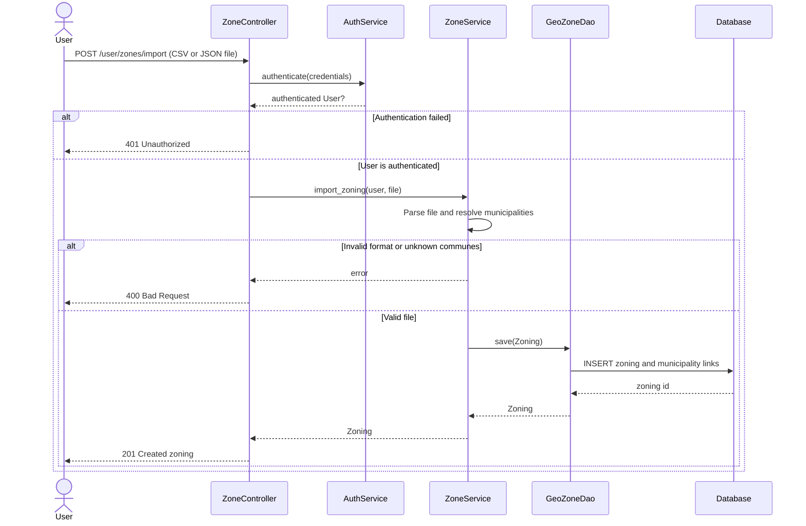

# Sequence diagrams

These diagrams describe the main exchanges between the client, the API layers
(controller, service, DAO) and the database. They follow the layered
architecture of the project and cover the features F0 to F4, plus the optional
import of custom zonings (FO3).

## 1. Initialize the databases (F0)

The administrator loads Météo-France temperature records and the municipality
referential (data.gouv.fr / geo.api.gouv.fr), then persists stations, daily
reports and official zonings (municipality, department, region).

## 2. Compute a punctual DJU (F1)

An anonymous or authenticated client requests heating / cooling DJU for GPS
coordinates, over a period and a time step (daily, weekly, monthly, yearly).
Cached results are reused when available (FO1). Otherwise temperatures are
estimated from nearby stations (inverse distance weighting, optional altitude
correction).

## 3. Consult public zonings (F2)

Any client can list official geographic zones (departments and regions) and
their municipalities. These zonings are available to every user.

## 4. Compute a zone DJU (F3)

DJU are computed on a territory (department, region, or custom zoning) with a
given period, time step and granularity. For official zonings the client does
not need to be authenticated. For a personal zoning, authentication is
required. Municipality-level DJU are then aggregated (for example
population-weighted).

## 5. Authenticate a user

Authentication is required before creating, importing or managing personal
zonings (F4).

## 6. Create a personalized zoning (F4)

An authenticated user builds a custom territory as a set of municipalities and
stores it for later DJU calculations.

## 7. Manage a personalized zoning (F4)

The owner can update the description, add or remove municipalities, or delete
a personal zoning.

## 8. Import a zoning from a file (FO3)

An authenticated user uploads a CSV or JSON file listing municipalities. The
API parses the file, maps rows to known communes, then stores a personal
zoning (same persistence path as F4).

