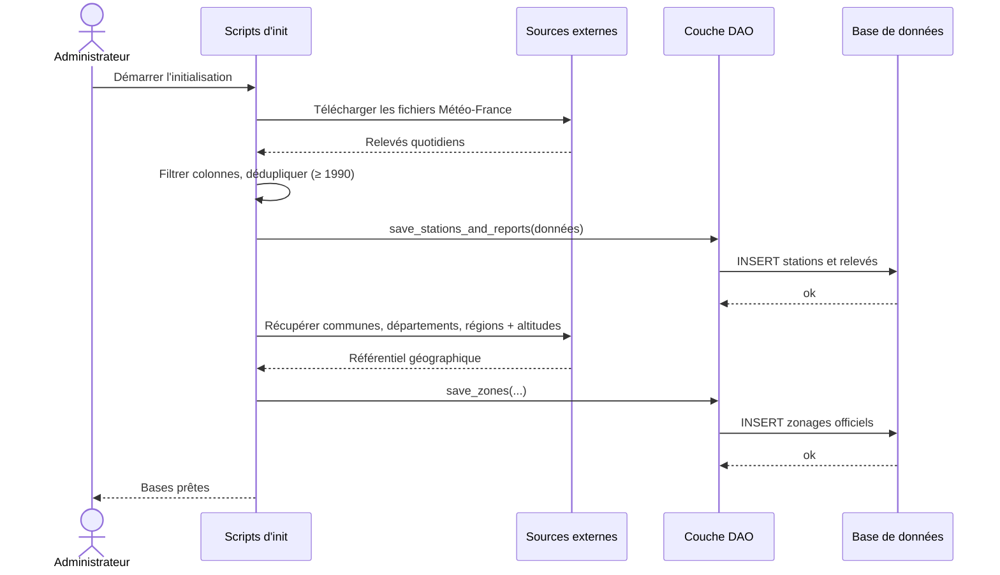
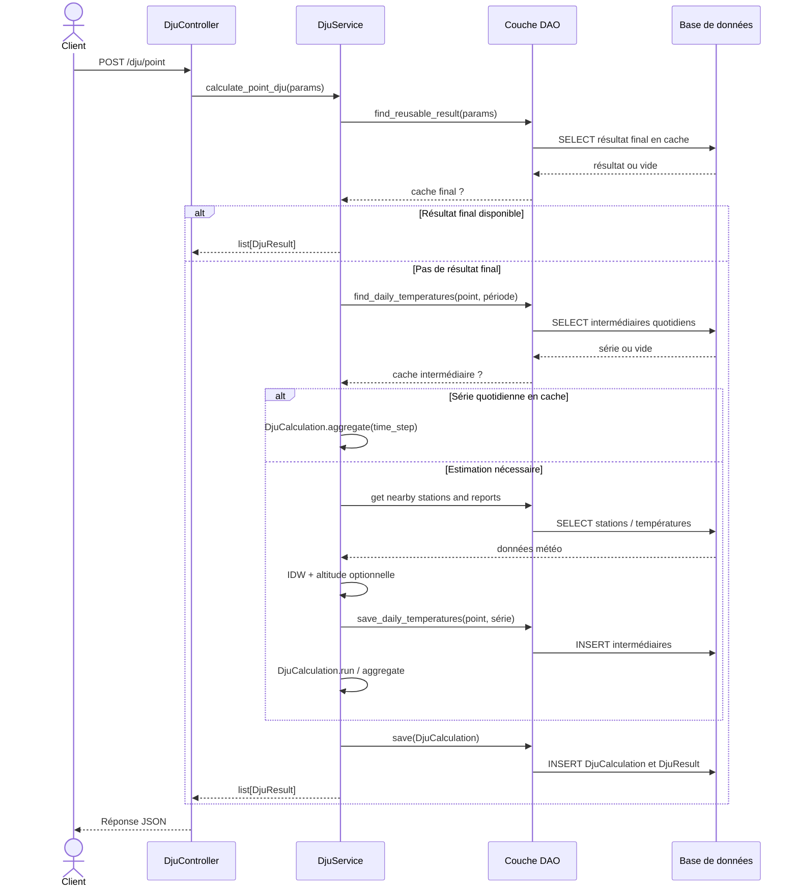
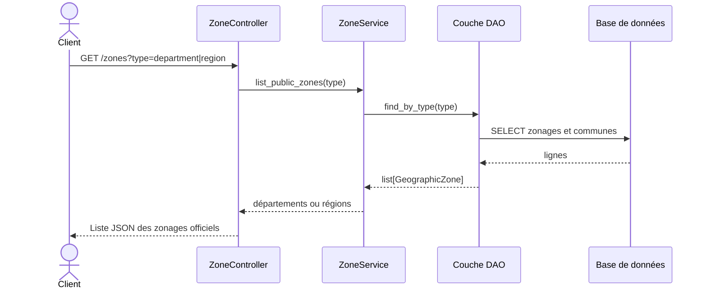
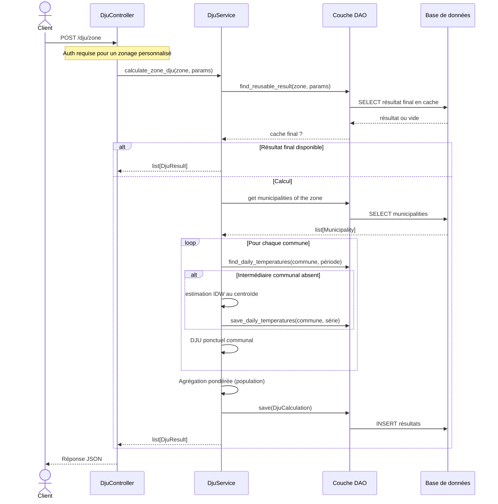
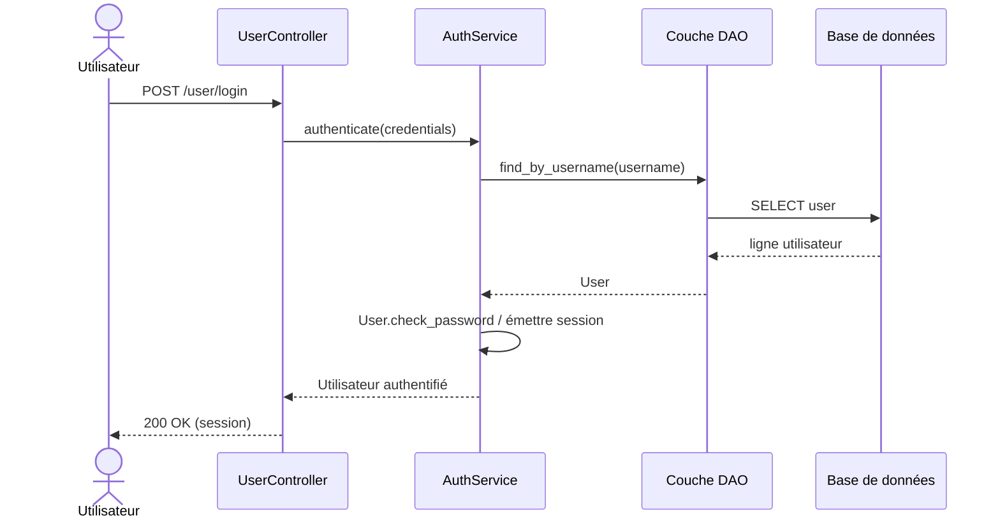
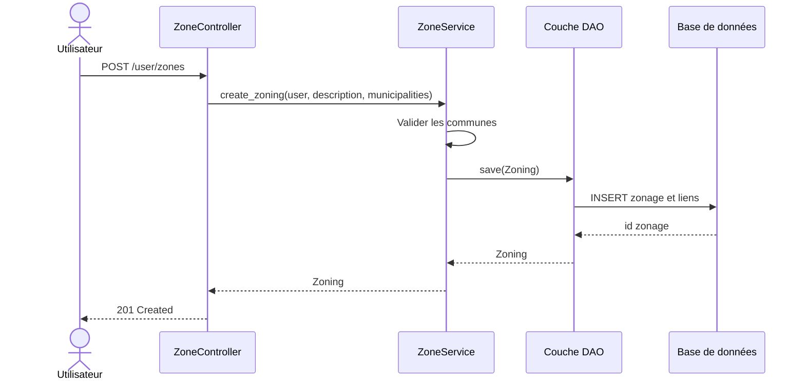
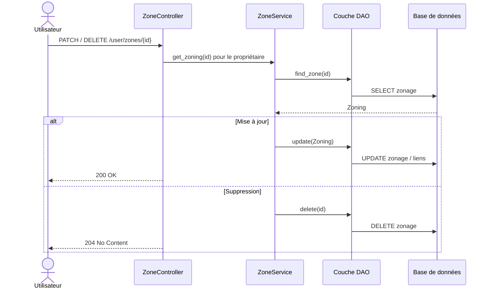
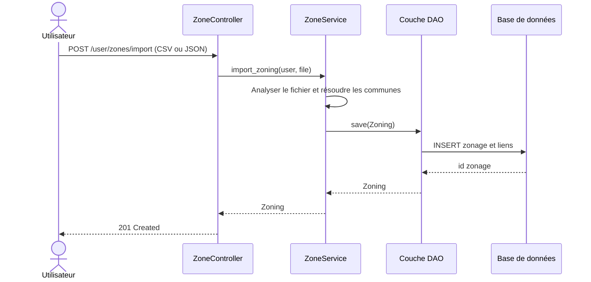

# Diagrammes de séquence

Échanges entre le client, les couches de l'API (contrôleur, service, DAO)
et la base de données. Couverture F0 à F4 et import optionnel FO3.

Thème Mermaid commun omis ici pour la lisibilité ; conserver le thème
`base` clair lors de l'export PNG.

## 1. Initialisation des bases de données (F0)

L'administrateur charge les relevés Météo-France et le référentiel communal,
puis persiste stations, observations et zonages officiels.

```mermaid
sequenceDiagram
    actor Admin as Administrateur
    participant Init as Scripts d'init
    participant Ext as Sources externes
    participant DAO as Couche DAO
    participant DB as Base de données

    Admin->>Init: Démarrer l'initialisation

    Init->>Ext: Télécharger les fichiers Météo-France
    Ext-->>Init: Relevés quotidiens
    Init->>Init: Filtrer colonnes, dédupliquer (≥ 1990)
    Init->>DAO: save_stations_and_reports(données)
    DAO->>DB: INSERT stations et relevés
    DB-->>DAO: ok

    Init->>Ext: Récupérer communes, départements, régions + altitudes
    Ext-->>Init: Référentiel géographique
    Init->>DAO: save_zones(...)
    DAO->>DB: INSERT zonages officiels
    DB-->>DAO: ok

    Init-->>Admin: Bases prêtes
```

## 2. Calcul d'un DJU ponctuel (F1)

Stratégie de cache : on ne stocke pas le résultat de *toute* requête reçue.
On cherche d'abord un **résultat final** pour la clé de paramètres. Sinon on
réutilise une **série quotidienne intermédiaire** déjà estimée pour ce point ;
seulement à défaut on relance l'IDW, on persiste les intermédiaires, puis on
agrège et on enregistre `DjuCalculation` / `DjuResult`.

```mermaid
sequenceDiagram
    actor Client
    participant Controller as DjuController
    participant Service as DjuService
    participant DAO as Couche DAO
    participant DB as Base de données

    Client->>Controller: POST /dju/point
    Controller->>Service: calculate_point_dju(params)

    Service->>DAO: find_reusable_result(params)
    DAO->>DB: SELECT résultat final en cache
    DB-->>DAO: résultat ou vide
    DAO-->>Service: cache final ?

    alt Résultat final disponible
        Service-->>Controller: list[DjuResult]
    else Pas de résultat final
        Service->>DAO: find_daily_temperatures(point, période)
        DAO->>DB: SELECT intermédiaires quotidiens
        DB-->>DAO: série ou vide
        DAO-->>Service: cache intermédiaire ?

        alt Série quotidienne en cache
            Service->>Service: DjuCalculation.aggregate(time_step)
        else Estimation nécessaire
            Service->>DAO: get nearby stations and reports
            DAO->>DB: SELECT stations / températures
            DB-->>Service: données météo
            Service->>Service: IDW + altitude optionnelle
            Service->>DAO: save_daily_temperatures(point, série)
            DAO->>DB: INSERT intermédiaires
            Service->>Service: DjuCalculation.run / aggregate
        end

        Service->>DAO: save(DjuCalculation)
        DAO->>DB: INSERT DjuCalculation et DjuResult
        Service-->>Controller: list[DjuResult]
    end

    Controller-->>Client: Réponse JSON
```

## 3. Consultation des zonages publics (F2)

```mermaid
sequenceDiagram
    actor Client
    participant Controller as ZoneController
    participant Service as ZoneService
    participant DAO as Couche DAO
    participant DB as Base de données

    Client->>Controller: GET /zones?type=department|region
    Controller->>Service: list_public_zones(type)
    Service->>DAO: find_by_type(type)
    DAO->>DB: SELECT zonages et communes
    DB-->>DAO: lignes
    DAO-->>Service: list[GeographicZone]
    Service-->>Controller: départements ou régions
    Controller-->>Client: Liste JSON des zonages officiels
```

## 4. Calcul d'un DJU zonal (F3)

Même logique de cache à deux niveaux : résultat final territorial, puis
températures quotidiennes **par commune** (pas de recalcul systématique des
moyennes communales).

```mermaid
sequenceDiagram
    actor Client
    participant Controller as DjuController
    participant Service as DjuService
    participant DAO as Couche DAO
    participant DB as Base de données

    Client->>Controller: POST /dju/zone
    Note over Controller: Auth requise pour un zonage personnalisé
    Controller->>Service: calculate_zone_dju(zone, params)

    Service->>DAO: find_reusable_result(zone, params)
    DAO->>DB: SELECT résultat final en cache
    DB-->>DAO: résultat ou vide
    DAO-->>Service: cache final ?

    alt Résultat final disponible
        Service-->>Controller: list[DjuResult]
    else Calcul
        Service->>DAO: get municipalities of the zone
        DAO->>DB: SELECT municipalities
        DB-->>Service: list[Municipality]

        loop Pour chaque commune
            Service->>DAO: find_daily_temperatures(commune, période)
            alt Intermédiaire communal absent
                Service->>Service: estimation IDW au centroïde
                Service->>DAO: save_daily_temperatures(commune, série)
            end
            Service->>Service: DJU ponctuel communal
        end

        Service->>Service: Agrégation pondérée (population)
        Service->>DAO: save(DjuCalculation)
        DAO->>DB: INSERT résultats
        Service-->>Controller: list[DjuResult]
    end

    Controller-->>Client: Réponse JSON
```

## 5. Authentification d'un utilisateur

```mermaid
sequenceDiagram
    actor User as Utilisateur
    participant Controller as UserController
    participant Service as AuthService
    participant DAO as Couche DAO
    participant DB as Base de données

    User->>Controller: POST /user/login
    Controller->>Service: authenticate(credentials)
    Service->>DAO: find_by_username(username)
    DAO->>DB: SELECT user
    DB-->>DAO: ligne utilisateur
    DAO-->>Service: User
    Service->>Service: User.check_password / émettre session
    Service-->>Controller: Utilisateur authentifié
    Controller-->>User: 200 OK (session)
```

## 6. Création d'un zonage personnalisé (F4)

```mermaid
sequenceDiagram
    actor User as Utilisateur
    participant Controller as ZoneController
    participant Service as ZoneService
    participant DAO as Couche DAO
    participant DB as Base de données

    User->>Controller: POST /user/zones
    Controller->>Service: create_zoning(user, description, municipalities)
    Service->>Service: Valider les communes
    Service->>DAO: save(Zoning)
    DAO->>DB: INSERT zonage et liens
    DB-->>DAO: id zonage
    DAO-->>Service: Zoning
    Service-->>Controller: Zoning
    Controller-->>User: 201 Created
```

## 7. Gestion d'un zonage personnalisé (F4)

```mermaid
sequenceDiagram
    actor User as Utilisateur
    participant Controller as ZoneController
    participant Service as ZoneService
    participant DAO as Couche DAO
    participant DB as Base de données

    User->>Controller: PATCH / DELETE /user/zones/{id}
    Controller->>Service: get_zoning(id) pour le propriétaire
    Service->>DAO: find_zone(id)
    DAO->>DB: SELECT zonage
    DB-->>Service: Zoning

    alt Mise à jour
        Service->>DAO: update(Zoning)
        DAO->>DB: UPDATE zonage / liens
        Controller-->>User: 200 OK
    else Suppression
        Service->>DAO: delete(id)
        DAO->>DB: DELETE zonage
        Controller-->>User: 204 No Content
    end
```

## 8. Import d'un zonage depuis un fichier (FO3)

```mermaid
sequenceDiagram
    actor User as Utilisateur
    participant Controller as ZoneController
    participant Service as ZoneService
    participant DAO as Couche DAO
    participant DB as Base de données

    User->>Controller: POST /user/zones/import (CSV ou JSON)
    Controller->>Service: import_zoning(user, file)
    Service->>Service: Analyser le fichier et résoudre les communes
    Service->>DAO: save(Zoning)
    DAO->>DB: INSERT zonage et liens
    DB-->>DAO: id zonage
    DAO-->>Service: Zoning
    Service-->>Controller: Zoning
    Controller-->>User: 201 Created
```
