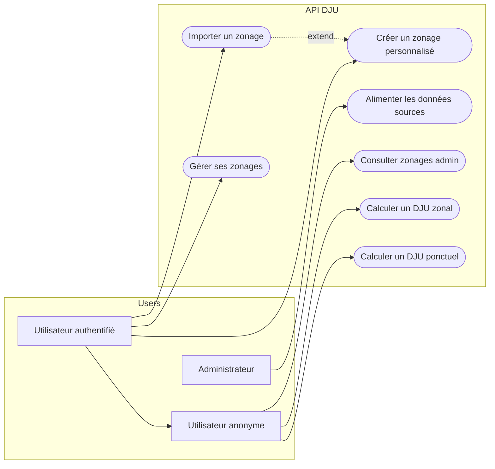

```mermaid
flowchart LR
  subgraph Users
    Anonyme["Utilisateur anonyme"]
    Authentifie["Utilisateur authentifié"]
    Admin["Administrateur"]
  end

  Authentifie --> Anonyme

  subgraph API_DJU["API DJU"]
    UC1(["Calculer un DJU ponctuel"])
    UC2(["Calculer un DJU zonal"])
    UC3(["Consulter zonages admin"])
    UC4(["Créer un zonage personnalisé"])
    UC5(["Gérer ses zonages"])
    UC6(["Importer un zonage"])
    UC7(["Alimenter les données sources"])
  end

  Anonyme --> UC1
  Anonyme --> UC2
  Anonyme --> UC3

  Authentifie --> UC4
  Authentifie --> UC5
  Authentifie --> UC6

  Admin --> UC7

  UC6 -.->|extend| UC4
```