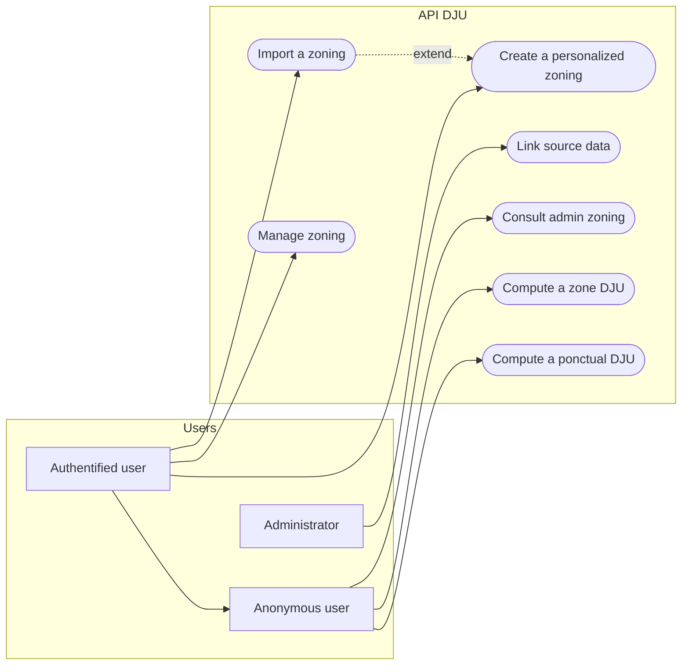

```mermaid
flowchart LR
  subgraph Users
    Anonyme["Anonymous user"]
    Authentifie["Authentified user"]
    Admin["Administrator"]
  end

  Authentifie --> Anonyme

  subgraph API_DJU["API DJU"]
    UC1(["Compute a ponctual DJU"])
    UC2(["Compute a zone DJU"])
    UC3(["Consult admin zoning"])
    UC4(["Create a personalized zoning"])
    UC5(["Manage zoning"])
    UC6(["Import a zoning"])
    UC7(["Link source data"])
  end

  Anonyme --> UC1
  Anonyme --> UC2
  Anonyme --> UC3

  Authentifie --> UC4
  Authentifie --> UC5
  Authentifie --> UC6

  Admin --> UC7

  UC6 -.->|extend| UC4
```