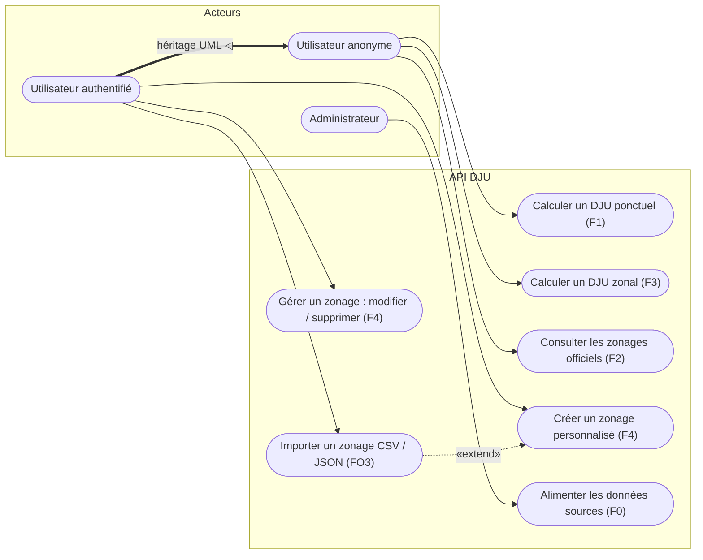

# Diagramme des cas d'utilisation

L'utilisateur authentifié hérite de l'utilisateur anonyme (annoté « héritage UML »).
« Gérer un zonage » couvre modification et suppression ; « Importer » étend la création.

| Cas d'utilisation | Fonctionnalité |
|---|---|
| Calculer un DJU ponctuel | F1 |
| Calculer un DJU zonal | F3 |
| Consulter les zonages officiels | F2 |
| Créer un zonage personnalisé | F4 |
| Gérer un zonage (modifier / supprimer) | F4 |
| Importer un zonage (CSV / JSON) | FO3 (`«extend»` de Créer) |
| Alimenter les données sources | F0 |

